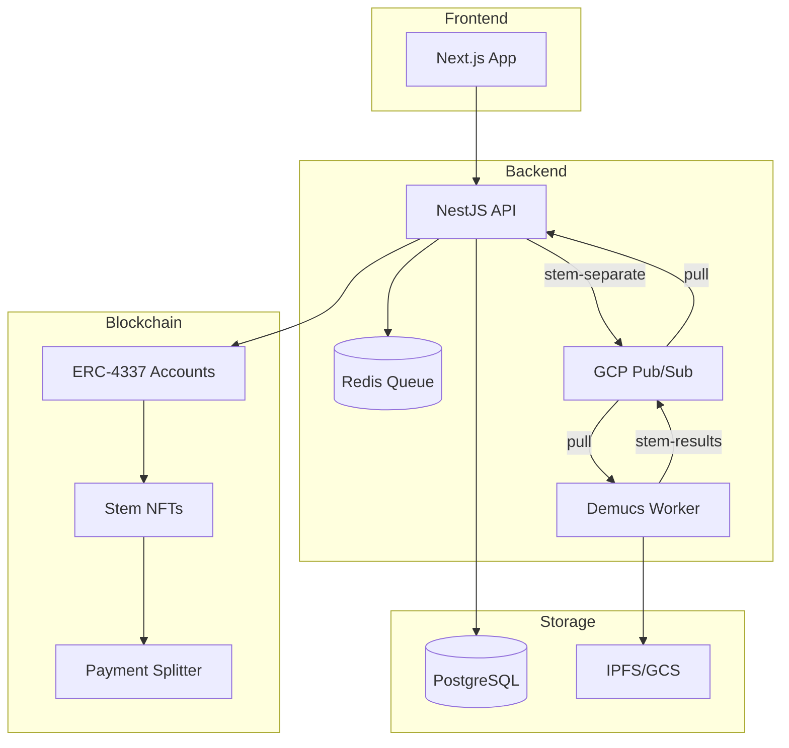

<div align="center">

# 🎵 Resonate

### The Agentic Audio Protocol

**Decentralized • AI-Native • Stem-Level Monetization**

[](https://www.typescriptlang.org/)
[](https://nestjs.com/)
[](https://nextjs.org/)
[](https://soliditylang.org/)
[](https://book.getfoundry.sh/)

<br/>

> **🚧 Work in Progress** — This is an experimental project under active development. Not production-ready.

</div>

---

## 🌟 Overview

Resonate is a decentralized music streaming protocol where artists monetize audio **stems** (vocals, drums, bass) as programmable IP, and users deploy **AI agents** to curate, remix, and negotiate usage rights in real-time.

### Key Features

- **🎛️ Stem-Level IP** — Artists upload stems as ERC-1155 NFTs with granular licensing
- **🤖 AI Agent Wallets** — ERC-4337 smart accounts with autonomous micro-payment capabilities
- **💰 Transparent Royalties** — On-chain payment splitting with real-time analytics
- **🔀 Remix Engine** — Composable smart contracts for derivative works

---

## 🏗️ Architecture



---

## 🚀 Quick Start

### Prerequisites

| Tool                                    | Install                                                       |
| --------------------------------------- | ------------------------------------------------------------- |
| **Node.js** 18+                         | [nodejs.org](https://nodejs.org/) or `nvm install 18`         |
| **Docker**                              | [docker.com/get-started](https://www.docker.com/get-started/) |
| **Redis**                               | Starts via Docker (port 6379)                                 |
| **Make**                                | Pre-installed on macOS/Linux; Windows: use WSL                |
| **Foundry** _(for contract deployment)_ | [getfoundry.sh](https://getfoundry.sh/)                       |

### Run Locally

Two AA modes are available — see [AA Integration](docs/account-abstraction.md) for architecture and [Local AA Development](docs/local-aa-development.md) for setup.

#### Forked Sepolia (recommended — session keys, full AA)

```bash
# 1. Set env vars
export SEPOLIA_RPC_URL=https://sepolia.drpc.org

# 2. Start infrastructure (Postgres, Redis, Pub/Sub emulator, Demucs worker)
make dev-up
make local-aa-fork              # Forks Sepolia, configures .env (AA infra already on-chain)
make deploy-contracts           # Deploy StemNFT + Marketplace + TransferValidator

# 3. Start services (separate terminals)
make backend-dev     # NestJS API on port 3001
make web-dev-fork    # Next.js on port 3000 (chainId 11155111, local RPC)
```

#### Local-Only (offline, no internet required)

```bash
# 1. Deploy everything (Docker + Anvil + all contracts)
# This starts Postgres, Redis, Pub/Sub emulator, and Demucs worker
make dev-up
make contracts-deploy-local  # Deploys AA + StemNFT + Marketplace + TransferValidator

# 2. Start services (separate terminals)
make backend-dev     # NestJS API on port 3001
make web-dev-local   # Next.js on port 3000 (chainId 31337)

# 3. (Optional) View Demucs worker logs
docker compose logs -f demucs-worker
```

### Stop & Clean

```bash
make db-reset        # Reset database (requires Docker running)
make dev-down        # Stop Docker containers
make local-aa-down   # Stop Anvil + bundler
```

### 📤 Upload Processing Flow

When an artist uploads a release, the following pipeline executes:

```
Upload → Validation → Pub/Sub → Stem Separation → Encryption → Storage → Ready
```

| Stage        | Status | Description                            |
| ------------ | ------ | -------------------------------------- |
| `pending`    | 🔵     | Track queued for processing            |
| `separating` | 🟡     | Demucs AI splitting audio into 6 stems |
| `uploading`  | 🟡     | Uploading stems to IPFS/storage        |
| `complete`   | 🟢     | Ready for playback and minting         |
| `failed`     | 🔴     | Processing error (check worker logs)   |

**Stems generated:** vocals, drums, bass, guitar, piano, other

The release page displays track status in real-time, with stems appearing as they complete processing.

### 🎛️ AI Stem Separation (Demucs)

The Demucs worker uses Facebook's [htdemucs_6s](https://github.com/facebookresearch/demucs) model to separate audio into 6 stems: **vocals, drums, bass, guitar, piano, other**.

> **GPU acceleration is enabled by default** — `make dev-up` launches the worker with NVIDIA GPU support via `docker-compose.gpu.yml`.

**Performance comparison:**
| Hardware | 3-min song | Notes |
|----------|------------|-------|
| CPU (8 cores) | ~10 min | Fallback if no GPU available |
| NVIDIA GPU (RTX 3080) | ~45 sec | 10-15x faster |

**Model caching:** The ~52MB htdemucs_6s model is pre-downloaded during Docker build.

```bash
# View worker logs
make worker-logs

# Check worker health
make worker-health

# Rebuild worker (after code changes)
make worker-rebuild

# Quick build (skip model pre-cache, downloads on first use)
make worker-quick-build
```

### ⚡ GPU Prerequisites

Since GPU is the default, ensure these are installed:

1. **NVIDIA GPU** with CUDA support
2. **[NVIDIA Container Toolkit](https://docs.nvidia.com/datacenter/cloud-native/container-toolkit/latest/install-guide.html)**

<details>
<summary>📋 NVIDIA Container Toolkit Installation (Ubuntu/Debian)</summary>

```bash
# Add NVIDIA package repository
curl -fsSL https://nvidia.github.io/libnvidia-container/gpgkey | \
  sudo gpg --dearmor -o /usr/share/keyrings/nvidia-container-toolkit-keyring.gpg

curl -s -L https://nvidia.github.io/libnvidia-container/stable/deb/nvidia-container-toolkit.list | \
  sed 's#deb https://#deb [signed-by=/usr/share/keyrings/nvidia-container-toolkit-keyring.gpg] https://#g' | \
  sudo tee /etc/apt/sources.list.d/nvidia-container-toolkit.list

# Install and configure
sudo apt-get update && sudo apt-get install -y nvidia-container-toolkit
sudo nvidia-ctk runtime configure --runtime=docker
sudo systemctl restart docker

# Verify installation
docker run --rm --gpus all nvidia/cuda:12.1.0-base-ubuntu22.04 nvidia-smi
```

</details>

**Verify GPU in worker:**

```bash
docker compose exec demucs-worker nvidia-smi
```

**Troubleshooting:**

- `nvidia-smi` fails → Reinstall NVIDIA Container Toolkit
- WSL2 users → Use NVIDIA driver for WSL, not native Linux driver
- Build hangs on apt-get → Rebuild with `make worker-rebuild` (fixed via `DEBIAN_FRONTEND=noninteractive`)

See [`workers/demucs/README.md`](workers/demucs/README.md) for full worker documentation.

---

## 📖 Documentation

| Document                                                          | Description                                   |
| ----------------------------------------------------------------- | --------------------------------------------- |
| [Project Specification](docs/RESONATE_SPECS.md)                   | Vision, architecture, and roadmap             |
| [Local AA Development](docs/local-aa-development.md)              | Account abstraction setup guide               |
| [Demucs Worker](workers/demucs/README.md)                         | GPU stem separation setup and troubleshooting |
| [Core Contracts](docs/phase5/core_contracts.md)                   | Stem NFT and marketplace contracts            |
| [Marketplace Integration](docs/phase5/marketplace_integration.md) | Frontend/backend integration                  |
| [Contributing](CONTRIBUTING.md)                                   | Contribution guidelines                       |

---

## 🛠️ Tech Stack

| Layer          | Technology                                      |
| -------------- | ----------------------------------------------- |
| Frontend       | Next.js 15, TanStack Query, Viem/Wagmi          |
| Backend        | NestJS, Prisma, BullMQ, GCP Pub/Sub, PostgreSQL |
| Blockchain     | Solidity, Foundry, ERC-4337, ZeroDev            |
| AI             | Demucs (htdemucs_6s), Vertex AI                 |
| Infrastructure | Docker, Redis, GCP Pub/Sub, GitHub Actions      |

---

## 📄 License

MIT © 2024-2025
