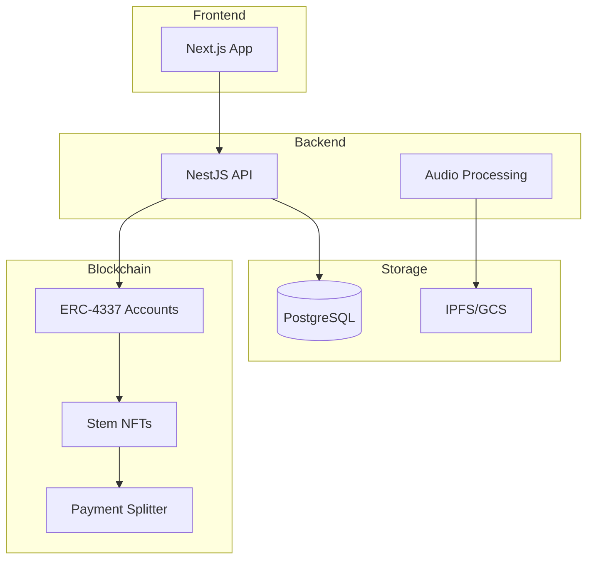

<div align="center">

# 🎵 Resonate

### The Agentic Audio Protocol

**Decentralized • AI-Native • Stem-Level Monetization**

[](https://www.typescriptlang.org/)
[](https://nestjs.com/)
[](https://nextjs.org/)
[](https://soliditylang.org/)
[](https://book.getfoundry.sh/)

<br/>

> **🚧 Work in Progress** — This is an experimental project under active development. Not production-ready.

</div>

---

## 🌟 Overview

Resonate is a decentralized music streaming protocol where artists monetize audio **stems** (vocals, drums, bass) as programmable IP, and users deploy **AI agents** to curate, remix, and negotiate usage rights in real-time.

### Key Features

- **🎛️ Stem-Level IP** — Artists upload stems as ERC-1155 NFTs with granular licensing
- **🤖 AI Agent Wallets** — ERC-4337 smart accounts with autonomous micro-payment capabilities
- **💰 Transparent Royalties** — On-chain payment splitting with real-time analytics
- **🔀 Remix Engine** — Composable smart contracts for derivative works

---

## 🏗️ Architecture



---

## 🚀 Quick Start

### Prerequisites

| Tool | Install |
|------|---------|
| **Node.js** 18+ | [nodejs.org](https://nodejs.org/) or `nvm install 18` |
| **Docker** | [docker.com/get-started](https://www.docker.com/get-started/) |
| **Make** | Pre-installed on macOS/Linux; Windows: use WSL |
| **Foundry** *(for AA dev)* | [getfoundry.sh](https://getfoundry.sh/) |

### Run Locally

```bash
# 1. Start infrastructure (PostgreSQL + Anvil + bundler + deploy contracts)
make dev-up
make local-aa-full

# 2. Start services (in separate terminals)
make backend-dev     # NestJS API (port 3001)
make web-dev-local   # Next.js frontend (port 3000, chainId 31337)
```

See [Local AA Development Guide](docs/local-aa-development.md) for troubleshooting and details.

---

## 📖 Documentation

| Document | Description |
|----------|-------------|
| [Project Specification](docs/RESONATE_SPECS.md) | Vision, architecture, and roadmap |
| [Local AA Development](docs/local-aa-development.md) | Account abstraction setup guide |
| [Contributing](CONTRIBUTING.md) | Contribution guidelines |

---

## 🛠️ Tech Stack

| Layer | Technology |
|-------|------------|
| Frontend | Next.js 15, TanStack Query, Viem/Wagmi |
| Backend | NestJS, Prisma, PostgreSQL |
| Blockchain | Solidity, Foundry, ERC-4337 |
| AI | Vertex AI, Audio Source Separation |
| Infrastructure | Docker, GitHub Actions |

---

## 📄 License

MIT © 2024-2025
