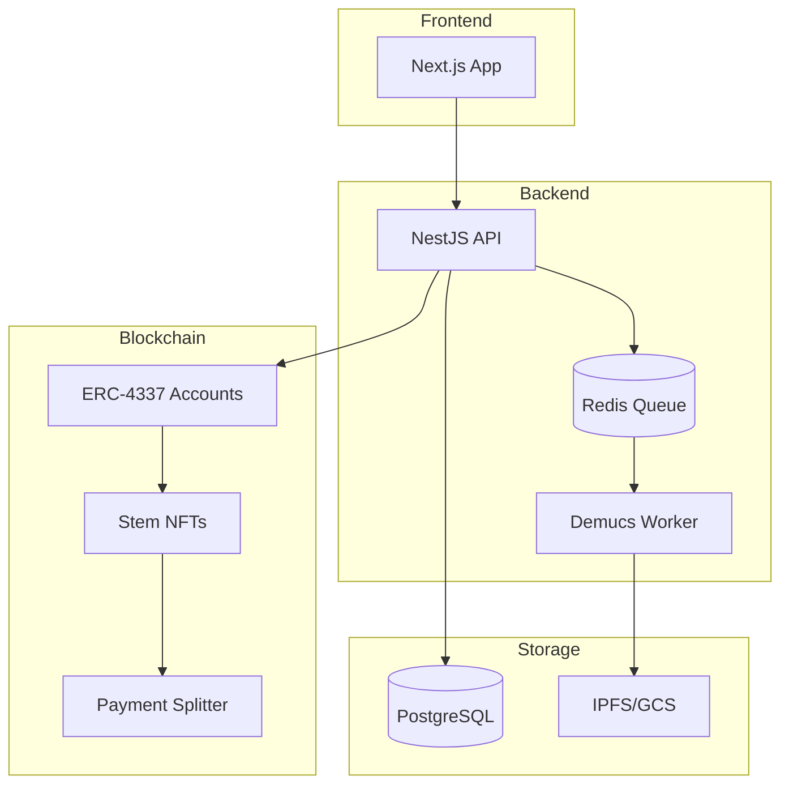

<div align="center">

# 🎵 Resonate

### The Agentic Audio Protocol

**Decentralized • AI-Native • Stem-Level Monetization**

[](https://www.typescriptlang.org/)
[](https://nestjs.com/)
[](https://nextjs.org/)
[](https://soliditylang.org/)
[](https://book.getfoundry.sh/)

<br/>

> **🚧 Work in Progress** — This is an experimental project under active development. Not production-ready.

</div>

---

## 🌟 Overview

Resonate is a decentralized music streaming protocol where artists monetize audio **stems** (vocals, drums, bass) as programmable IP, and users deploy **AI agents** to curate, remix, and negotiate usage rights in real-time.

### Key Features

- **🎛️ Stem-Level IP** — Artists upload stems as ERC-1155 NFTs with granular licensing
- **🤖 AI Agent Wallets** — ERC-4337 smart accounts with autonomous micro-payment capabilities
- **💰 Transparent Royalties** — On-chain payment splitting with real-time analytics
- **🔀 Remix Engine** — Composable smart contracts for derivative works

---

## 🏗️ Architecture



---

## 🚀 Quick Start

### Prerequisites

| Tool | Install |
|------|---------|
| **Node.js** 18+ | [nodejs.org](https://nodejs.org/) or `nvm install 18` |
| **Docker** | [docker.com/get-started](https://www.docker.com/get-started/) |
| **Redis** | Starts via Docker (port 6379) |
| **Make** | Pre-installed on macOS/Linux; Windows: use WSL |
| **Foundry** *(for AA dev)* | [getfoundry.sh](https://getfoundry.sh/) |

### Run Locally

```bash
# 1. Start infrastructure (PostgreSQL + Anvil + bundler + deploy contracts)
make dev-up
make local-aa-full

# 2. Start services (in separate terminals)
make backend-dev     # NestJS API (port 3001)
make web-dev-local   # Next.js frontend (port 3000, chainId 31337)

# 3. (Optional) Run Demucs Worker for AI Stem Separation
# The worker starts automatically with 'dev-up', but you can view its logs:
docker compose logs -f demucs-worker
```


### 🎛️ AI Stem Separation (Demucs)

The Demucs worker uses Facebook's [htdemucs_6s](https://github.com/facebookresearch/demucs) model to separate audio into 6 stems: **vocals, drums, bass, guitar, piano, other**.

**Performance comparison:**
| Hardware | 3-min song | Notes |
|----------|------------|-------|
| CPU (8 cores) | ~10 min | Default, no setup needed |
| NVIDIA GPU (RTX 3080) | ~45 sec | 10-15x faster |

**Model caching:** The ~1GB model is pre-downloaded during Docker build (cached in a volume for fast rebuilds).

```bash
# View worker logs
make worker-logs

# Check worker health
make worker-health

# Rebuild worker (after code changes)
make worker-rebuild

# Quick build (skip model pre-cache, downloads on first use)
make worker-quick-build
```

### ⚡ GPU Acceleration (Recommended for Production)

Enable GPU with a single command:

```bash
# Start worker with GPU support
make worker-gpu

# Verify GPU is detected
docker compose exec demucs-worker nvidia-smi
```

**Prerequisites:**
- NVIDIA GPU with CUDA support
- [NVIDIA Container Toolkit](https://docs.nvidia.com/datacenter/cloud-native/container-toolkit/latest/install-guide.html)

<details>
<summary>📋 NVIDIA Container Toolkit Installation (Ubuntu/Debian)</summary>

```bash
# Add NVIDIA package repository
curl -fsSL https://nvidia.github.io/libnvidia-container/gpgkey | \
  sudo gpg --dearmor -o /usr/share/keyrings/nvidia-container-toolkit-keyring.gpg

curl -s -L https://nvidia.github.io/libnvidia-container/stable/deb/nvidia-container-toolkit.list | \
  sed 's#deb https://#deb [signed-by=/usr/share/keyrings/nvidia-container-toolkit-keyring.gpg] https://#g' | \
  sudo tee /etc/apt/sources.list.d/nvidia-container-toolkit.list

# Install and configure
sudo apt-get update && sudo apt-get install -y nvidia-container-toolkit
sudo nvidia-ctk runtime configure --runtime=docker
sudo systemctl restart docker

# Verify installation
docker run --rm --gpus all nvidia/cuda:12.1.0-base-ubuntu22.04 nvidia-smi
```
</details>

**Troubleshooting:**
- `nvidia-smi` fails in container → Reinstall NVIDIA Container Toolkit
- WSL2 users → Use NVIDIA driver for WSL, not native Linux driver
- Permission denied → Add user to `docker` group: `sudo usermod -aG docker $USER`

### Clean Up & Reset

```bash
# Stop all Docker services (keeps data)
make dev-down

# Stop only AA infrastructure
make local-aa-down

# Reset database (destructive - deletes all data)
make db-reset

# View AA logs
make local-aa-logs
```

---

## 📖 Documentation

| Document | Description |
|----------|-------------|
| [Project Specification](docs/RESONATE_SPECS.md) | Vision, architecture, and roadmap |
| [Local AA Development](docs/local-aa-development.md) | Account abstraction setup guide |
| [Contributing](CONTRIBUTING.md) | Contribution guidelines |

---

## 🛠️ Tech Stack

| Layer | Technology |
|-------|------------|
| Frontend | Next.js 15, TanStack Query, Viem/Wagmi |
| Backend | NestJS, Prisma, BullMQ, PostgreSQL |
| Blockchain | Solidity, Foundry, ERC-4337 |
| AI | Demucs (htdemucs_6s), Vertex AI |
| Infrastructure | Docker, Redis, GitHub Actions |

---

## 📄 License

MIT © 2024-2025
