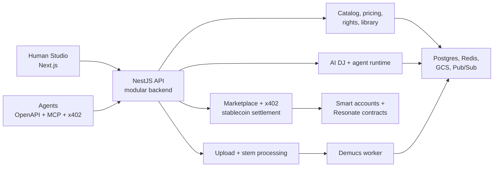
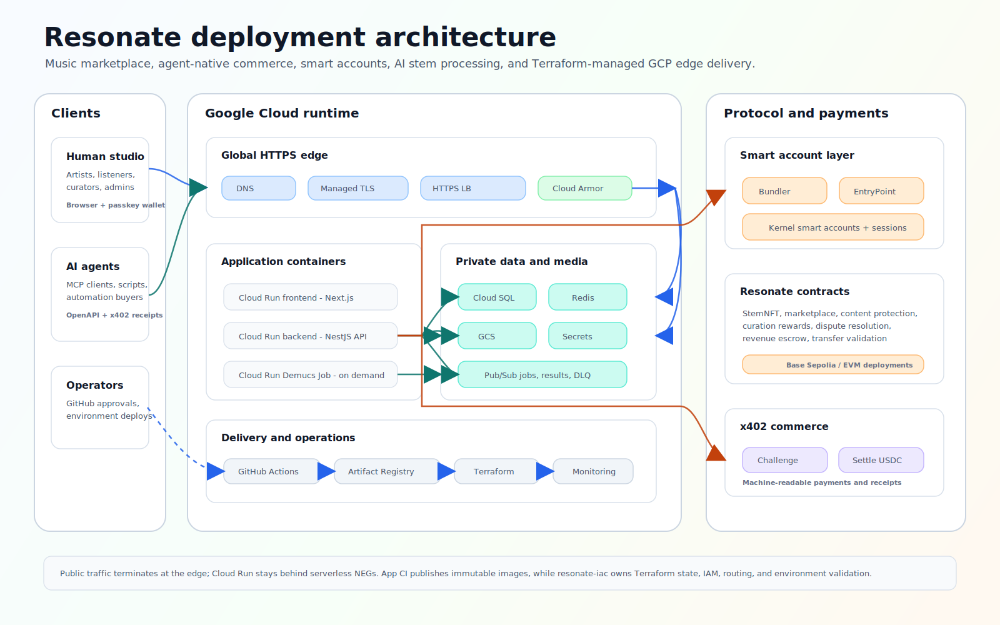

<div align="center">

<svg width="100%" height="220" viewBox="0 0 800 220" fill="none" xmlns="http://www.w3.org/2000/svg" style="background: #08080F; border-radius: 16px; border: 1px solid rgba(124, 92, 255, 0.2); box-shadow: 0 20px 40px rgba(8, 8, 15, 0.5);">
  <!-- Background Patterns / Ambient Glow -->
  <defs>
    <linearGradient id="hyacinthGlow" x1="0%" y1="0%" x2="100%" y2="100%">
      <stop offset="0%" stop-color="#7C5CFF" stop-opacity="0.25"/>
      <stop offset="50%" stop-color="#C4B5FD" stop-opacity="0.05"/>
      <stop offset="100%" stop-color="#08080F" stop-opacity="0"/>
    </linearGradient>
    <linearGradient id="textGrad" x1="0%" y1="0%" x2="100%" y2="0%">
      <stop offset="0%" stop-color="#FFFFFF"/>
      <stop offset="60%" stop-color="#C4B5FD"/>
      <stop offset="100%" stop-color="#7C5CFF"/>
    </linearGradient>
  </defs>
  
  <!-- Glow -->
  <rect width="800" height="220" fill="url(#hyacinthGlow)"/>
  
  <!-- Concentric design waves (Electric minimalist) -->
  <circle cx="700" cy="110" r="150" stroke="#7C5CFF" stroke-opacity="0.15" stroke-width="1.5" stroke-dasharray="10 15"/>
  <circle cx="700" cy="110" r="110" stroke="#7C5CFF" stroke-opacity="0.25" stroke-width="1.5"/>
  <circle cx="700" cy="110" r="70" stroke="#C4B5FD" stroke-opacity="0.35" stroke-width="1.5" stroke-dasharray="5 5"/>
  <circle cx="700" cy="110" r="30" stroke="#7C5CFF" stroke-opacity="0.45" stroke-width="2"/>
  <circle cx="700" cy="110" r="4" fill="#FFFFFF" opacity="0.9"/>
  
  <!-- Clean Minimalist Typographic Header -->
  <text x="60" y="95" fill="url(#textGrad)" font-family="system-ui, -apple-system, sans-serif" font-weight="800" font-size="44" letter-spacing="-0.03em">RESONATE</text>
  <text x="62" y="130" fill="#C4B5FD" font-family="system-ui, -apple-system, sans-serif" font-weight="600" font-size="14" letter-spacing="0.18em">FANS BRING THE SHOW • ON-CHAIN AUDIO IP</text>
  <text x="62" y="165" fill="rgba(255,255,255,0.6)" font-family="system-ui, -apple-system, sans-serif" font-weight="400" font-size="12" letter-spacing="0.02em">Programmable Stems • Human Studio • x402 Commerce • MCP Server</text>
</svg>

<br/>
<br/>

[](https://www.typescriptlang.org/)
[](https://nestjs.com/)
[](https://nextjs.org/)
[](https://soliditylang.org/)
[](https://book.getfoundry.sh/)

<br/>

> **🚧 Work in Progress.** This is an experimental project under active development. Not production-ready.

</div>

---

## 🌟 Overview

Resonate is an AI-native music platform that uses AI, agent interfaces, and blockchain rails as product primitives, not afterthoughts. Artists upload releases, split songs into stems, and sell licensed assets in stablecoin. Listeners get a full music app with an AI DJ, marketplace, and wallet-native purchases. AI agents discover, quote, and buy stems over HTTP with x402. No account, no OAuth, just `curl` + USDC + a signed receipt.

The human studio, storefront API, x402 payment flow, and MCP interface are peers over the same on-chain catalog. Three audiences, one catalog:

- **Artists**: upload releases, mint stems as NFTs, price per-license type (personal / remix / commercial), earn royalties via on-chain payment splitter.
- **Listeners**: full music app: player, library, playlists, marketplace, AI DJ, curator-resolved disputes. Wallet-native purchases. You own what you buy.
- **Agents**: storefront endpoints, licensing-aware quotes, x402 HTTP payments, machine-readable purchase receipts. No account required.

---

## ⚡ Key Capabilities

- **Programmable stems**: AI-separated 6-stem assets (vocals, drums, bass, guitar, piano, other) as the core monetizable unit · [Upload flow](docs/features/artist_upload_flow_mvp.md)
- **x402 commerce**: machine-to-machine stem purchases over HTTP with USDC settlement and structured receipts · [x402 payments](docs/architecture/x402_payments.md)
- **MCP tools**: `catalog.search`, `stem.quote`, `stem.download` over Streamable HTTP at `/mcp` · [MCP server](docs/architecture/mcp_server.md)
- **Resonate Shows**: escrow-backed fan campaigns that turn city-level demand into booking signals · [Shows](docs/features/resonate_shows.md)
- **AI DJ**: taste-constrained agent runtime with commerce-aware recommendations · [Agent commerce](docs/features/agent-commerce-runtime.md)
- **Smart accounts**: ERC-4337 Kernel accounts with session keys for gasless UX · [Account abstraction](docs/account-abstraction/account-abstraction.md)
- **Marketplace**: on-chain stem trading with licensing tiers and stablecoin settlement · [Contracts](docs/smart-contracts/core_contracts.md)
- **Community curation**: dispute flows and curator-resolved content quality signals · [Curation](docs/features/community_curation_disputes.md)

See the [feature catalog](docs/features/README.md) for the full index of implemented, partial, planned, and retired capabilities.

---

## 🏗️ Architecture


```mermaid
flowchart LR
  Studio["Human Studio<br>Next.js"] --> API["NestJS API<br>modular backend"]
  Agents["Agents<br>OpenAPI + MCP + x402"] --> API
  API --> Catalog["Catalog, pricing,<br>rights, library"]
  API --> Commerce["Marketplace + x402<br>stablecoin settlement"]
  API --> Runtime["AI DJ + agent runtime"]
  API --> Ingestion["Upload + stem processing"]
  Commerce --> Chain["Smart accounts +<br>Resonate contracts"]
  Ingestion --> Worker["Demucs worker"]
  Catalog --> Data["Postgres, Redis,<br>GCS, Pub/Sub"]
  Runtime --> Data
  Worker --> Data
```

Resonate deploys as a full-stack music and agent-commerce system: Cloud Run services, Pub/Sub pipelines, Cloud SQL, Redis, GCS, ERC-4337 smart accounts, and a Terraform-managed GCP edge. Application CI publishes immutable images; [`resonate-iac`](https://github.com/akoita/resonate-iac) applies infrastructure releases.



→ [Application architecture](docs/architecture/application_architecture.md) · [Deployment architecture](docs/architecture/deployment_architecture.md)

---

## 🚀 Quick Start

> For the full development setup guide with detailed explanations, see [Getting Started](docs/getting-started.md).

### Prerequisites

| Tool | Install |
| --- | --- |
| **Node.js** 22.12+ | [nodejs.org](https://nodejs.org/) or `nvm install 22` |
| **Docker** | [docker.com/get-started](https://www.docker.com/get-started/) |
| **Make** | Pre-installed on macOS/Linux; Windows: use WSL |
| **Foundry** _(contracts)_ | [getfoundry.sh](https://getfoundry.sh/) |

### Forked Sepolia (recommended)

```bash
# Install dependencies
npm install -g npm@11.14.1
cd contracts && ./scripts/install-deps.sh
cd ../backend && npm ci
cd ../web && npm ci --legacy-peer-deps
cd ../desktop && npm ci
cd ..

# Start infrastructure + worker + chain fork + contracts
export SEPOLIA_RPC_URL=https://sepolia.drpc.org
make dev-up
make worker-gpu
make local-aa-fork
make deploy-contracts

# Start services (separate terminals)
make backend-dev     # NestJS API on port 3000
make web-dev-fork    # Next.js on port 3001 (chain 11155111, local RPC)
```

### Local-Only (offline fallback)

```bash
make dev-up
make worker-gpu
make contracts-deploy-local

make backend-dev     # port 3000
make web-dev-local   # port 3001 (chain 31337)
```

### Stop & Clean

```bash
make db-reset        # Reset database
make dev-down        # Stop Postgres, Redis, Pub/Sub, Demucs worker
make local-aa-down   # Stop Anvil + Alto
```

---

## 📖 Documentation

| Document | Description |
| --- | --- |
| [User Guide](docs/features/user_manual.md) | In-app manual at `/help` — how to use Resonate (all personas) |
| [Getting Started](docs/getting-started.md) | Full development setup guide |
| [Feature Catalog](docs/features/README.md) | Index of all platform capabilities |
| [Project Specification](docs/rfc/RESONATE_SPECS.md) | Vision, architecture, and roadmap |
| [Deployment Architecture](docs/architecture/deployment_architecture.md) | GCP, smart accounts, blockchain, x402 topology |
| [Environment Variables](docs/deployment/environment.md) | App runtime and provider configuration |
| [Local AA Development](docs/account-abstraction/local-aa-development.md) | Account abstraction setup |
| [Demucs Worker](workers/demucs/README.md) | GPU stem separation setup |
| [x402 Payments](docs/architecture/x402_payments.md) | Machine-to-machine stem purchases |
| [MCP Server](docs/architecture/mcp_server.md) | Agent tool discovery and setup |
| [Core Contracts](docs/smart-contracts/core_contracts.md) | Stem NFT and marketplace contracts |
| [Troubleshooting](docs/troubleshooting.md) | Common issues and fixes |
| [Contributing](CONTRIBUTING.md) | Contribution guidelines |

---

## 🛠️ Tech Stack

| Layer | Technology |
| --- | --- |
| Frontend | Next.js 15, TanStack Query, Viem/Wagmi |
| Backend | NestJS, Prisma, BullMQ, GCP Pub/Sub, PostgreSQL |
| Blockchain | Solidity, Foundry, ERC-4337, ZeroDev |
| AI | Demucs (htdemucs_6s), Vertex AI |
| Infrastructure | Docker, Redis, GCP Pub/Sub, GitHub Actions |

---

## 📄 License

MIT © 2024-2026
