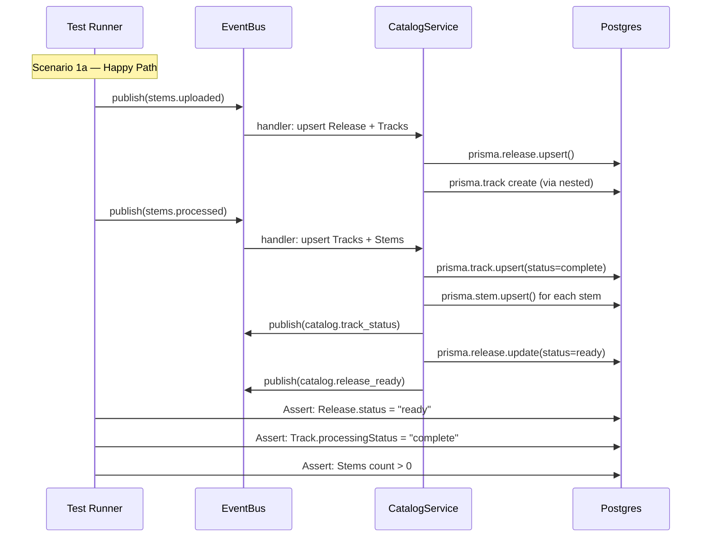
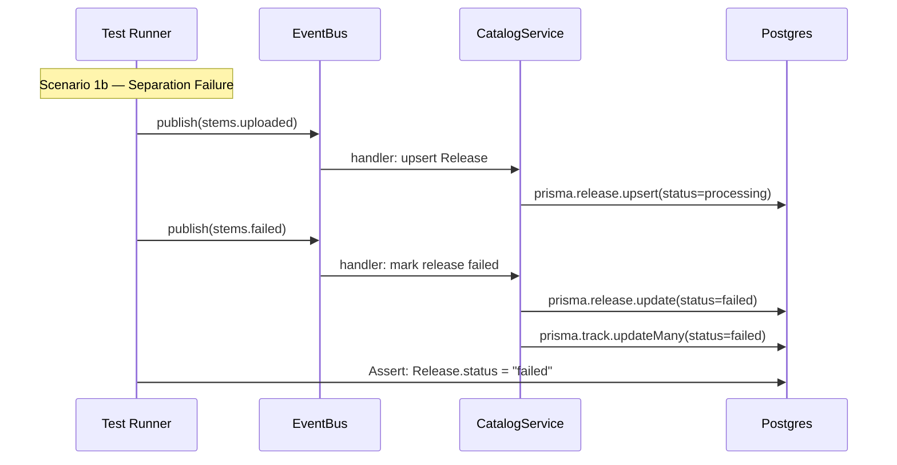
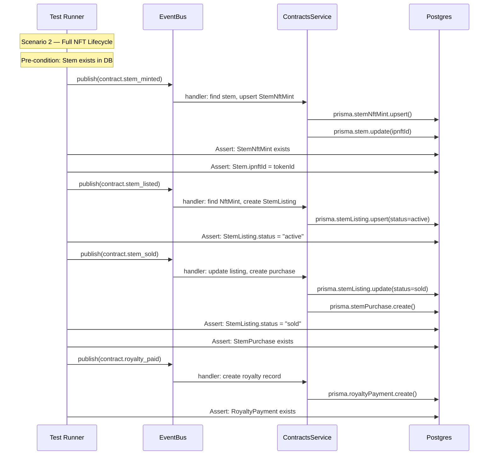
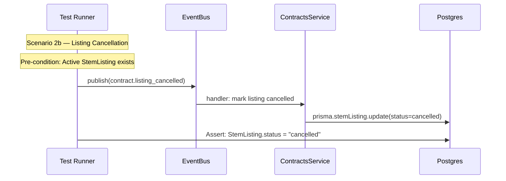
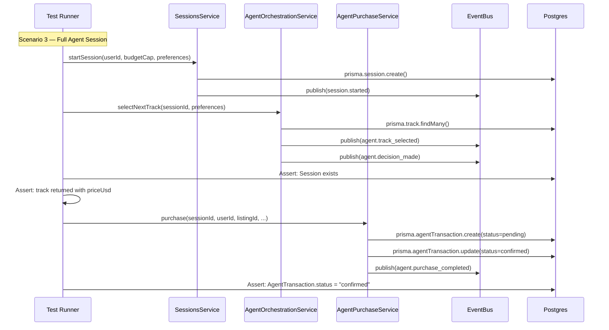
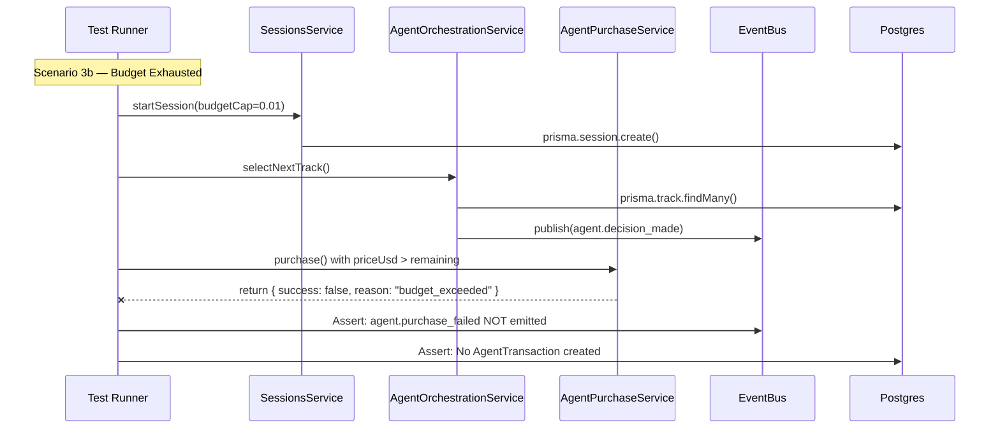
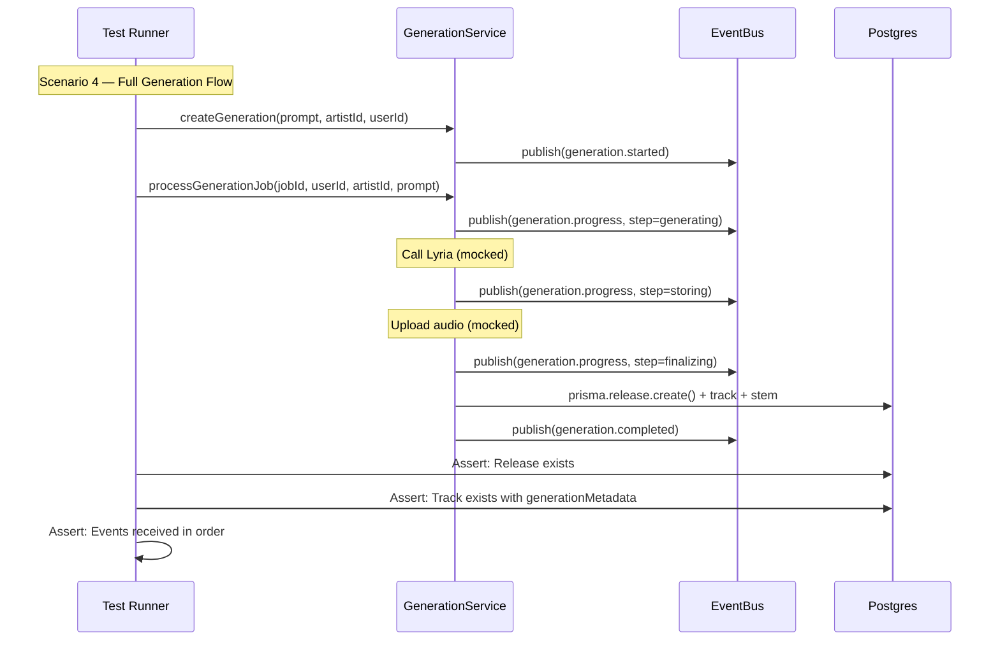

# Choreography Test Scenarios

> **Purpose**: Document the event-driven choreography flows tested by `choreography.integration.spec.ts`.
> After any change to an EventBus publisher or subscriber, check this document to determine if a choreography test needs updating.

---

## How to Use This Document

1. **Adding a new event?** → Add it to the relevant flow diagram below, then add a test assertion
2. **Changing an event handler?** → Find which flow(s) it appears in; update the "DB Assertions" and/or "Event Assertions"
3. **Removing a subscriber?** → Remove it from the diagram and mark the test as `it.skip()` until the flow is redesigned
4. **Adding a new service?** → If it subscribes to existing events, add a new flow or extend an existing one

---

## Flow 1: Release Ingestion Pipeline

### Scenario

An artist uploads audio files. The system processes them through stem separation, persists the catalog data, and signals readiness. This is the most critical flow — it spans **3 services**: `IngestionService` → `CatalogService` → `EventsGateway`.

### Participants

| Service            | Role                                                            | Source File                      |
| ------------------ | --------------------------------------------------------------- | -------------------------------- |
| `IngestionService` | **Publisher** — Emits `stems.uploaded` and `stems.processed`    | `ingestion/ingestion.service.ts` |
| `CatalogService`   | **Subscriber** — Reacts to create/update Release, Tracks, Stems | `catalog/catalog.service.ts`     |
| `EventsGateway`    | **Subscriber** — Forwards `catalog.release_ready` to WebSocket  | `shared/events.gateway.ts`       |

### Sequence Diagram

### DB Assertions

| After Event       | Table     | Field              | Expected       |
| ----------------- | --------- | ------------------ | -------------- |
| `stems.uploaded`  | `Release` | `status`           | `"processing"` |
| `stems.uploaded`  | `Track`   | exists             | `true`         |
| `stems.processed` | `Track`   | `processingStatus` | `"complete"`   |
| `stems.processed` | `Stem`    | count per track    | `≥ 1`          |
| `stems.processed` | `Release` | `status`           | `"ready"`      |
| `stems.failed`    | `Release` | `status`           | `"failed"`     |

### Event Assertions

| Trigger                             | Expected Follow-on Event         |
| ----------------------------------- | -------------------------------- |
| `stems.processed` (all tracks done) | `catalog.track_status` per track |
| `stems.processed` (all tracks done) | `catalog.release_ready`          |

### When to Update

- Change `IngestionService.processUpload()` → update trigger event shape
- Change `CatalogService.onModuleInit()` `stems.uploaded` handler → update DB assertions
- Change `CatalogService.onModuleInit()` `stems.processed` handler → update stem/track assertions
- Add new subscriber to `stems.uploaded` or `stems.processed` → add new assertion block

---

## Flow 2: Contract Indexing → Marketplace Lifecycle

### Scenario

The on-chain indexer detects smart contract events (StemMinted, Listed, Sold, Cancelled, RoyaltyPaid). ContractsService reacts by persisting marketplace records to the database. This tests the full NFT lifecycle.

### Participants

| Service            | Role                                                                             | Source File                      |
| ------------------ | -------------------------------------------------------------------------------- | -------------------------------- |
| `IndexerService`   | **Publisher** — Emits `contract.*` events from on-chain logs                     | `contracts/indexer.service.ts`   |
| `ContractsService` | **Subscriber** — Persists StemNftMint, StemListing, StemPurchase, RoyaltyPayment | `contracts/contracts.service.ts` |

### Sequence Diagram

### DB Assertions

| After Event                  | Table            | Field     | Expected          |
| ---------------------------- | ---------------- | --------- | ----------------- |
| `contract.stem_minted`       | `StemNftMint`    | `tokenId` | matches event     |
| `contract.stem_minted`       | `Stem`           | `ipnftId` | `= event.tokenId` |
| `contract.stem_listed`       | `StemListing`    | `status`  | `"active"`        |
| `contract.stem_sold`         | `StemListing`    | `status`  | `"sold"`          |
| `contract.stem_sold`         | `StemPurchase`   | exists    | `true`            |
| `contract.royalty_paid`      | `RoyaltyPayment` | exists    | `true`            |
| `contract.listing_cancelled` | `StemListing`    | `status`  | `"cancelled"`     |

### When to Update

- Change `ContractsService.subscribeToContractEvents()` → update DB assertions
- Add new contract event (e.g., `contract.royalty_split`) → add new test case
- Change `StemNftMint` / `StemListing` schema → update seeding and assertions

---

## Flow 3: Agent Session Lifecycle

### Scenario

A user starts an AI agent session. The agent selects tracks, makes pricing decisions, and executes purchases. This chain spans **4 services**: `SessionsService` → `AgentOrchestrationService` → `AgentPurchaseService` → `WalletService`.

### Participants

| Service                     | Role                                                                                 | Source File                               |
| --------------------------- | ------------------------------------------------------------------------------------ | ----------------------------------------- |
| `SessionsService`           | **Publisher** — Creates session, emits `session.started`                             | `sessions/sessions.service.ts`            |
| `AgentOrchestrationService` | **Publisher** — Selects tracks, emits `agent.track_selected` + `agent.decision_made` | `sessions/agent_orchestration.service.ts` |
| `AgentPurchaseService`      | **Publisher** — Executes purchase, emits `agent.purchase_completed`                  | `agents/agent_purchase.service.ts`        |
| `WalletService`             | **Side effect** — Budget tracking, emits `wallet.spent`                              | `identity/wallet.service.ts`              |

### Sequence Diagram

### DB Assertions

| After Step                   | Table              | Field          | Expected                            |
| ---------------------------- | ------------------ | -------------- | ----------------------------------- |
| `startSession`               | `Session`          | exists         | `true`                              |
| `startSession`               | `Session`          | `budgetCapUsd` | matches input                       |
| `selectNextTrack`            | —                  | return value   | `{ status: "ok", track, priceUsd }` |
| `purchase` (success)         | `AgentTransaction` | `status`       | `"confirmed"`                       |
| `purchase` (success)         | `AgentTransaction` | `txHash`       | non-null                            |
| `purchase` (budget exceeded) | `AgentTransaction` | —              | not created                         |

### Event Assertions

| After Step           | Expected Event             | Key Fields                             |
| -------------------- | -------------------------- | -------------------------------------- |
| `startSession`       | `session.started`          | `sessionId`, `userId`, `budgetCapUsd`  |
| `selectNextTrack`    | `agent.track_selected`     | `sessionId`, `trackId`                 |
| `selectNextTrack`    | `agent.decision_made`      | `sessionId`, `priceUsd`, `licenseType` |
| `purchase` (success) | `agent.purchase_completed` | `txHash`, `mode: "onchain"`            |

### When to Update

- Change `SessionsService.startSession()` → update session seeding
- Change `AgentOrchestrationService.selectNextTrack()` → update track selection assertions
- Change `AgentPurchaseService.purchase()` → update transaction assertions
- Change wallet budget logic → update budget exhaustion test

---

## Flow 4: AI Generation Pipeline

### Scenario

A user triggers AI music generation. The system enqueues a job, calls Lyria, stores audio, creates DB records, and emits progress events. Tests the full event sequence from `generation.started` to `generation.completed`.

### Participants

| Service             | Role                                                                      | Source File                        |
| ------------------- | ------------------------------------------------------------------------- | ---------------------------------- |
| `GenerationService` | **Publisher** — Enqueues job, processes with Lyria, creates Release+Track | `generation/generation.service.ts` |
| `EventsGateway`     | **Subscriber** — Forwards all `generation.*` events to WebSocket          | `shared/events.gateway.ts`         |

### Sequence Diagram

### Event Assertions (ordered)

| Sequence | Event Name             | Key Fields             |
| :------: | ---------------------- | ---------------------- |
|    1     | `generation.started`   | `prompt`, `userId`     |
|    2     | `generation.progress`  | `step: "generating"`   |
|    3     | `generation.progress`  | `step: "storing"`      |
|    4     | `generation.progress`  | `step: "finalizing"`   |
|    5     | `generation.completed` | `trackId`, `releaseId` |

### DB Assertions

| After Step             | Table     | Field                | Expected                  |
| ---------------------- | --------- | -------------------- | ------------------------- |
| `processGenerationJob` | `Release` | exists               | `true`                    |
| `processGenerationJob` | `Track`   | `generationMetadata` | contains prompt, provider |
| `processGenerationJob` | `Stem`    | `type`               | `"master"`                |

### When to Update

- Change `GenerationService.processGenerationJob()` → update event sequence assertions
- Change `GenerationService.createGeneration()` → update job creation assertions
- Add new progress steps → add to ordered event list
- Change Release schema for AI tracks → update DB assertions

---

## Quick Reference: Event → Handler Map

Use this table to find which choreography test(s) to update when changing an event handler.

| Event Name                   | Publisher                               | Subscriber       | Choreography Flow |
| ---------------------------- | --------------------------------------- | ---------------- | ----------------- |
| `stems.uploaded`             | IngestionService                        | CatalogService   | Flow 1            |
| `stems.processed`            | IngestionService / StemResultSubscriber | CatalogService   | Flow 1            |
| `stems.failed`               | StemResultSubscriber                    | CatalogService   | Flow 1            |
| `catalog.track_status`       | CatalogService                          | EventsGateway    | Flow 1            |
| `catalog.release_ready`      | CatalogService                          | EventsGateway    | Flow 1            |
| `contract.stem_minted`       | IndexerService                          | ContractsService | Flow 2            |
| `contract.stem_listed`       | IndexerService                          | ContractsService | Flow 2            |
| `contract.stem_sold`         | IndexerService                          | ContractsService | Flow 2            |
| `contract.listing_cancelled` | IndexerService                          | ContractsService | Flow 2            |
| `contract.royalty_paid`      | IndexerService                          | ContractsService | Flow 2            |
| `session.started`            | SessionsService                         | EventsGateway    | Flow 3            |
| `agent.track_selected`       | AgentOrchestrationService               | EventsGateway    | Flow 3            |
| `agent.decision_made`        | AgentOrchestrationService               | EventsGateway    | Flow 3            |
| `agent.purchase_completed`   | AgentPurchaseService                    | EventsGateway    | Flow 3            |
| `generation.started`         | GenerationService                       | EventsGateway    | Flow 4            |
| `generation.progress`        | GenerationService                       | EventsGateway    | Flow 4            |
| `generation.completed`       | GenerationService                       | EventsGateway    | Flow 4            |
