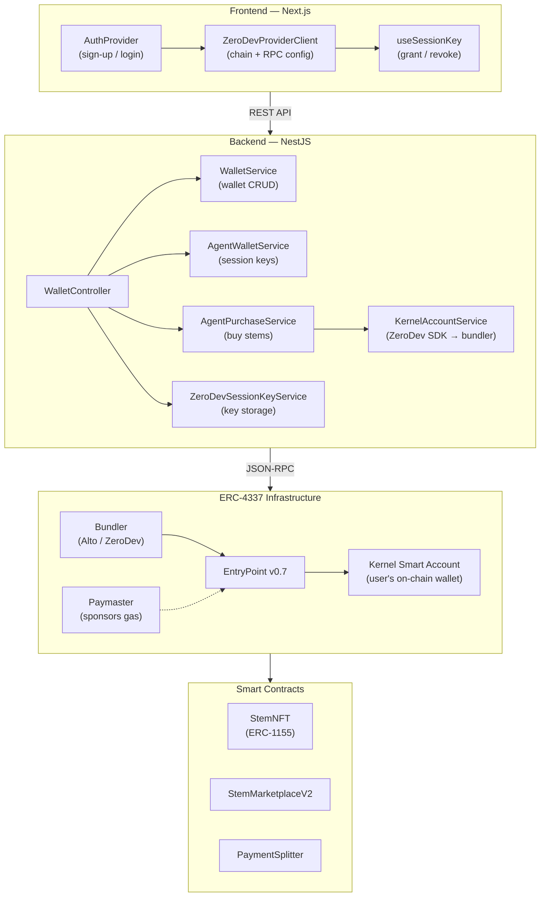
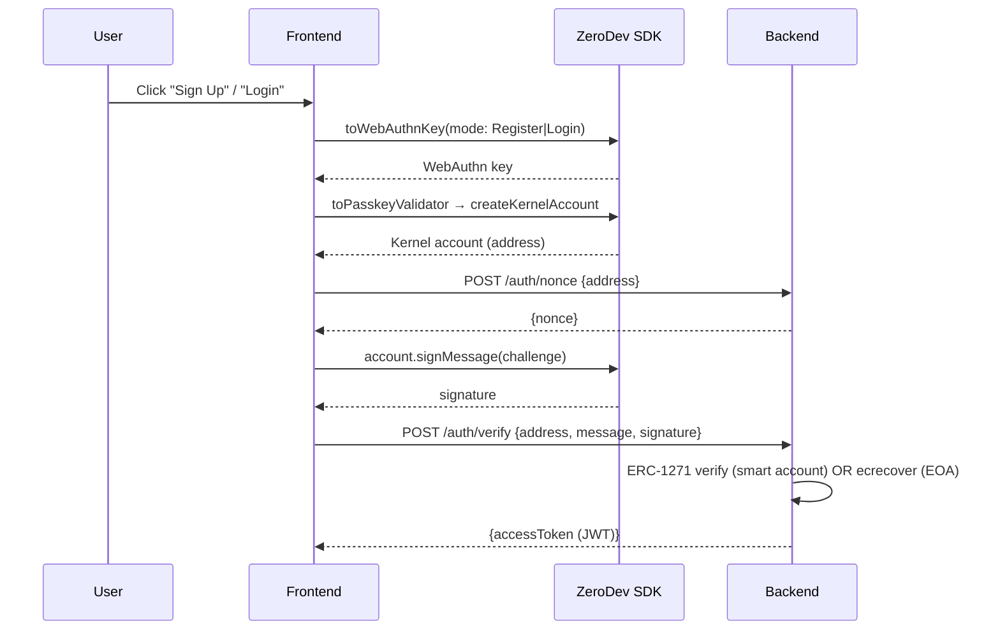
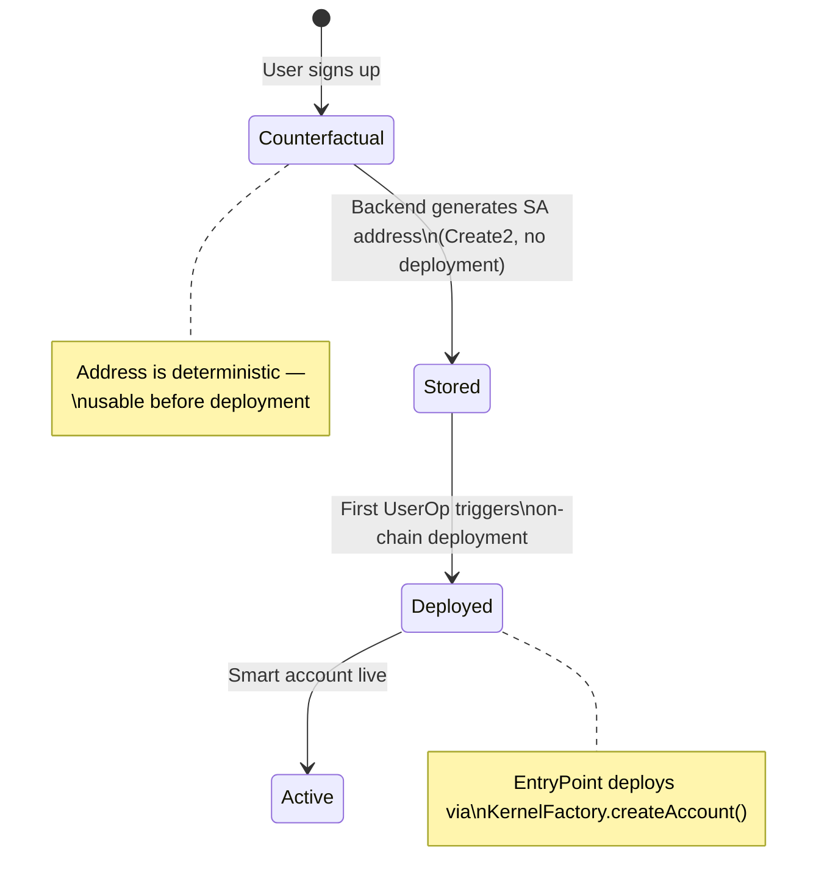
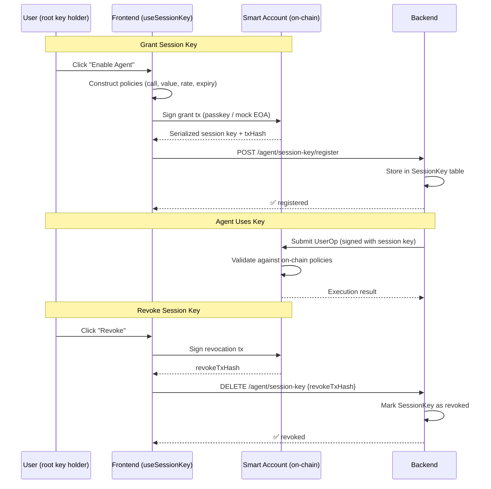
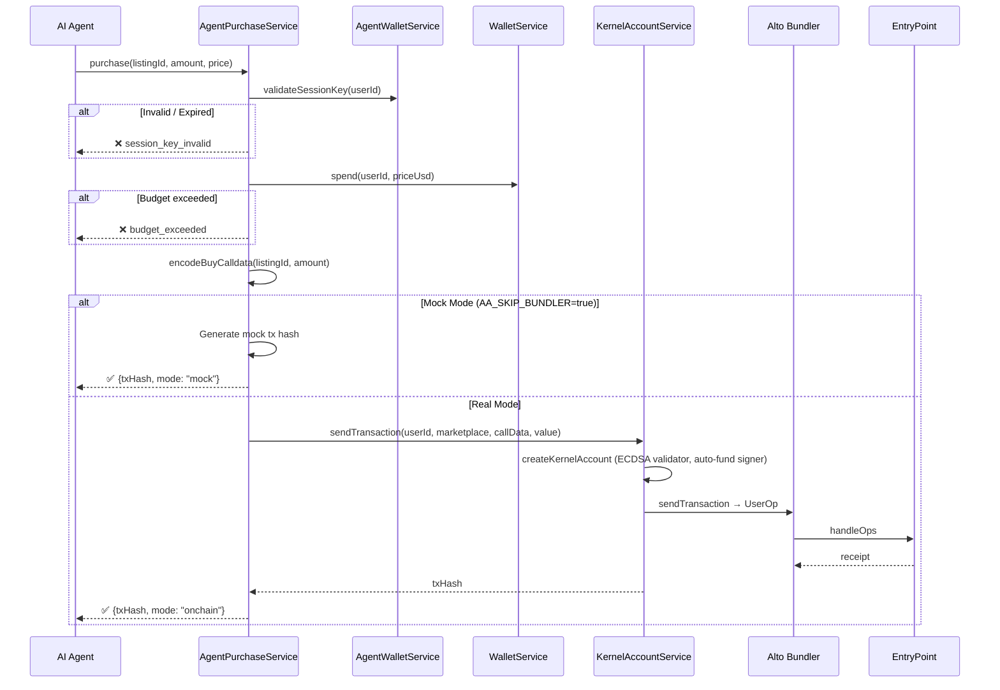

# Account Abstraction Integration

How ERC-4337 smart accounts are integrated into Resonate — from user sign-up to agent-driven purchases.

---

## Architecture Overview

Every Resonate user interacts through a **Kernel v3 Smart Account** (ZeroDev). The system spans four layers:



### Key Contracts

| Contract                  | Purpose                                | Source                                       |
| ------------------------- | -------------------------------------- | -------------------------------------------- |
| **EntryPoint v0.7**       | ERC-4337 singleton, validates UserOps  | `@account-abstraction/core`                  |
| **Kernel v3.1**           | Modular smart account implementation   | `kernel/Kernel.sol`                          |
| **KernelFactory**         | Deterministic smart account deployment | `contracts/src/aa/KernelFactory.sol`         |
| **ECDSAValidator**        | Validates ECDSA signer ownership       | `kernel/validator/ECDSAValidator.sol`        |
| **UniversalSigValidator** | ERC-6492 signature validation          | `contracts/src/aa/UniversalSigValidator.sol` |

---

## Authentication Flow

Users authenticate by signing a challenge with their smart account. Two modes are supported:

### Production (Passkeys + ZeroDev)



### Development (Mock ECDSA)

When `NEXT_PUBLIC_ZERODEV_PROJECT_ID` is absent or `chainId === 31337`:

1. Frontend generates a random EOA private key (persisted in `localStorage` as `mock_pk`)
2. Uses the **EOA address directly** as the user identity (no smart account deployment needed)
3. Backend verifies the EOA signature with standard `ecrecover` (since localhost is unreachable for ERC-1271)
4. JWT is issued for the EOA address

> **Source:** [`AuthProvider.tsx`](../web/src/components/auth/AuthProvider.tsx) — `getOrConnectAccount()` function

---

## Wallet Management

### Data Model

Each user has a `Wallet` record in PostgreSQL:

```
Wallet
├── userId          (FK → User)
├── address         (smart account address, deterministic via Create2)
├── accountType     ("local" | "erc4337")
├── provider        ("local" | "erc4337")
├── balanceUsd      (funded amount)
├── spentUsd        (spent amount)
├── monthlyCapUsd   (spending limit)
├── entryPoint      (EntryPoint address)
├── factory         (KernelFactory address)
├── paymaster       (Paymaster URL)
├── bundler         (Bundler URL)
├── salt            (Create2 salt)
└── ownerAddress    (signer address)
```

### Address Generation

Smart account addresses are **deterministic** — generated at the backend using `Erc4337WalletProvider` without deploying the account on-chain:

```typescript
// backend/src/modules/identity/wallet_providers/erc4337_wallet_provider.ts
// Uses Create2 to derive address from (factory, salt, entryPoint)
// Deployment happens lazily on first UserOperation
```

### Lifecycle



---

## Session Keys (Self-Custodial Agent Delegation)

Session keys allow the AI agent to make purchases **on behalf of the user** without holding the root key.

### Grant & Revoke Flow



### On-Chain Policies

Session keys use ZeroDev Kernel v3's permission plugin stack:

| Policy                | Purpose                                                                                   |
| --------------------- | ----------------------------------------------------------------------------------------- |
| **Call Policy**       | Restricts which contract+function the key can call (e.g., only `StemMarketplaceV2.buy()`) |
| **Value Policy**      | Maximum ETH per transaction                                                               |
| **Rate Limit Policy** | Maximum transactions per time window                                                      |
| **Timestamp Policy**  | Session key expiry date                                                                   |

### Data Model

```
SessionKey
├── id              (CUID)
├── userId          (FK → User)
├── serializedKey   (ZeroDev serialized session key data)
├── permissions     (JSON — policies enforced on-chain)
├── validUntil      (expiry timestamp)
├── txHash          (grant transaction hash)
├── revokedAt       (null if active)
├── revokedTxHash   (revocation transaction hash)
├── createdAt
└── updatedAt
```

### Flow

| Step | Actor           | Action                                                                     |
| ---- | --------------- | -------------------------------------------------------------------------- |
| 1    | User (frontend) | Clicks "Enable Agent" → `useSessionKey.grant()`                            |
| 2    | Frontend        | Constructs session key with policies via ZeroDev SDK                       |
| 3    | User            | Signs the grant transaction (passkey / mock EOA)                           |
| 4    | Frontend        | Sends serialized key to `POST /wallet/agent/session-key/register`          |
| 5    | Backend         | Stores in `SessionKey` table (never creates keys itself)                   |
| 6    | Agent           | Uses stored key for `AgentPurchaseService.purchase()`                      |
| 7    | User (frontend) | Clicks "Revoke" → signs revocation tx → `DELETE /wallet/agent/session-key` |

> **Source:** Frontend [`useSessionKey.ts`](../web/src/hooks/useSessionKey.ts) · Backend [`zerodev_session_key.service.ts`](../backend/src/modules/identity/zerodev_session_key.service.ts)

---

## Agent Purchases

When the AI agent decides to buy a stem, `AgentPurchaseService` executes the purchase:



> The `KernelAccountService` uses `@zerodev/sdk` to create Kernel v3.1 accounts with deterministic ECDSA signers. The SDK handles nonce management, gas estimation, UserOp signing, and account deployment (initCode) automatically.

> **Source:** [`agent_purchase.service.ts`](../backend/src/modules/agents/agent_purchase.service.ts)

---

## API Reference

All endpoints are under `/wallet` and require JWT authentication.

### Smart Account Management

| Method | Endpoint             | Description                      |
| ------ | -------------------- | -------------------------------- |
| `POST` | `/wallet/aa/enable`  | Switch user to ERC-4337 provider |
| `POST` | `/wallet/aa/refresh` | Refresh smart account metadata   |
| `POST` | `/wallet/aa/deploy`  | Deploy smart account on-chain    |
| `GET`  | `/wallet/:userId`    | Get wallet record                |
| `POST` | `/wallet/fund`       | Fund wallet (admin)              |
| `POST` | `/wallet/budget`     | Set monthly spending cap         |

### Agent Wallet

| Method   | Endpoint                             | Description                                          |
| -------- | ------------------------------------ | ---------------------------------------------------- |
| `POST`   | `/wallet/agent/enable`               | Enable agent wallet (issues mock session key in dev) |
| `POST`   | `/wallet/agent/session-key/register` | Register user-granted session key                    |
| `DELETE` | `/wallet/agent/session-key`          | Revoke session key (accepts `revokeTxHash`)          |
| `GET`    | `/wallet/agent/status`               | Get agent wallet + session key status                |
| `GET`    | `/wallet/agent/transactions`         | Get agent purchase history                           |
| `POST`   | `/wallet/agent/purchase`             | Execute agent purchase                               |

### Paymaster (Admin)

| Method | Endpoint                  | Description              |
| ------ | ------------------------- | ------------------------ |
| `POST` | `/wallet/paymaster`       | Configure paymaster      |
| `GET`  | `/wallet/paymaster`       | Get paymaster status     |
| `POST` | `/wallet/paymaster/reset` | Reset paymaster for user |

> **Source:** [`wallet.controller.ts`](../backend/src/modules/identity/wallet.controller.ts)

---

## Environment Variables

### Backend (`backend/.env`)

| Variable             | Purpose                       | Default                                |
| -------------------- | ----------------------------- | -------------------------------------- |
| `AA_ENTRY_POINT`     | EntryPoint v0.7 address       | Set by deploy script                   |
| `AA_FACTORY`         | KernelFactory address         | Set by deploy script                   |
| `AA_KERNEL`          | Kernel implementation address | Set by deploy script                   |
| `AA_ECDSA_VALIDATOR` | ECDSA validator address       | Set by deploy script                   |
| `AA_SIG_VALIDATOR`   | ERC-6492 sig validator        | Set by deploy script                   |
| `AA_CHAIN_ID`        | Chain ID                      | `31337` (local) / `11155111` (Sepolia) |
| `AA_BUNDLER`         | Bundler URL                   | `http://localhost:4337` / ZeroDev URL  |
| `AA_PAYMASTER`       | Paymaster URL                 | Optional                               |
| `AA_SKIP_BUNDLER`    | Skip bundler (mock mode)      | `true`                                 |
| `ZERODEV_PROJECT_ID` | ZeroDev dashboard project ID  | Required for forked Sepolia            |
| `SEPOLIA_RPC_URL`    | Sepolia RPC endpoint          | Required for forked Sepolia            |
| `BLOCK_EXPLORER_URL` | Block explorer for tx links   | `https://sepolia.etherscan.io`         |

### Frontend (`web/.env.local`)

| Variable                         | Purpose                               | Default          |
| -------------------------------- | ------------------------------------- | ---------------- |
| `NEXT_PUBLIC_CHAIN_ID`           | Target chain ID                       | `31337`          |
| `NEXT_PUBLIC_ZERODEV_PROJECT_ID` | ZeroDev project ID (enables passkeys) | None (mock mode) |
| `NEXT_PUBLIC_RPC_URL`            | RPC override (forked Sepolia)         | Chain default    |

---

## Development Modes

| Mode               | Chain      | AA Infra                          | Bundler        | Auth       | Use Case                      |
| ------------------ | ---------- | --------------------------------- | -------------- | ---------- | ----------------------------- |
| **Local-Only**     | `31337`    | Deployed by `DeployLocalAA.s.sol` | Alto (Docker)  | Mock ECDSA | Offline, contract development |
| **Forked Sepolia** | `11155111` | Already on Sepolia (via fork)     | Alto (Docker)  | Mock ECDSA | Session keys, full AA testing |
| **Production**     | `11155111` | Sepolia mainnet                   | ZeroDev hosted | Passkeys   | Live environment              |

See [Local AA Development](local-aa-development.md) for setup instructions.

---

## File Map

| File                                                                       | Layer     | Responsibility                                           |
| -------------------------------------------------------------------------- | --------- | -------------------------------------------------------- |
| `web/src/components/auth/AuthProvider.tsx`                                 | Frontend  | Smart account creation, auth flow, passkey/mock signer   |
| `web/src/components/auth/ZeroDevProviderClient.tsx`                        | Frontend  | ZeroDev SDK config, chain/RPC setup                      |
| `web/src/hooks/useSessionKey.ts`                                           | Frontend  | Session key grant/revoke UI flow                         |
| `web/src/hooks/useAgentWallet.ts`                                          | Frontend  | Agent wallet state management                            |
| `web/src/components/agent/AgentBudgetCard.tsx`                             | Frontend  | Agent budget + session key status UI                     |
| `backend/src/modules/identity/wallet.controller.ts`                        | Backend   | REST API (20+ endpoints)                                 |
| `backend/src/modules/identity/wallet.service.ts`                           | Backend   | Wallet CRUD, budget tracking, deployment                 |
| `backend/src/modules/identity/wallet_providers/erc4337_wallet_provider.ts` | Backend   | ERC-4337 address generation                              |
| `backend/src/modules/identity/zerodev_session_key.service.ts`              | Backend   | Session key storage + retrieval                          |
| `backend/src/modules/identity/kernel_account.service.ts`                   | Backend   | ZeroDev Kernel account creation + tx sending via bundler |
| `backend/src/modules/agents/agent_wallet.service.ts`                       | Backend   | Agent wallet enable/disable, session key registration    |
| `backend/src/modules/agents/agent_purchase.service.ts`                     | Backend   | Agent purchase execution via KernelAccountService        |
| `backend/src/modules/identity/erc4337/erc4337_client.ts`                   | Backend   | Bundler JSON-RPC client (low-level)                      |
| `backend/src/modules/identity/paymaster.service.ts`                        | Backend   | Gas sponsorship                                          |
| `contracts/script/DeployLocalAA.s.sol`                                     | Contracts | Deploy AA infra to local Anvil                           |
| `contracts/src/aa/KernelFactory.sol`                                       | Contracts | Smart account factory                                    |
| `contracts/src/aa/UniversalSigValidator.sol`                               | Contracts | ERC-6492 signature validation                            |
| `scripts/update-aa-config.sh`                                              | Infra     | Auto-configure `.env` from deployed contracts            |
