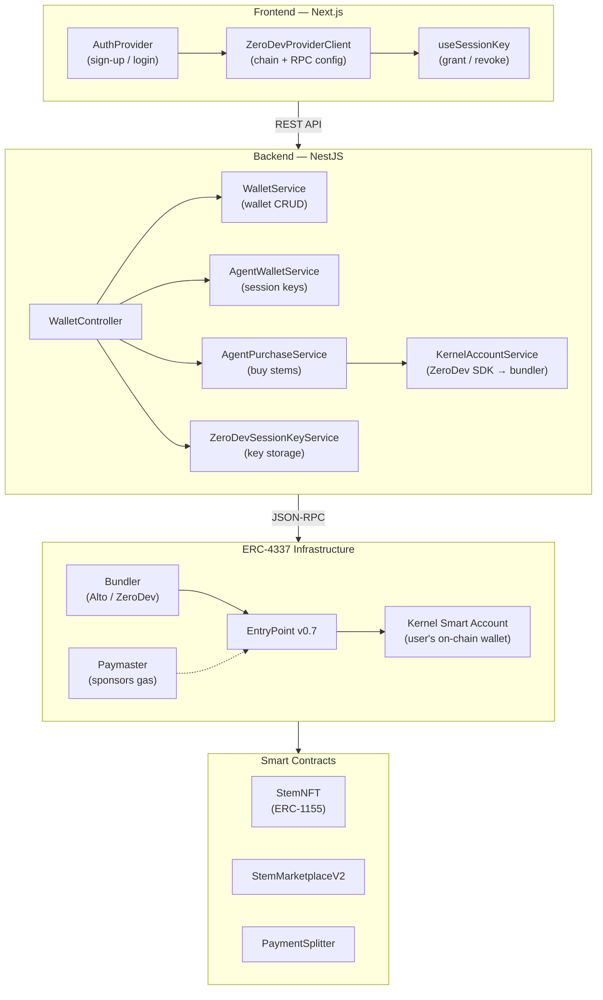
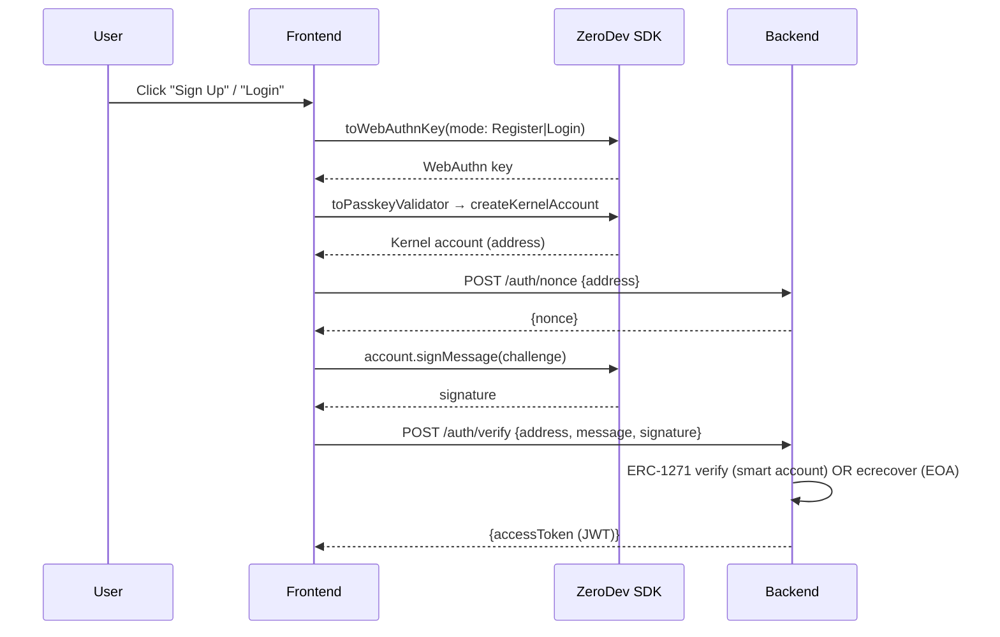
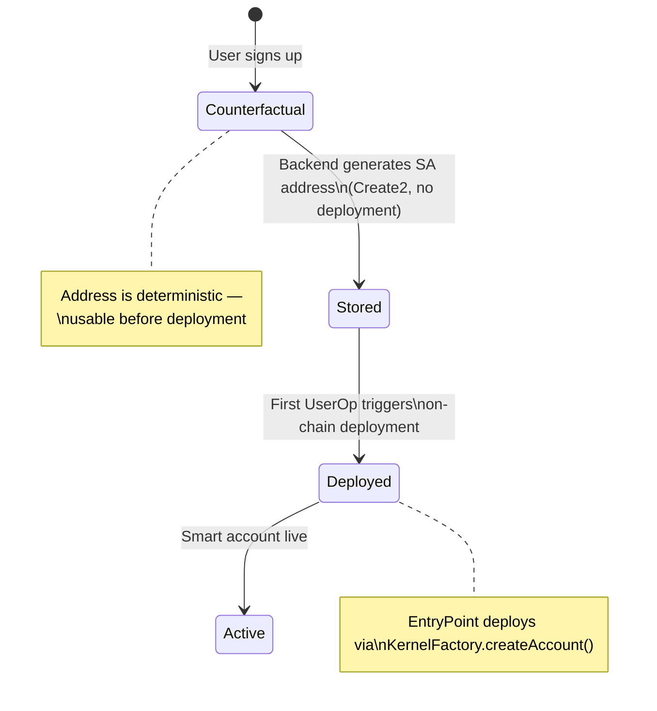
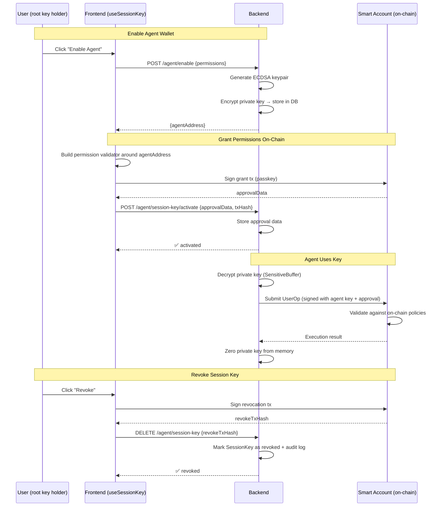
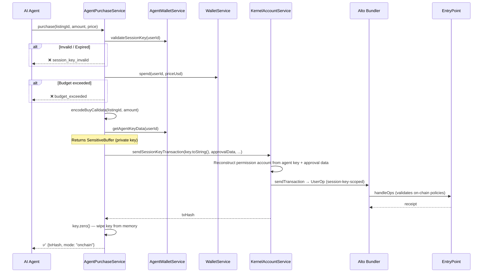

# Account Abstraction Integration

How ERC-4337 smart accounts are integrated into Resonate — from user sign-up to agent-driven purchases.

---

## Architecture Overview

Every Resonate user interacts through a **Kernel v3 Smart Account** (ZeroDev). The system spans four layers:



### Key Contracts

| Contract                  | Purpose                                | Source                                       |
| ------------------------- | -------------------------------------- | -------------------------------------------- |
| **EntryPoint v0.7**       | ERC-4337 singleton, validates UserOps  | `@account-abstraction/core`                  |
| **Kernel v3.1**           | Modular smart account implementation   | `kernel/Kernel.sol`                          |
| **KernelFactory**         | Deterministic smart account deployment | `contracts/src/aa/KernelFactory.sol`         |
| **ECDSAValidator**        | Validates ECDSA signer ownership       | `kernel/validator/ECDSAValidator.sol`        |
| **UniversalSigValidator** | ERC-6492 signature validation          | `contracts/src/aa/UniversalSigValidator.sol` |

---

## Authentication Flow

Users authenticate by signing a challenge with their smart account. Two modes are supported:

### Production (Passkeys + ZeroDev)



### Development (Self-Hosted Passkeys)

When `NEXT_PUBLIC_ZERODEV_PROJECT_ID` is absent:

1. Frontend uses the **same WebAuthn Passkey flow** as production
2. Passkey server URL switches from ZeroDev hosted to **self-hosted on the NestJS backend** (`/api/zerodev/self-hosted`)
3. A real Kernel v3 smart account is created from the passkey validator
4. Backend verifies the smart account signature (ERC-1271) or falls back to `ecrecover`
5. JWT is issued for the smart account address

> **Key change (PR #382):** The old "Mock ECDSA" flow (`mock_pk` in localStorage, random EOA) has been removed. Local dev now validates the same auth path as production — only the passkey server URL differs.

> **Source:** [`AuthProvider.tsx`](../web/src/components/auth/AuthProvider.tsx) — `getOrConnectAccount()` function

---

## Wallet Management

### Data Model

Each user has a `Wallet` record in PostgreSQL:

```
Wallet
├── userId          (FK → User)
├── address         (smart account address, deterministic via Create2)
├── accountType     ("local" | "erc4337")
├── provider        ("local" | "erc4337")
├── balanceUsd      (funded amount)
├── spentUsd        (spent amount)
├── monthlyCapUsd   (spending limit)
├── entryPoint      (EntryPoint address)
├── factory         (KernelFactory address)
├── paymaster       (Paymaster URL)
├── bundler         (Bundler URL)
├── salt            (Create2 salt)
└── ownerAddress    (signer address)
```

### Address Generation

Smart account addresses are **deterministic** — generated at the backend using `Erc4337WalletProvider` without deploying the account on-chain:

```typescript
// backend/src/modules/identity/wallet_providers/erc4337_wallet_provider.ts
// Uses Create2 to derive address from (factory, salt, entryPoint)
// Deployment happens lazily on first UserOperation
```

### Lifecycle



---

## Session Keys (Agent-Owned Key Model)

The AI agent owns an ECDSA keypair. The private key **never leaves the backend**. The user grants on-chain permissions to the agent's public address via their passkey.

> **Security**: The private key is encrypted at rest (AES-256-GCM or GCP Cloud KMS), wrapped in a `SensitiveBuffer` during use (zeroed after signing), and every access is audit-logged. See [Agent Wallet Security](agent-wallet-security.md) for full details.

### Agent-Owned Key Flow



### On-Chain Policies

Session keys use ZeroDev Kernel v3's permission plugin stack:

| Policy                | Purpose                                                                                   |
| --------------------- | ----------------------------------------------------------------------------------------- |
| **Call Policy**       | Restricts which contract+function the key can call (e.g., only `StemMarketplaceV2.buy()`) |
| **Value Policy**      | Maximum ETH per transaction                                                               |
| **Rate Limit Policy** | Maximum transactions per time window                                                      |
| **Timestamp Policy**  | Session key expiry date                                                                   |

### Data Model

```
SessionKey
├── id              (UUID)
├── userId          (FK → User)
├── agentPrivateKey (AES-256-GCM encrypted — never sent to frontend)
├── agentAddress    (public address of the agent's key)
├── approvalData    (serialized permission approval from user's passkey)
├── permissions     (JSON — policies enforced on-chain)
├── validUntil      (expiry timestamp)
├── txHash          (grant transaction hash)
├── revokedAt       (null if active)
├── revokeTxHash    (revocation transaction hash)
├── createdAt
└── updatedAt

KeyAuditLog (append-only)
├── id              (UUID)
├── userId          (who)
├── action          (decrypt, sign, rotate, revoke, enable, activate)
├── agentAddress    (which key)
├── context         (JSON — txHash, listingId, reason, etc.)
└── createdAt       (when)
```

### Flow

| Step | Actor           | Action                                                                     |
| ---- | --------------- | -------------------------------------------------------------------------- |
| 1    | User (frontend) | Clicks "Enable Agent" → `useAgentWallet.enable()`                          |
| 2    | Backend         | Generates ECDSA keypair, encrypts private key, stores in DB                |
| 3    | Backend         | Returns `agentAddress` to frontend                                         |
| 4    | Frontend        | Builds permission validator around `agentAddress` via ZeroDev SDK          |
| 5    | User            | Signs the grant transaction (passkey)                                      |
| 6    | Frontend        | Sends `approvalData` to `POST /wallet/agent/session-key/activate`          |
| 7    | Agent           | Uses decrypted key for `AgentPurchaseService.purchase()`, then zeros it    |
| 8    | User (frontend) | Clicks "Revoke" → signs revocation tx → `DELETE /wallet/agent/session-key` |

> **Source:** Frontend [`useSessionKey.ts`](../web/src/hooks/useSessionKey.ts) · Backend [`zerodev_session_key.service.ts`](../backend/src/modules/identity/zerodev_session_key.service.ts) · Security [`agent-wallet-security.md`](agent-wallet-security.md)

---

## Agent Purchases

When the AI agent decides to buy a stem, `AgentPurchaseService` executes the purchase:



> The `KernelAccountService` reconstructs the permission account from the agent's private key + user's approval data. The session key carries on-chain policies, so the bundler enforces constraints automatically.

> **Source:** [`agent_purchase.service.ts`](../backend/src/modules/agents/agent_purchase.service.ts)

---

## API Reference

All endpoints are under `/wallet` and require JWT authentication.

### Smart Account Management

| Method | Endpoint             | Description                      |
| ------ | -------------------- | -------------------------------- |
| `POST` | `/wallet/aa/enable`  | Switch user to ERC-4337 provider |
| `POST` | `/wallet/aa/refresh` | Refresh smart account metadata   |
| `GET`  | `/wallet/:userId`    | Get wallet record                |
| `POST` | `/wallet/fund`       | Fund wallet (admin)              |
| `POST` | `/wallet/budget`     | Set monthly spending cap         |

### Agent Wallet

| Method   | Endpoint                             | Description                                              |
| -------- | ------------------------------------ | -------------------------------------------------------- |
| `POST`   | `/wallet/agent/enable`               | Enable agent wallet — generates agent keypair on backend |
| `POST`   | `/wallet/agent/session-key/activate` | Store user's on-chain approval data for the agent key    |
| `DELETE` | `/wallet/agent/session-key`          | Revoke session key (accepts `revokeTxHash`)              |
| `POST`   | `/wallet/agent/rotate`               | Rotate agent key — new keypair, revoke old, re-approve   |
| `GET`    | `/wallet/agent/status`               | Get agent wallet + session key status                    |
| `GET`    | `/wallet/agent/transactions`         | Get agent purchase history                               |
| `POST`   | `/wallet/agent/purchase`             | Execute agent purchase                                   |

### Paymaster (Admin)

| Method | Endpoint                  | Description              |
| ------ | ------------------------- | ------------------------ |
| `POST` | `/wallet/paymaster`       | Configure paymaster      |
| `GET`  | `/wallet/paymaster`       | Get paymaster status     |
| `POST` | `/wallet/paymaster/reset` | Reset paymaster for user |

> **Source:** [`wallet.controller.ts`](../backend/src/modules/identity/wallet.controller.ts)

---

## Environment Variables

### Backend (`backend/.env`)

| Variable                   | Purpose                                                               | Default                                |
| -------------------------- | --------------------------------------------------------------------- | -------------------------------------- |
| `AA_ENTRY_POINT`           | EntryPoint v0.7 address                                               | Set by deploy script                   |
| `AA_FACTORY`               | KernelFactory address                                                 | Set by deploy script                   |
| `AA_KERNEL`                | Kernel implementation address                                         | Set by deploy script                   |
| `AA_ECDSA_VALIDATOR`       | ECDSA validator address                                               | Set by deploy script                   |
| `AA_SIG_VALIDATOR`         | ERC-6492 sig validator                                                | Set by deploy script                   |
| `AA_CHAIN_ID`              | Chain ID                                                              | `31337` (local) / `11155111` (Sepolia) |
| `AA_BUNDLER`               | Bundler URL                                                           | `http://localhost:4337` / ZeroDev URL  |
| `AA_PAYMASTER`             | Paymaster URL                                                         | Optional                               |
| `AA_SKIP_BUNDLER`          | Skip bundler for non-session-key txs (deprecated for agent purchases) | `false`                                |
| `AA_STRICT_BUNDLER`        | Throw on bundler failure                                              | `false`                                |
| `AA_STRICT_MODE`           | No fallbacks, mocks, or auto-funding                                  | `false`                                |
| `ZERODEV_PROJECT_ID`       | ZeroDev dashboard project ID                                          | Required for forked Sepolia            |
| `SEPOLIA_RPC_URL`          | Sepolia RPC endpoint                                                  | Required for forked Sepolia            |
| `BLOCK_EXPLORER_URL`       | Block explorer for tx links                                           | `https://sepolia.etherscan.io`         |
| `KMS_PROVIDER`             | Agent key encryption provider: `local` or `gcp-kms`                   | `local`                                |
| `AGENT_KEY_ENCRYPTION_KEY` | 64-char hex key for local AES-256-GCM encryption                      | Required when `KMS_PROVIDER=local`     |
| `GCP_KMS_KEY_NAME`         | Full GCP KMS CryptoKey resource name                                  | Required when `KMS_PROVIDER=gcp-kms`   |

### Frontend (`web/.env.local`)

| Variable                         | Purpose                                                         | Default                        |
| -------------------------------- | --------------------------------------------------------------- | ------------------------------ |
| `NEXT_PUBLIC_CHAIN_ID`           | Target chain ID                                                 | `31337`                        |
| `NEXT_PUBLIC_ZERODEV_PROJECT_ID` | ZeroDev project ID — if set, uses ZeroDev hosted passkey server | None (uses self-hosted server) |
| `NEXT_PUBLIC_RPC_URL`            | RPC override (forked Sepolia)                                   | Chain default                  |

---

## Development Modes

| Mode               | Chain      | AA Infra                          | Bundler        | Auth                         | Paymaster          | Use Case                      |
| ------------------ | ---------- | --------------------------------- | -------------- | ---------------------------- | ------------------ | ----------------------------- |
| **Local-Only**     | `31337`    | Deployed by `DeployLocalAA.s.sol` | Alto (Docker)  | Passkeys (self-hosted)       | ❌ None            | Offline, contract development |
| **Forked Sepolia** | `11155111` | Already on Sepolia (via fork)     | Alto (Docker)  | Passkeys (self-hosted or ZD) | ✅ ZeroDev testnet | Session keys, full AA testing |
| **Production**     | `11155111` | Sepolia mainnet                   | ZeroDev hosted | Passkeys (ZeroDev)           | ✅ ZeroDev         | Live environment              |

See [Local AA Development](local-aa-development.md) for setup instructions.

---

## File Map

| File                                                                       | Layer     | Responsibility                                           |
| -------------------------------------------------------------------------- | --------- | -------------------------------------------------------- |
| `web/src/components/auth/AuthProvider.tsx`                                 | Frontend  | Smart account creation, auth flow, passkey/mock signer   |
| `web/src/components/auth/ZeroDevProviderClient.tsx`                        | Frontend  | ZeroDev SDK config, chain/RPC setup                      |
| `web/src/hooks/useSessionKey.ts`                                           | Frontend  | Session key grant/revoke UI flow                         |
| `web/src/hooks/useAgentWallet.ts`                                          | Frontend  | Agent wallet state management                            |
| `web/src/components/agent/AgentBudgetCard.tsx`                             | Frontend  | Agent budget + session key status UI                     |
| `backend/src/modules/identity/wallet.controller.ts`                        | Backend   | REST API (20+ endpoints)                                 |
| `backend/src/modules/identity/wallet.service.ts`                           | Backend   | Wallet CRUD, budget tracking, deployment                 |
| `backend/src/modules/identity/wallet_providers/erc4337_wallet_provider.ts` | Backend   | ERC-4337 address generation                              |
| `backend/src/modules/identity/zerodev_session_key.service.ts`              | Backend   | Agent-owned key management + key rotation                |
| `backend/src/modules/identity/kernel_account.service.ts`                   | Backend   | ZeroDev Kernel account creation + tx sending via bundler |
| `backend/src/modules/agents/agent_wallet.service.ts`                       | Backend   | Agent wallet enable/disable, key rotation                |
| `backend/src/modules/agents/agent_purchase.service.ts`                     | Backend   | Agent purchase execution with zero-after-use keys        |
| `backend/src/modules/shared/crypto.service.ts`                             | Backend   | AES-256-GCM / GCP KMS encryption for agent keys          |
| `backend/src/modules/shared/sensitive_buffer.ts`                           | Backend   | Zero-after-use key wrapper                               |
| `backend/src/modules/shared/key_audit.service.ts`                          | Backend   | Append-only audit log for key access                     |
| `backend/src/modules/identity/erc4337/erc4337_client.ts`                   | Backend   | Bundler JSON-RPC client (low-level)                      |
| `backend/src/modules/identity/paymaster.service.ts`                        | Backend   | Gas sponsorship                                          |
| `contracts/script/DeployLocalAA.s.sol`                                     | Contracts | Deploy AA infra to local Anvil                           |
| `contracts/src/aa/KernelFactory.sol`                                       | Contracts | Smart account factory                                    |
| `contracts/src/aa/UniversalSigValidator.sol`                               | Contracts | ERC-6492 signature validation                            |
| `contracts/scripts/update-aa-config.sh`                                    | Contracts | Auto-configure `.env` from deployed contracts            |
| `backend/scripts/generate-agent-encryption-key.sh`                         | Backend   | Generate AES-256 encryption key for agent keys           |
| `docs/security/agent-wallet-security.md`                                   | Docs      | Agent key security architecture                          |
