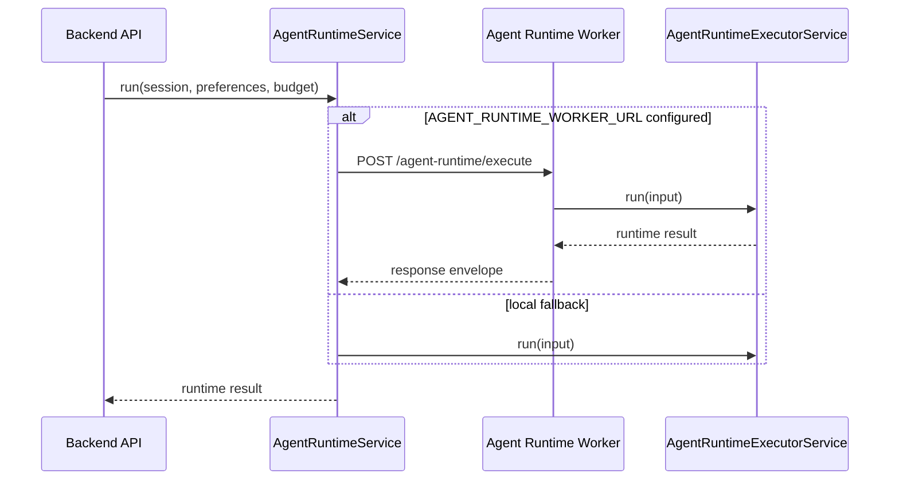

# Agent Runtime Worker

The commerce-agent runtime can run in-process with the backend or through a
separate NestJS worker process. The backend keeps `AgentRuntimeService` as the
canonical caller-facing entrypoint, while `AgentRuntimeExecutorService` owns the
local ADK / Vertex / LangGraph / deterministic fallback execution path.



## Process

Run the standard backend:

```bash
cd backend
npm run start:dev
```

Run the worker as a separate process:

```bash
cd backend
PORT=3002 npm run start:agent-worker:dev
```

Point the backend at the worker:

```env
AGENT_RUNTIME_WORKER_URL=http://localhost:3002
INTERNAL_SERVICE_KEY=<shared-internal-key>
```

## Contract

The worker exposes:

```http
POST /agent-runtime/execute
```

Request body:

```json
{
  "requestId": "optional-request-id",
  "input": {
    "sessionId": "session-1",
    "userId": "user-1",
    "recentTrackIds": [],
    "budgetRemainingUsd": 1,
    "preferences": {}
  }
}
```

Response body:

```json
{
  "status": "ok",
  "requestId": "optional-request-id",
  "sessionId": "session-1",
  "userId": "user-1",
  "result": { "status": "approved" },
  "timingMs": 42,
  "executedAt": "2026-04-26T00:00:00.000Z"
}
```

If `INTERNAL_SERVICE_KEY` is configured, callers must send it as
`x-internal-service-key`. In production, the worker refuses requests unless the
secret is configured.

## Fallback

When `AGENT_RUNTIME_WORKER_URL` is unset, the backend executes the runtime
in-process. When the worker is configured but unavailable, the backend falls
back in-process unless `AGENT_RUNTIME_WORKER_REQUIRED=true`.
