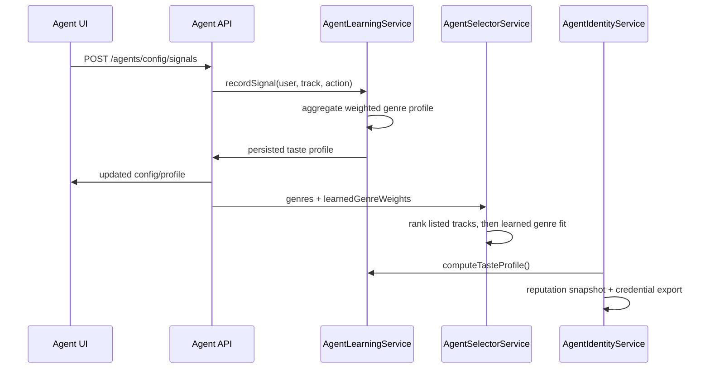

# Agent Learning Loop

Issue: [#290](https://github.com/akoita/resonate/issues/290)

The agent learning loop turns user and agent behavior into a durable taste
profile. The profile is stored on `AgentConfig`, shown in the dashboard, fed
back into selector ranking, and reused by the local identity/reputation layer
as the off-chain precursor to ERC-8004 attestations.

## Data Model

`AgentSignal` records every learning event:

- `userId`
- `sessionId`
- `trackId`
- `action`: `accept`, `skip`, `replay`, `add_to_playlist`, or `purchase`
- `weight`: `purchase=5`, `add_to_playlist=3`, `replay=2`, `accept=1`,
  `skip=-1`
- optional `metadata`

`AgentConfig` stores the latest aggregate:

- `learnedTasteProfile`
- `tasteScore`
- `tasteUpdatedAt`

## Flow

## Scoring

Taste score is deterministic:

- diversity: genres explored
- depth: accumulated positive signal weight
- acceptance: positive versus skipped signals
- consistency: strength of the top learned genre

The score is local and off-chain today. Later ERC-8004 work can attest the
profile or a hash of it without changing the signal collection contract.
