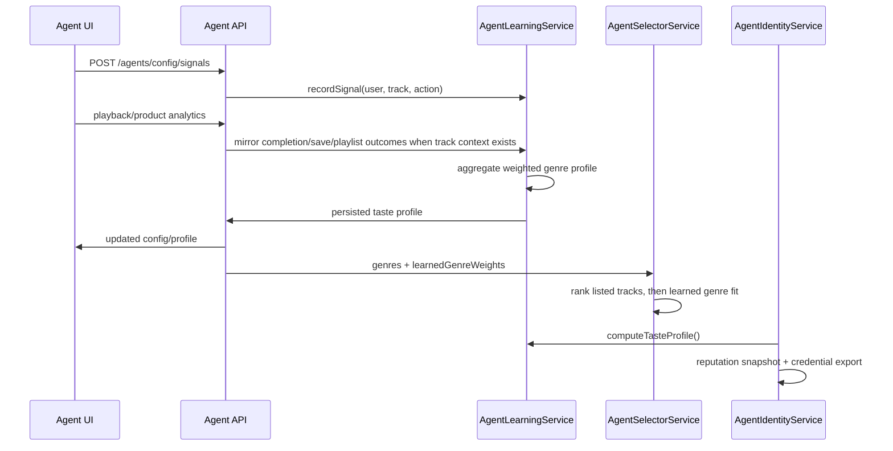

# Agent Learning Loop

Issue: [#290](https://github.com/akoita/resonate/issues/290)

The agent learning loop turns user and agent behavior into a durable taste
profile. The profile is stored on `AgentConfig`, shown in the dashboard, fed
back into selector ranking, and reused by the local identity/reputation layer
as the off-chain precursor to ERC-8004 attestations.

## Data Model

`AgentSignal` records every learning event:

- `userId`
- `sessionId`
- `trackId`
- `action`: `accept`, `skip`, `complete`, `save`, `replay`,
  `add_to_playlist`, or `purchase`
- `weight`: `purchase=5`, `save=3`, `add_to_playlist=3`, `replay=2`,
  `complete=1.5`, `accept=1`, `skip=-1`
- optional `metadata` using `agent-signal-metadata/v1`

Signal metadata is intentionally bounded and privacy-safe. The stable fields
are:

- session context: `sessionIntent`, `sessionIntentName`, `mood`, `vibe`,
  `energy`, `genres`, `licenseType`, `queueStyle`, and `startSource`
- source context: `source`, `filterKind`, `runtime`, and compact
  recommendation score/explanation summaries
- outcome context under `outcome`: `type`, `firstPick`, `completionRatio`,
  `durationMs`, `sessionDurationMs`, `priceUsd`, and coarse `status`

Metadata must not include raw private history, wallet addresses, emails, URLs,
auth/session secrets, exact location, or free-form user text.

`AgentConfig` stores the latest aggregate:

- `learnedTasteProfile`
- `tasteScore`
- `tasteUpdatedAt`

## Flow

## Scoring

Taste score is deterministic:

- diversity: genres explored
- depth: accumulated positive signal weight
- acceptance: positive versus skipped signals
- consistency: strength of the top learned genre

The score is local and off-chain today. Later ERC-8004 work can attest the
profile or a hash of it without changing the signal collection contract.

## Session Intent Feedback

Session Intent presets and Home vibe sessions now write their intent, mood,
energy, queue style, license posture, and start source into `AgentSignal`
metadata when the agent accepts a first pick or a user requests the next pick.
Playback completions and library saves are mirrored from analytics into
`complete` and `save` signals when the authenticated user and catalog track are
known. Stopping an AI DJ session annotates existing signals from that session
with a coarse duration outcome.
