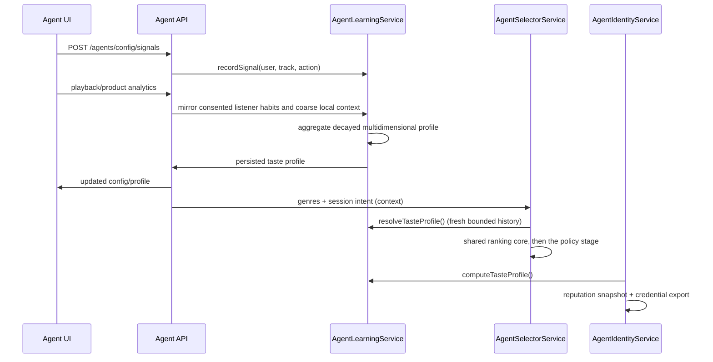

# Agent Learning Loop

> **Frozen (ADR-TE-6, 2026-09-30).** ERC-8004 identity and reputation publishing and on-chain curator agents proved the technology but serve no current customer. The code stays behind `ERC8004_ENABLED` and `ERC8004_REPUTATION_SCHEDULER_ENABLED` (both default off); no new work without a new ADR naming a user and a revenue line. The learning loop and taste score are not frozen; only attesting them on-chain is. See [ADR-TE-6](../strategy/taste-engine-decisions.md).

Issue: [#290](https://github.com/akoita/resonate/issues/290)

The agent learning loop turns user and agent behavior into a durable taste
profile. The profile is stored on `AgentConfig`, shown in the dashboard, fed
back into selector ranking, and reused by the local identity/reputation layer
as the off-chain precursor to ERC-8004 attestations.

## Data Model

`AgentSignal` records every learning event:

- `userId`
- `sessionId`
- `trackId`
- `action`: `accept`, `skip`, `complete`, `save`, `replay`,
  `loop`, `unsave`, `add_to_playlist`, or `purchase`
- `weight`: `purchase=5`, `save=3`, `add_to_playlist=3`, `replay=2`,
  `complete=1.5`, `accept=1`, `skip=-1`, `loop=2.5`, `unsave=-2`
- optional `metadata` using `agent-signal-metadata/v1`

Signal metadata is intentionally bounded and privacy-safe. The stable fields
are:

- session context: `sessionIntent`, `sessionIntentName`, `mood`, `vibe`,
  `energy`, `genres`, `licenseType`, `queueStyle`, and `startSource`
- source context: `source`, `filterKind`, `runtime`, and compact
  recommendation score/explanation summaries
- outcome context under `outcome`: `type`, `firstPick`, `completionRatio`,
  `durationMs`, `sessionDurationMs`, `priceUsd`, and coarse `status`

Metadata must not include raw private history, wallet addresses, emails, URLs,
auth/session secrets, exact location, or free-form user text.

`AgentConfig` stores the latest aggregate:

- `learnedTasteProfile`
- `tasteScore`
- `tasteUpdatedAt`

## Flow

```mermaid
sequenceDiagram
  participant UI as Agent UI
  participant API as Agent API
  participant Learn as AgentLearningService
  participant Selector as AgentSelectorService
  participant Identity as AgentIdentityService

  UI->>API: POST /agents/config/signals
  API->>Learn: recordSignal(user, track, action)
  UI->>API: playback/product analytics
  API->>Learn: mirror consented listener habits and coarse local context
  Learn->>Learn: aggregate decayed multidimensional profile
  Learn->>API: persisted taste profile
  API->>UI: updated config/profile
  API->>Selector: genres + session intent (context)
  Selector->>Learn: resolveTasteProfile() (fresh bounded history)
  Selector->>Selector: shared ranking core, then the policy stage
  Identity->>Learn: computeTasteProfile()
  Identity->>Identity: reputation snapshot + credential export
```

## Profile dimensions and bounds (#2063)

The v2 aggregate retains v1 fields and adds `moodWeights`, `artistWeights`,
`energyBandWeights`, `tempoBandWeights` and `contextWeights`. Context keys join
an hour bucket and weekday kind; each contains genre and mood weights. Release
metadata supplies genre/moods and credited artists; current original full-mix
features supply audio bands through the measured-feature reader. Inferred
metadata cannot supply audio preferences.

Configuration bounds reads to 500 newest signals within 730 days and sets
half-lives of 60 days for behavioral signals and 365 days for purchase, pledge
and collect. Controls apply before aggregation: reset filters history, hidden
genre/artist tracks are excluded, hidden moods are removed, and declared
multipliers govern each applicable dimension and context. Read-time computation
keeps decay and controls current. No schema migration or new raw history store
is required. See [habit profile v2](../features/agent_taste_intelligence.md#habit-profile-v2-2063).

## Scoring

Taste score is deterministic:

- diversity: genres explored
- depth: accumulated positive signal weight
- acceptance: positive versus skipped signals
- consistency: strength of the top learned genre

The score is local and off-chain today. Later ERC-8004 work can attest the
profile or a hash of it without changing the signal collection contract.

## One Core, One Profile, One Policy (#1456, #1957)

The learned profile is not DJ-private. The AI DJ selector and the Home feed
(`GET /recommendations/:userId`) consume it the same way:

1. **One ranking core.** Both score candidates with `DiscoveryRankingService`.
   Nothing about payment, placement or stems for sale is an input (ADR-TE-2
   rule 6), so a listing never changes a listener's ranking on either surface.
2. **One taste profile.** `resolveAgentTasteProfile` computes v2 weights from
   bounded signal history with current controls and time decay. Signal writes
   persist the aggregate on `AgentConfig.learnedTasteProfile`; a valid v1
   snapshot remains readable when no history exists to upgrade it. The DJ and
   Home pass the same `genreWeights` to the core. Session start merges the same
   `favoredGenres` into queries. Mood, credited artist, measured energy/tempo
   and coarse contextual weights enrich the profile and Taste Memory summaries;
   this slice does not add new ranking dimensions or listening lanes.
3. **One served history.** Home writes `RecommendationProfile.servedTrackIds`;
   the DJ reads it and demotes already-served tracks (not an exclusion).
4. **Session intent is context.** Intent, mood and queue style travel with the
   request into the core as `sessionIntent`. A match earns a
   `session_intent_fit` signal for this request only. Signal metadata still
   records the intent as session context for the journal, but the intent itself
   is never folded into `learnedTasteProfile`.
5. **One policy stage.** After scoring, `applyDiscoveryPolicy` removes hidden
   and fully AI-generated tracks, reserves an exploration share for verified
   human artists the listener has not played, caps two tracks per artist (per
   10 session tracks in the DJ), and guarantees a categorical `reasonCode` plus
   vocabulary sentences (`discovery-explanations.ts`). The accept signal keeps
   `metadata.recommendation.reasonCode`, validated against that vocabulary.

The LLM runtimes (`AGENT_RUNTIME=adk|vertex`) still choose their own tracks
through `catalog_search`, but their picks now pass the policy step at
the single runtime choke point, `AgentRuntimeService.run`
(`AgentRuntimePolicyService`): the picks are scored with the shared core and the
same context as the selector (step 2's profile, intent and served history), then
rules 1 (hidden), 2 (fully AI) and 4 (diversity cap, session mode) filter them
and rule 5 attaches `reasonCode` and vocabulary sentences, which reach the accept
signal. The model's order is kept. Rule 3 (exploration share) labels a
qualifying model pick a discovery pick in place; when the session is due one and
no model pick qualifies, the model's last pick is swapped for the deterministic
selector's discovery pick. The deterministic fallback and the
model-assisted reranker run the full policy in the selector.

## Session Intent Feedback

Session Intent presets and Home vibe sessions now write their intent, mood,
energy, queue style, license posture, and start source into `AgentSignal`
metadata when the agent accepts a first pick or a user requests the next pick.
Listener playback and library analytics are mirrored into taste signals only
with current optional measurement consent and playback training enabled.
Repeated completions become `replay` signals; finite segment loops and library
removals produce `loop` and `unsave`. Playlist starts enrich the existing
`accept` signal. The mirror excludes agent-originated playback and deduplicates
retries; local context contains only hour buckets and weekday/weekend labels.
See [learning from listening habits](../features/agent_taste_intelligence.md#learning-from-listening-habits-2062)
for the complete mappings and privacy boundaries. Stopping an AI DJ session
annotates existing signals from that session with a coarse duration outcome.
