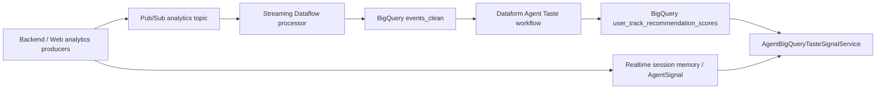
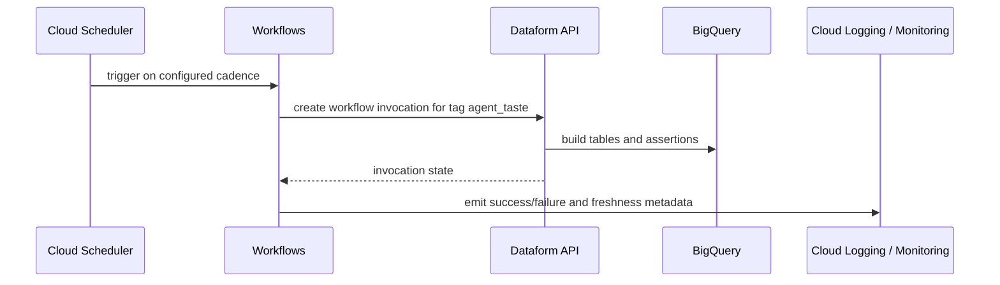

# Agent Taste Intelligence Orchestration

## Overview

Agent Taste Intelligence uses a hybrid data path:



The streaming path is responsible for durable, canonical event ingestion. The
Dataform path is responsible for derived warehouse tables that are safe to
rerun, validate, backfill, and promote through normal data-release practices.
The realtime session path is intentionally separate so AI DJ sessions can adapt
immediately before warehouse materialization catches up.

## Current Execution

Today, operators can materialize scores manually:

```bash
cd workers/analytics-dataflow
AGENT_TASTE_MATERIALIZATION_PROJECT_ID="$GCP_PROJECT_ID" \
AGENT_TASTE_BIGQUERY_DATASET="$ANALYTICS_BIGQUERY_DATASET" \
./run-agent-taste-materialization.sh --verify
```

Use manual runs for:

- first staging smoke tests
- backfills after event taxonomy changes
- incident recovery
- validating SQL with `--dry-run`

Manual execution should remain available even after scheduled orchestration is
live.

## Target GCP Orchestration

Production scheduling should be managed outside this repository by
`resonate-iac`:



Recommended responsibilities:

| Layer | Responsibility |
| --- | --- |
| Cloud Scheduler | Owns cadence per environment. |
| Workflows | Invokes Dataform, polls result, handles retries, emits structured status. |
| Dataform | Compiles SQL, resolves dependencies, runs Agent Taste tables/assertions. |
| BigQuery | Stores clean events, derived feature tables, and serving scores. |
| Cloud Monitoring | Alerts on failed workflow invocation or stale score assertions. |

## Cadence

| Job | Staging | Production v1 | Notes |
| --- | --- | --- | --- |
| Agent Taste baseline | hourly | every 15-60 minutes | Tune by event volume and BigQuery cost. |
| Agent Taste assertions | same invocation | same invocation | Fail closed for empty/stale/invalid serving tables. |
| Materialization report | same invocation | same invocation | Used by dashboard and operator inspection. |
| BQML evaluation | daily/manual | daily/manual | Offline quality gate; do not autopromote. |

## Batch And Streaming Split

Taste should not be modeled as only batch or only streaming.

Durable taste belongs in nearline warehouse materialization:

- saves and playlist adds
- purchases and agent purchases
- replay/skip rates
- longer-term session-intent fit
- confidence, rank, and explanation context
- ML training/evaluation labels

Realtime adaptation belongs in runtime session state:

- current Session Intent
- immediate skips
- current queue shape
- short-lived mood/vibe changes
- budget and buying posture
- active DJ constraints

The backend should blend both:

```text
candidate catalog search
  + realtime AgentSignal/session state
  + BigQuery durable taste scores
  + deterministic fallback signals
  -> final AI DJ ranking
```

This keeps the DJ responsive without forcing every session event through a
warehouse scoring job before the next pick.

## Dataform Handoff

The app repo provides the template in
`workers/analytics-dataflow/dataform/`. `resonate-iac` should provide:

- managed Dataform repository or release configuration
- compilation variables for project, dataset, table names, version, freshness
- workflow configuration or Workflows invocation target tagged `agent_taste`
- Cloud Scheduler cadence per environment
- IAM for Workflows/Dataform/BigQuery
- Monitoring alerts for failed invocations and failed assertions

The corresponding infrastructure handoff lives in
`resonate-iac/docs/agent-taste-dataform-orchestration.md`.

Do not hardcode GCP project IDs or dataset IDs into Dataform source files. Use
environment-specific Dataform release configuration.

## Failure Behavior

The backend selector must continue to treat BigQuery taste as optional. If the
scheduled job is stale, empty, or temporarily broken, online recommendations
fall back to deterministic catalog, learned genre, listing, embedding, and
metadata-derived signals.

Dataform assertions should page operators before stale scores become product
confusing, but they should not block normal app traffic.
