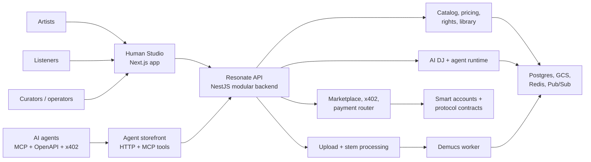
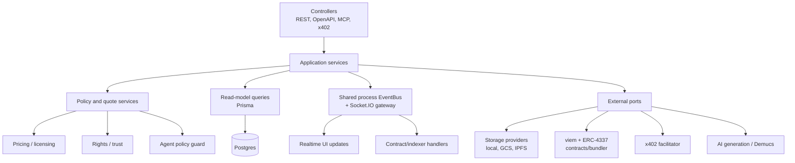
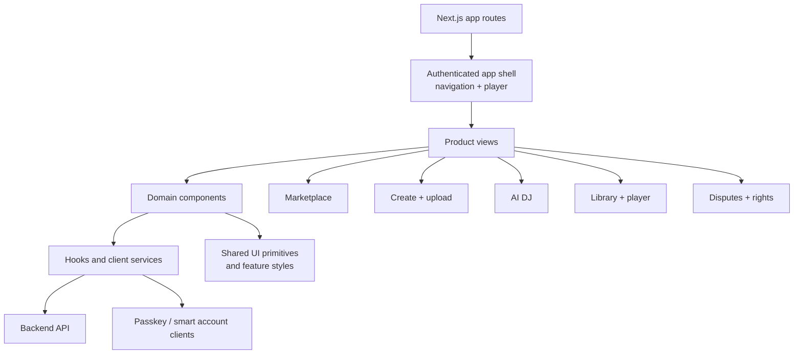
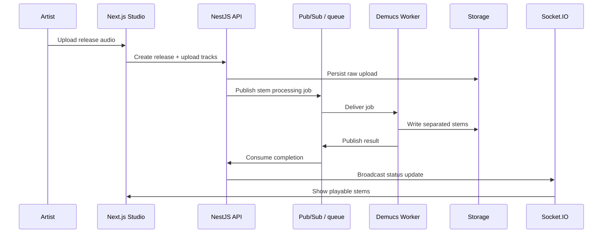
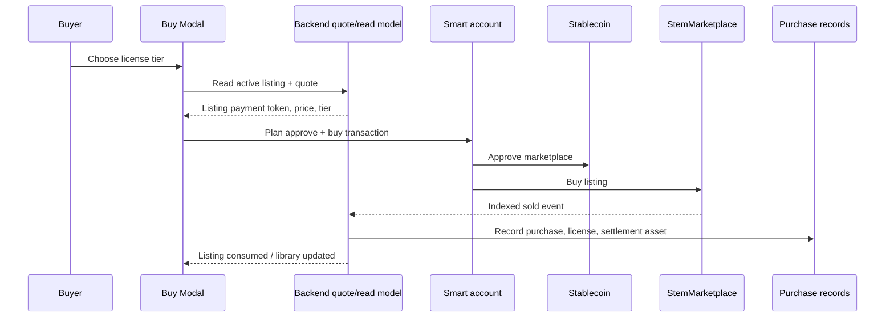
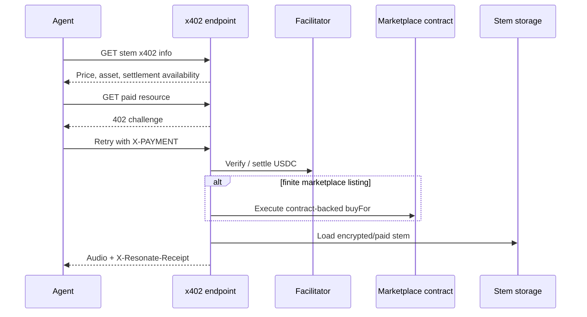

# Application Architecture

Resonate is organized as a modular full-stack product around one catalog and
several first-class interaction surfaces: a human music studio, an agent-native
storefront, x402 commerce, smart-account marketplace actions, and asynchronous
stem processing.

This document is the application-level complement to the
[deployment architecture](./deployment_architecture.md). The deployment view
explains where the system runs; this view explains how the product and code are
composed.

## System Context

## Bounded Contexts

| Context | Responsibilities | Primary Code |
| --- | --- | --- |
| Human studio | App shell, player, upload, marketplace, library, wallet UX, disputes, AI DJ panels | `web/src/app`, `web/src/components`, `web/src/hooks` |
| Catalog and library | Releases, tracks, stems, search, ownership, listener library, storefront discovery | `backend/src/modules/catalog`, `backend/src/modules/library` |
| Marketplace and contracts | Mint/list/buy flows, contract indexing, listing read models, royalty and settlement records | `backend/src/modules/contracts`, `contracts/` |
| Pricing and licensing | Stem pricing, license tiers, marketplace quote behavior, durable purchase metadata | `backend/src/modules/pricing`, `web/src/components/marketplace` |
| Agent commerce | Storefront x402, MCP tools, machine-readable receipts, payment-router envelope | `backend/src/modules/x402`, `backend/src/modules/mcp`, `backend/src/modules/agents` |
| Agent runtime | AI DJ orchestration, recommendation adapters, policy guard, wallet/purchase execution, evaluation | `backend/src/modules/agents`, `backend/src/modules/recommendations` |
| Ingestion and AI media | Upload validation, queueing, stem separation, encryption, storage, status updates | `backend/src/modules/ingestion`, `workers/demucs`, `backend/src/modules/storage` |
| Rights and trust | Upload rights routing, evidence bundles, human verification, disputes, content protection | `backend/src/modules/rights`, `backend/src/modules/trust`, `backend/src/modules/curation` |
| Realtime and notifications | Socket.IO fan-out, notification persistence, event broadcasts, Redis adapter fallback | `backend/src/modules/shared`, `backend/src/modules/notifications` |

## Backend Component Model

The backend follows a modular-monolith style. Modules are deployed together, but
domain ownership is kept explicit through NestJS modules, focused services,
typed event payloads, and persistence models. This keeps local development and
integration testing practical while still making the main product boundaries
visible.

Cross-cutting subscribers attach to the shared `EventBus` exported by
`SharedModule`. Feature modules should import that shared provider instead of
declaring their own `EventBus`, so realtime fan-out, contract/indexer handlers,
and analytics bridge subscribers observe the same process-level event stream.

## Frontend Component Model

The frontend is product-surface oriented: routes own workflow composition, domain
components own feature interaction, hooks own API/wallet integration, and shared
UI primitives keep repeated controls predictable.

## Core Flows

### Upload To Playable Stems

### Stablecoin Marketplace Purchase

### Agent x402 Download

## Architectural Patterns

| Pattern | How Resonate uses it | Why it matters |
| --- | --- | --- |
| Modular monolith | NestJS modules group catalog, contracts, x402, agents, ingestion, rights, trust, and notifications | Keeps delivery simple while preserving domain boundaries |
| BFF plus machine storefront | The same backend serves the human app, OpenAPI, MCP, and x402 surfaces | Human and agent clients share catalog/pricing truth |
| Event-driven side effects | Contract events, upload progress, processing results, and marketplace updates flow through event handlers and realtime broadcasts | Long-running work and on-chain state changes do not block UI flows |
| Read-model reconciliation | Indexer events and frontend listing intents are reconciled into marketplace listing rows | UI state remains stable even when chain events and app notifications arrive out of order |
| Ports and adapters | Storage providers, x402 facilitator, AI clients, contract clients, and funding options sit behind local services | External infrastructure can vary by environment without rewriting product logic |
| Policy guardrails | Rights routing, marketplace license tiers, agent spending policy, and x402 settlement checks run before execution | Payment and licensing flows fail closed instead of creating partial entitlements |
| Idempotent receipts | x402 settlement and purchase records keep explicit status and receipt metadata | Machine clients get auditable outcomes, and retries can be handled safely |
| Testcontainers-first integration | Backend integration tests use real Postgres, Redis, Anvil, and Pub/Sub emulator containers | Cross-module behavior is verified against infrastructure closer to production |

## Source References

- Deployment view: [deployment_architecture.md](./deployment_architecture.md)
- Service boundaries: [architecture_service_boundaries.md](./architecture_service_boundaries.md)
- Event taxonomy: [event_taxonomy_domain_model.md](./event_taxonomy_domain_model.md)
- x402 payments: [x402_payments.md](./x402_payments.md)
- MCP server: [mcp_server.md](./mcp_server.md)
- Agent runtime worker: [agent-runtime-worker.md](./agent-runtime-worker.md)
- Licensing model: [licensing_pricing_model.md](./licensing_pricing_model.md)
- Feature catalog: [../features/README.md](../features/README.md)
