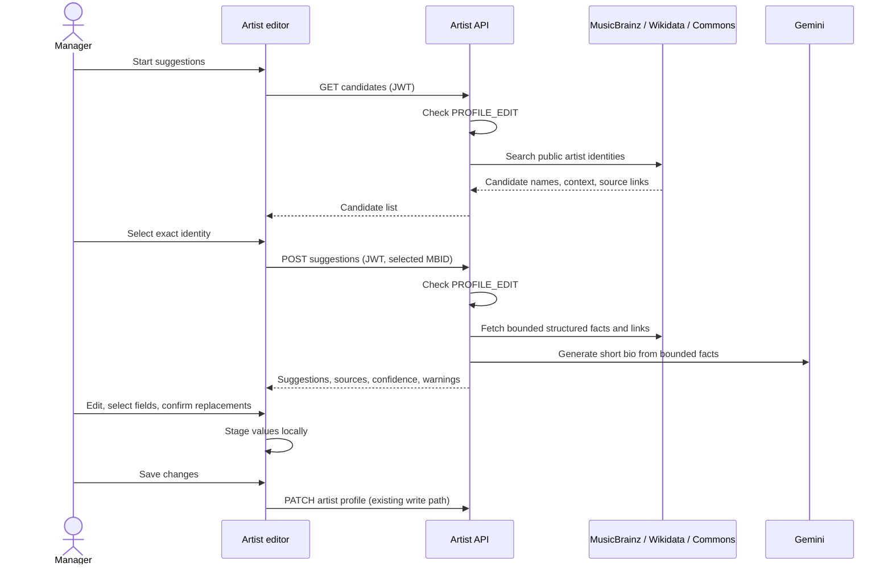

# Artist profile enrichment

Artist profile enrichment is a read-only suggestion path for an authorized
profile editor. The editor remains the only place where values are saved.
Issue [#1763](https://github.com/akoita/resonate/issues/1763) defines the
user-facing behavior; [the feature page](../features/artist_profile.md)
describes the editor and API contract.

The backend does not fetch a URL supplied by the user or by an arbitrary
artist link. It constructs requests to fixed provider origins from validated
MusicBrainz and Wikidata identifiers, rejects redirects, and bounds response
size and time. MusicBrainz requests are paced; the endpoints are throttled
per client IP before the route JWT guard runs. Provider failure can omit a suggestion without
changing the profile. The AI model receives structured public facts and can
return only a proposed bio; it cannot choose an identity, call tools, or write
profile fields.

Commons image suggestions require explicit CC0 or Public Domain metadata.
The review UI shows the file page and rights metadata, while the existing
profile schema stores only the approved image URL. Source/provenance records
for saved profile fields are not persisted. Adding persistent provenance would
require a separate data-model and lifecycle decision.
