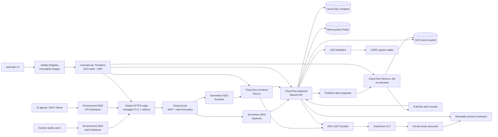

# Deployment Architecture

This diagram is the high-level deployment view for Resonate. It combines the
application repository, the `resonate-iac` infrastructure repository, the
Google Cloud edge/runtime platform, smart account infrastructure, protocol
contracts, and the x402 payment surface into one recruiter-readable
architecture view.

## Scope

The diagram is intentionally a deployment-level model, not a complete class or
module diagram. It follows a C4-style container/deployment view:

- External actors: human users, AI agents, and operators
- Cloud edge/runtime: DNS, Google-managed TLS, external HTTPS load balancer,
  Cloud Armor, serverless NEGs, Cloud Run frontend/backend/Demucs, Pub/Sub,
  Cloud SQL, Redis, GCS, Secret Manager, IAM, Artifact Registry, and Monitoring
- Delivery control plane: `resonate` CI creates immutable images and
  `resonate-iac` applies Terraform-managed Cloud Run releases
- Blockchain layer: ERC-4337 bundler, EntryPoint, Kernel smart accounts,
  session keys, and Resonate protocol contracts
- Payment layer: x402 challenge/verification flow and USDC settlement

## Primary Runtime Flows

## Components

### Human App

Next.js frontend, passkey wallet UX, player, marketplace, upload, dispute, and
curation surfaces. Deployed as a Cloud Run service and configured from
environment-specific IaC values.

### Agent API

OpenAPI, public storefront, `/mcp`, x402 quote/download endpoints, and
structured receipts. Allows machine clients to discover, quote, pay for, and
download stems without a Resonate account.

### Edge

Environment DNS, Google-managed certificates, global external HTTPS load
balancer, Cloud Armor, and serverless NEGs. Public traffic terminates at the
edge before reaching Cloud Run; Cloud Armor policies can be previewed before
enforcement.

### Backend

NestJS modules for auth, catalog, storefront, x402, MCP, storage, generation,
contracts, rights, payments, notifications, and indexing. Runs on Cloud Run with
Secret Manager-backed configuration.

### Stem Processing

Pub/Sub topics `stem-separate`, `stem-results`, and `stem-dlq`; Demucs Cloud
Run Job. The worker can run CPU or GPU mode, starts on demand per queued track,
and writes processed stems to durable storage.

### Data

Cloud SQL Postgres, Memorystore Redis, GCS stems bucket, and optional IPFS
storage mode. Cloud SQL and Redis are reached through private networking.

### Smart Accounts

ZeroDev/Kernel v3, ERC-4337 bundler, EntryPoint v0.7, session keys, and
passkeys. Users transact through smart accounts; agents can act through
permissioned session keys.

### Contracts

`StemNFT`, `StemMarketplaceV2`, `ContentProtection`, `CurationRewards`,
`DisputeResolution`, `RevenueEscrow`, `TransferValidator`, and payment asset
contracts. Contract addresses are deployed from this repo and handed to
`resonate-iac` for cloud runtime config.

### x402

x402 challenges, facilitator verify/settle, USDC payout wallet, and receipt
headers. The machine payment surface shares catalog and pricing data with the
human app.

### Delivery

GitHub Actions, Workload Identity Federation, Artifact Registry, Terraform,
remote GCS state, and Cloud Run image overrides. App CI produces immutable
images; `resonate-iac` owns environment deploys, edge changes, and Terraform
state.

### Observability

Cloud Monitoring uptime checks, error-rate alerts, Pub/Sub backlog, and DB CPU.
Managed by the `observability` Terraform module; Demucs job mode is monitored
through queue/backlog and job execution logs rather than a resident health
endpoint.

## Source References

- Application overview and local topology: [README.md](../../README.md)
- Service boundaries: [architecture_service_boundaries.md](./architecture_service_boundaries.md)
- x402 payment layer: [x402_payments.md](./x402_payments.md)
- MCP server: [mcp_server.md](./mcp_server.md)
- Account abstraction: [account-abstraction.md](../account-abstraction/account-abstraction.md)
- Smart contracts: [core_contracts.md](../smart-contracts/core_contracts.md)
- Contract and cloud deployment split: [deployment.md](../smart-contracts/deployment.md)
- IaC runtime modules: `resonate-iac/modules/{networking,data,security,compute,edge,cicd,observability}`
- IaC delivery model: `resonate-iac/docs/deployment-operating-model.md`
- IaC edge model: `resonate-iac/docs/cloud-edge-architecture.md`
- Cross-repo deploy contract: `resonate-iac/docs/cross-repo-deploy-contract.md`
