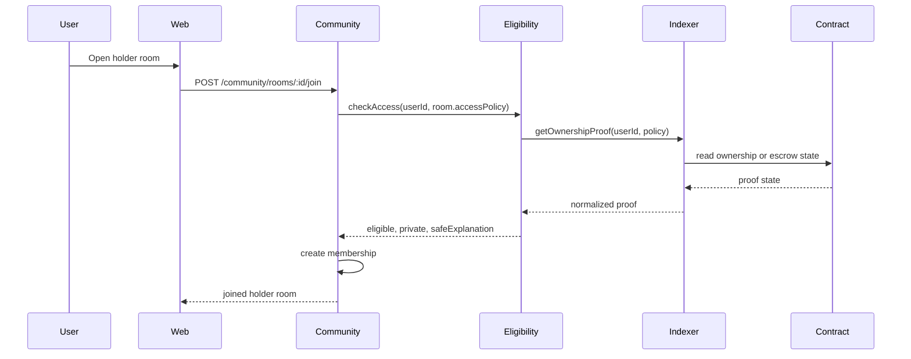
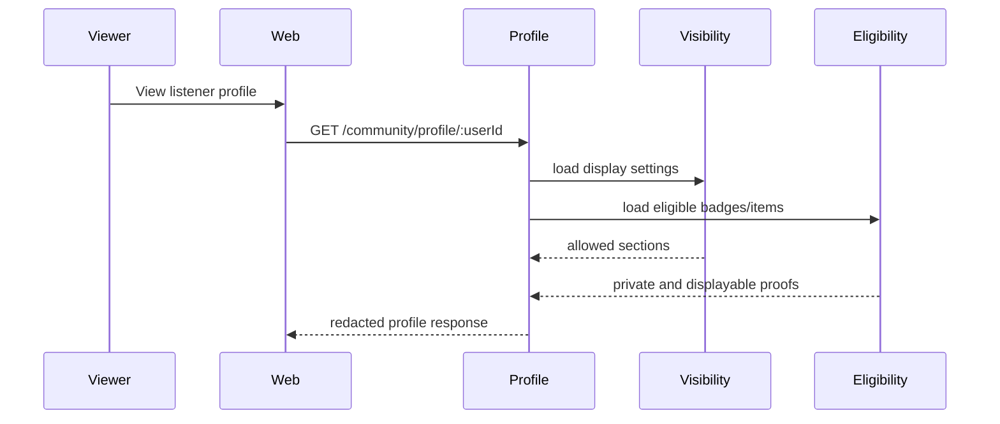

# Listener Community Network Architecture

## Purpose

This document translates the Listener Community Network product/RFC work into
technical boundaries for backend, frontend, analytics, protocol, and moderation
implementation.

The architecture follows one core rule:

> Blockchain proves ownership, authority, escrow, settlement, and portable
> credentials. The community product state stays off-chain, privacy-aware, fast,
> and moderatable.

## Bounded Contexts

| Context | Owns | Does Not Own |
| --- | --- | --- |
| Community | profiles, visibility settings, rooms, memberships, messages, roles, badges, benefit eligibility, moderation state | marketplace settlement, contract truth, raw analytics warehouse, identity auth |
| Marketplace | purchases, listings, item ownership, royalties, settlement status | profile display choices, room membership, moderation |
| Shows | campaigns, pledges, campaign lifecycle, escrow lifecycle | generic community messages, artist room membership |
| Analytics | event envelope, raw/fact event processing, product metrics | transactional community state |
| Identity/Auth | user identity, wallet connection, artist/team permissions | badges, rooms, benefit rules |
| Indexer/Protocol | contract reads, ownership proofs, escrow state, authority proofs | private profile state, chat, moderation |

## Core Services

### `CommunityProfileService`

Responsibilities:

- create and update listener community profiles;
- enforce profile visibility;
- decide which badges, items, playlists, and proofs are displayable;
- return public profile views with private fields removed.

### `CommunityEligibilityService`

Responsibilities:

- convert marketplace, contract, campaign, show, and badge state into access
  eligibility;
- distinguish private eligibility from public display;
- answer room access and benefit eligibility checks;
- fail closed for new grants when required upstream proof is unavailable.

This is the key service boundary for blockchain-backed social utility.

### `CommunityRoomService`

Responsibilities:

- create rooms from artist, campaign, show, cohort, or platform sources;
- manage memberships and role grants;
- enforce room access policy;
- support join, leave, remove, ban, pause, and archive workflows.

### `CommunityMessageService`

Responsibilities:

- create, list, delete, and report messages;
- enforce room membership and moderation state;
- emit analytics events;
- keep messages off-chain and deletable.

### `CommunityBenefitService`

Responsibilities:

- manage artist and platform benefit rules;
- evaluate eligibility;
- record redemptions;
- route economic redemptions to marketplace, x402, payment, or contract layers
  only when settlement is required.

### `CommunityModerationService`

Responsibilities:

- receive reports;
- manage action state;
- enforce bans and removals;
- preserve audit logs for destructive actions;
- provide hooks for AI triage without making AI the final authority.

### `CommunityCohortService`

Responsibilities:

- serve opt-in taste cohorts;
- apply minimum-size and expiry rules;
- return safe match explanations;
- serve authenticated cohort detail for listeners with a visible suggested or
  joined membership;
- activate cohort-scoped rooms only for joined members of visible, consented,
  above-threshold cohorts;
- keep cohort room access derived from server-side `CommunityCohortMembership`
  state, never from client-submitted claims;
- avoid exposing private listening history or private user facts.

### `CommunityCohortGenerationService`

Responsibilities:

- materialize `CommunityCohort` and `CommunityCohortMembership` records from
  safe transactional signals;
- use current `CommunityVisibilitySettings` consent before creating
  memberships;
- build taste, artist-affinity, campaign, coarse city-scene, and collector
  cohorts without exposing raw listener histories, wallet holdings, exact
  sensitive counts, other listener identities, or fine location;
- preserve hidden memberships and avoid duplicate memberships across repeated
  runs;
- mark no-longer-eligible visible memberships `stale` before recomputing
  visible counts, so regenerated cohorts cannot keep stale members above the
  privacy threshold, while preserving prior joined intent for requalification;
- set generated cohort lifecycle state on every refresh: `active` when the
  cohort meets `minimumSize`, `archived` when it falls below threshold, and
  `expired` when there are no current eligible visible members;
- expose an admin-triggered generation surface through
  `POST /admin/community/cohorts/generate`.

## Domain Model

### `CommunityProfile`

```text
id
userId
displayName
bio
profileVisibility: private | community | followers | public
createdAt
updatedAt
```

### `CommunityVisibilitySettings`

```text
userId
showTasteBadges: boolean
showOwnedItems: boolean
showCampaignSupport: boolean
showShowAttendance: boolean
showPlaylists: boolean
showWalletAddress: boolean
allowTasteMatching: boolean
allowCityScenes: boolean
updatedAt
```

### `CommunityBadge`

```text
id
userId
badgeType: early_listener | supporter | collector | attendee | curator | remixer | ambassador | moderator
sourceType: track | release | artist | marketplace_item | campaign | show | playlist | remix | manual
sourceId
visibility: private | community | followers | public
credentialType: offchain | nft_proposed
tokenContractAddress
tokenId
chainId
grantedAt
revokedAt
```

`credentialType`, `tokenContractAddress`, `tokenId`, and `chainId` are proposed
fields for badges that might later become portable NFT credentials. The default
badge model remains off-chain and private. For public supporter and collector
credentials, the current product rule is to use off-chain opt-in public badges
backed by existing ownership/support proof before minting any new NFT-backed
community credential. For show attendance credentials, the current product rule
is to use off-chain opt-in attendance badges backed by event-scoped proof before
minting any NFT-backed attendance credential. For remix and contributor
credentials, the current product rule is to use publication-scoped attribution
proofs tied to Remix Studio, catalog, licensing, and lineage state instead of a
standalone community-only token.

NFT-backed badges should be treated as public or selectively revealable
ownership credentials, not as a replacement for Resonate's privacy controls.
Other systems can build business rules from the token contract, token metadata,
collection, or ownership state: discounts, promotions, ticket priority, partner
perks, Discord roles, venue access, or remix eligibility. The holder can carry
that credential outside Resonate by connecting the owning wallet elsewhere.
Resonate should still keep community membership, messages, moderation,
visibility choices, and sensitive taste/community state off-chain.

This makes badges a ladder:

1. `offchain` badge: private, revocable, fast, and invisible unless the listener
   chooses to show it.
2. existing NFT ownership proof: verifier input for holder access, public badge
   eligibility, Discord roles, artist sites, or partner perks.
3. event-scoped attendance proof: verifier input for opted-in post-show
   rewards, artist recognition, or partner perks without exposing city-scene
   cohort membership.
4. publication-scoped attribution proof: verifier input for opted-in remixer
   and contributor recognition after publication and rights approval.
5. `nft_proposed` credential: deferred portable proof for open ecosystems,
   partner integrations, and owner-controlled interoperability once the use case
   is proven.
6. Benefit rules can accept either private Resonate eligibility or verified NFT
   ownership, depending on the artist/operator policy.

See
[Blockchain-Native Community Membership Boundaries](../rfc/community-membership-boundaries.md),
[Public Supporter And Collector Credential Rules](../rfc/public-supporter-collector-credential-rules.md),
[Show Attendance Credential Boundaries](../rfc/show-attendance-credential-boundaries.md), and
[Remix And Contributor Credential Boundaries](../rfc/remix-contributor-credential-boundaries.md)
for the current on-chain/off-chain decision framework. The key architecture rule
is that NFT ownership, event-scoped attendance, or publication-scoped
attribution can unlock or attest to eligibility, but community membership, room
state, moderation, profile visibility, private cohorts, city-scene membership,
private collaboration state, cohort rooms, and messages remain backend-owned
product state.

### `CommunityRoom`

```text
id
roomType: artist_public | artist_holder | show_campaign_supporter | show_city_demand | cohort | remix | announcement
ownerType: artist | show_campaign | cohort | platform
ownerId
artistId
title
description
accessPolicyJson
status: active | paused | archived
createdAt
updatedAt
```

### `CommunityMembership`

```text
id
roomId
userId
role: member | holder | artist_team | moderator | admin
sourceType: manual | ownership | campaign_pledge | show_attendance | artist_team | cohort
status: active | left | removed | banned
joinedAt
endedAt
```

### `CommunityMessage`

```text
id
roomId
authorUserId
body
messageType: message | announcement
status: visible | deleted_by_author | deleted_by_moderator | hidden_pending_review
createdAt
updatedAt
deletedAt
```

### `CommunityBenefitRule`

```text
id
artistId
benefitType: room_access | discount | early_access | fee_discount | drop_priority | ticket_priority | remix_eligibility
eligibilityPolicyJson
redemptionPolicyJson
status: draft | active | paused | expired
createdAt
updatedAt
```

### `CommunityBenefitRedemption`

```text
id
benefitRuleId
userId
redemptionStatus: pending | redeemed | failed | reversed
settlementType: none | x402 | marketplace | contract
settlementReference
redeemedAt
```

### `CommunityModerationReport`

```text
id
roomId
messageId
reporterUserId
reason
status: open | reviewed | actioned | dismissed
createdAt
resolvedAt
```

### `CommunityCohort`

```text
id
cohortType: taste | artist_affinity | city_scene | collector | campaign
reasonCode
title
safeExplanation
minimumSize
visibleMemberCount
status: suggested | active | expired | archived
createdAt
updatedAt
expiresAt
```

### `CommunityCohortMembership`

```text
id
cohortId
userId
status: suggested | joined | left | hidden | removed
suggestedAt
suggestedEventAt
joinedAt
leftAt
hiddenAt
createdAt
updatedAt
```

## Access Policy Shape

Access policies should be structured JSON evaluated by
`CommunityEligibilityService`.

```json
{
  "type": "ownership",
  "anyOf": [
    {
      "assetType": "stem_nft",
      "artistId": "artist_123"
    },
    {
      "assetType": "collectible_moment",
      "releaseId": "release_456"
    }
  ]
}
```

```json
{
  "type": "campaign_support",
  "campaignId": "campaign_123",
  "minStatus": "confirmed"
}
```

```json
{
  "type": "nft_credential",
  "credentialType": "community_badge",
  "chainId": "<chain-id>",
  "contractAddress": "<erc721-or-erc1155-contract>",
  "metadata": {
    "artistId": "artist_123",
    "badgeType": "supporter",
    "season": "2026"
  }
}
```

```json
{
  "type": "compound",
  "allOf": [
    {
      "type": "badge",
      "badgeType": "collector"
    },
    {
      "type": "artist_follow",
      "artistId": "artist_123"
    }
  ]
}
```

## Eligibility Result Contract

Every access or benefit check should return a normalized result:

```json
{
  "eligible": true,
  "displayable": false,
  "redeemable": true,
  "settlementRequired": false,
  "private": true,
  "reasonCode": "owns_artist_stem",
  "safeExplanation": "You own a stem from this artist."
}
```

Field meanings:

- `eligible`: user qualifies for access or benefit.
- `displayable`: user chose to show the proof publicly.
- `redeemable`: user can consume the benefit now.
- `settlementRequired`: redemption requires payment, transfer, escrow, or
  contract settlement.
- `private`: user qualifies but underlying proof should not be exposed.
- `reasonCode`: internal reason for analytics and debugging.
- `safeExplanation`: user-facing explanation without private third-party facts.

## Blockchain And Indexer Flow



The contract/indexer layer supplies proof. The community layer owns membership,
visibility, moderation, and display.

## Privacy Flow



Eligibility and display are separate. A user can unlock a holder benefit while
keeping the asset hidden from public profile views.

## API Boundaries

### Profile

```text
GET    /community/profile/me
PATCH  /community/profile/me
GET    /community/profile/:userId
GET    /community/profile/:userId/showcase
```

### Badges And Benefits

```text
GET    /community/badges/me
GET    /community/benefits/me
POST   /community/benefits/:benefitId/redeem
```

### Rooms And Messages

```text
GET    /community/artists/:artistId/rooms
GET    /community/artists/:artistId/rooms/me
POST   /community/artists/:artistId/rooms/enable
POST   /community/rooms/:roomId/join
POST   /community/rooms/:roomId/leave
GET    /community/rooms/:roomId/messages
POST   /community/rooms/:roomId/messages
POST   /community/messages/:messageId/report
DELETE /community/messages/:messageId
POST   /community/rooms/:roomId/members/:userId/moderate
PATCH  /community/rooms/:roomId/status
```

### Discord Bridge

```text
GET    /community/artists/:artistId/discord
GET    /community/artists/:artistId/discord/manage
POST   /community/artists/:artistId/discord/connect
POST   /community/artists/:artistId/discord/disconnect
POST   /community/artists/:artistId/discord/test
POST   /community/artists/:artistId/discord/role-mappings
POST   /community/artists/:artistId/discord/sync-roles
POST   /community/artists/:artistId/discord/retry/:attemptId
```

Artist Discord bridge management is artist/team/operator scoped. Public reads
return only the official invite metadata when the artist explicitly enables
public display. Webhook URLs are write-only secrets: they are stored
server-side, masked in artist DTOs, and never returned in full. Announcement
mirroring is non-blocking and records retryable `CommunityDiscordSyncAttempt`
rows. Role sync currently reports aggregate candidate counts from server-side
`CommunityRole` rows; member-level Discord role assignment requires future
listener Discord account linking and explicit consent.

### Shows And Campaign Rooms

```text
GET    /shows/campaigns/:campaignId/community
POST   /shows/campaigns/:campaignId/community/join
POST   /shows/campaigns/:campaignId/community/city-interest/join
```

### Cohorts

```text
GET    /community/cohorts/suggestions
GET    /community/cohorts/:cohortId
POST   /community/cohorts/:cohortId/join
POST   /community/cohorts/:cohortId/leave
POST   /community/cohorts/:cohortId/hide
POST   /admin/community/cohorts/generate
GET    /admin/community/cohorts/quality
```

`GET /community/cohorts/:cohortId` is an authenticated listener detail read. It
must use the same consent, lifecycle, threshold, expiry, and membership
visibility gates as cohort suggestions, and it must fail closed for hidden,
left, stale, archived, expired, below-threshold, or disabled-consent cohorts.
The response is allowed to include cohort type, safe reason, safe explanation,
bucketed member-count copy, membership state, privacy redactions, music-native
next actions, and capped visible-member profile summaries for joined members
whose profile visibility is `public` or `community` and whose matching consent
is still enabled. Public profile summaries may include public profile links;
community-visible contextual summaries must not include stable public links or
stable user identifiers. It must not include non-opted-in listener IDs, wallet
addresses, exact hidden/private membership counts, raw listening history, fine
location, raw cohort metadata, or private member lists.

`GET /admin/community/cohorts/quality` returns aggregate operational quality
signals only: lifecycle counts, stale membership counts, disabled-consent
filtering counts, generated-cohort lifecycle counts, cohort action-event
counts, cohort-type distribution, and bounded reason-code summaries with member
counts bucketed instead of exact. It must not include listener IDs, wallets,
raw listening histories, purchase addresses, or fine location.

The admin UI route `/admin/community/cohorts` is a real-data validation surface
over those two endpoints. It lets admins run generation with a selected
`minimumSize` of 2 or more, refresh aggregate quality, and inspect the blockers
when no generated cohort is visible. It must not create sample users, fake
signals, seeded cohorts, or synthetic listener memberships in shared staging
environments.

## Analytics Events

Community events should use the existing analytics envelope and consent
boundaries.

| Event | Fired When |
| --- | --- |
| `community.profile_visibility_updated` | User changes profile visibility. |
| `community.ownership_display_updated` | User changes item ownership display. |
| `community.badge_displayed` | Badge becomes visible in a profile response. |
| `community.role_granted` | User receives a community role. |
| `community.benefit_unlocked` | User becomes eligible for a benefit. |
| `community.benefit_redeemed` | User redeems a benefit. |
| `community.artist_tab_enabled` | Artist/team enables the default artist rooms. |
| `community.room_joined` | User joins a room. |
| `community.room_left` | User leaves a room. |
| `community.room_access_denied` | User attempts gated room access and is denied. |
| `community.message_created` | User posts a room message, or artist/operator posts a `campaign_update` message. |
| `community.message_reported` | User reports a message. |
| `community.message_deleted` | User or moderator removes a message. |
| `community.member_moderated` | Artist/team removes or bans a room member. |
| `community.room_status_updated` | Artist/team pauses, reopens, or archives a room. |
| `community.moderation_action_taken` | Admin resolves a moderation report through the operator queue. |
| `community.campaign_room_joined` | Confirmed supporter joins a Shows campaign room. |
| `community.show_city_interest_joined` | User joins a show city demand group. |
| `community.badge_granted` | Private badge proof is granted or reactivated. |
| `community.role_granted` | Private scoped role is granted or reactivated. |
| `community.cohort_suggested` | System suggests a cohort. |
| `community.cohort_joined` | User joins a cohort. |
| `community.cohort_left` | User leaves a cohort. |
| `community.cohort_hidden` | User hides a suggested cohort. |
| `community.discord_bridge_connected` | Artist links Discord. |
| `community.discord_announcement_mirrored` | Artist announcement is delivered to Discord. |
| `community.discord_role_sync_completed` | Artist runs Discord role sync status successfully. |
| `community.discord_role_sync_failed` | Artist role sync cannot run, for example because role sync is disabled. |

## Security And Abuse Requirements

- Never expose wallet address unless `showWalletAddress=true`.
- Never expose private item ownership through profile, room, or cohort copy.
- Do not grant room access directly from client-submitted ownership data.
- Recheck ownership or proof state before sensitive benefit redemption.
- Allow off-chain room bans even when a user still owns an access asset.
- Rate-limit message creation, joins, reports, and redemption attempts.
- Keep destructive moderation actions in an audit trail.
- Provide operator/admin moderation surfaces for report triage, room status, and
  governance review before community rooms become broadly discoverable.
  `/admin/community/moderation` now exposes open reports, room status, message
  previews, membership-count context, and admin resolution actions. The admin
  DTO deliberately omits wallet addresses, user emails, raw access-policy JSON,
  and full message history; destructive actions emit
  `community.moderation_action_taken`.
- Cohort rooms are stricter than cohort detail. Suggested members can see safe
  aggregate detail, but only joined members of active, unexpired,
  above-threshold cohorts with current consent can open or join the room.
  Cohort rooms must not expose member lists, wallet addresses, raw listening
  history, raw cohort metadata, or private eligibility details. Message authors
  outside the current viewer are displayed as cohort members rather than raw
  user identifiers.
- Use minimum cohort sizes to avoid revealing sensitive taste or location
  inferences.
- Fail closed for new holder grants during indexer or contract read outages.
- Keep existing memberships usable during temporary proof outages unless a
  policy requires immediate revocation.

## Verification Plan

Backend:

- profile visibility unit tests;
- ownership hidden-but-eligible integration tests;
- gated room access integration tests;
- benefit redemption idempotency tests;
- moderation action tests;
- cohort consent and minimum-size tests;
- cohort room access-control, message redaction, and report/moderation tests.

Protocol/indexer:

- ownership proof read tests;
- stale proof and outage tests;
- escrow pledge state mapping tests;
- authority proof mapping tests.

Frontend:

- profile showcase visibility tests;
- artist community tab tests;
- holder-only room states;
- campaign room join path;
- cohort room ready, locked, and empty states;
- hidden wallet and hidden ownership states.

Analytics:

- event emission tests;
- consent boundary tests;
- aggregate threshold tests for artist-facing analytics.

## Related Documents

- [Listener Community Network](../features/listener_community_network.md)
- [Listener Community Network Execution Plan](../features/listener_community_network_execution_plan.md)
- [Listener Community Network RFC](../rfc/listener-community-network.md)
- [Blockchain-Native Community Membership Boundaries](../rfc/community-membership-boundaries.md)
- [Analytics Event Taxonomy v1](analytics_event_taxonomy_v1.md)
- [Marketplace Integration](../smart-contracts/marketplace_integration.md)
- Background: [The NFT Staircase](https://a16zcrypto.com/posts/article/the-nft-staircase/)
- Background: [5 ways you/your company can use NFTs](https://a16zcrypto.com/posts/article/5-ways-to-use-nfts/)
- Background: [Building partnerships with NFT projects and communities](https://a16zcrypto.com/posts/article/building-partnerships-with-nft-projects-and-communities/)
- Background: [Tokens: A New Digital Primitive](https://a16zcrypto.com/posts/article/tokens-are-a-new-digital-primitive/)
- Background: [NFTs and ownership](https://a16zcrypto.com/posts/article/nfts-and-ownership/)
