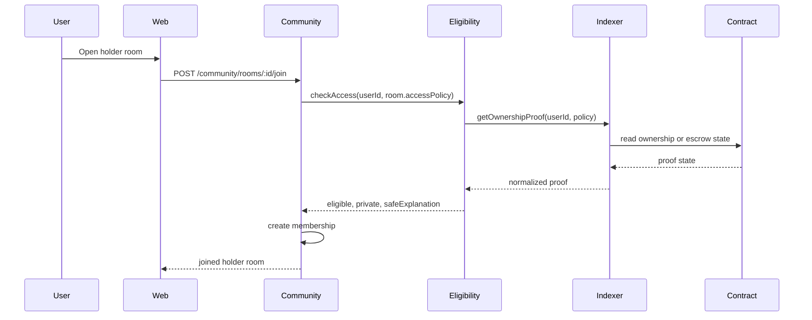
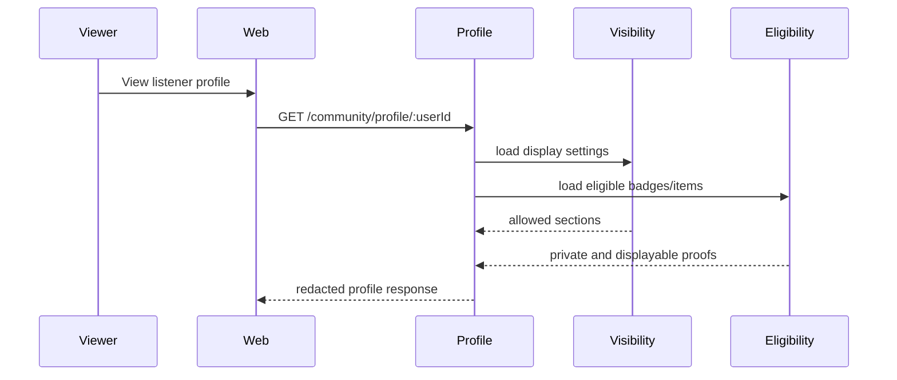

# Listener Community Network Architecture

## Purpose

This document translates the Listener Community Network product/RFC work into
technical boundaries for backend, frontend, analytics, protocol, and moderation
implementation.

The architecture follows one core rule:

> Blockchain proves ownership, authority, escrow, settlement, and portable
> credentials. The community product state stays off-chain, privacy-aware, fast,
> and moderatable.

## Bounded Contexts

| Context | Owns | Does Not Own |
| --- | --- | --- |
| Community | profiles, visibility settings, rooms, memberships, messages, roles, badges, benefit eligibility, moderation state | marketplace settlement, contract truth, raw analytics warehouse, identity auth |
| Marketplace | purchases, listings, item ownership, royalties, settlement status | profile display choices, room membership, moderation |
| Shows | campaigns, pledges, campaign lifecycle, escrow lifecycle | generic community messages, artist room membership |
| Analytics | event envelope, raw/fact event processing, product metrics | transactional community state |
| Identity/Auth | user identity, wallet connection, artist/team permissions | badges, rooms, benefit rules |
| Indexer/Protocol | contract reads, ownership proofs, escrow state, authority proofs | private profile state, chat, moderation |

## Core Services

### `CommunityProfileService`

Responsibilities:

- create and update listener community profiles;
- enforce profile visibility;
- decide which badges, items, playlists, and proofs are displayable;
- return public profile views with private fields removed.

### `CommunityEligibilityService`

Responsibilities:

- convert marketplace, contract, campaign, show, and badge state into access
  eligibility;
- distinguish private eligibility from public display;
- answer room access and benefit eligibility checks;
- fail closed for new grants when required upstream proof is unavailable.

This is the key service boundary for blockchain-backed social utility.

### `CommunityRoomService`

Responsibilities:

- create rooms from artist, campaign, show, cohort, or platform sources;
- manage memberships and role grants;
- enforce room access policy;
- support join, leave, remove, ban, pause, and archive workflows.

### `CommunityMessageService`

Responsibilities:

- create, list, delete, and report messages;
- enforce room membership and moderation state;
- emit analytics events;
- keep messages off-chain and deletable.

### `CommunityBenefitService`

Responsibilities:

- manage artist and platform benefit rules;
- evaluate eligibility;
- record redemptions;
- route economic redemptions to marketplace, x402, payment, or contract layers
  only when settlement is required.

### `CommunityModerationService`

Responsibilities:

- receive reports;
- manage action state;
- enforce bans and removals;
- preserve audit logs for destructive actions;
- provide hooks for AI triage without making AI the final authority.

### `CommunityCohortService`

Responsibilities:

- serve opt-in taste cohorts;
- apply minimum-size and expiry rules;
- return safe match explanations;
- avoid exposing private listening history or private user facts.

### `CommunityCohortGenerationService`

Responsibilities:

- materialize `CommunityCohort` and `CommunityCohortMembership` records from
  safe transactional signals;
- use current `CommunityVisibilitySettings` consent before creating
  memberships;
- build taste, artist-affinity, campaign, coarse city-scene, and collector
  cohorts without exposing raw listener histories, wallet holdings, exact
  sensitive counts, other listener identities, or fine location;
- preserve hidden memberships and avoid duplicate memberships across repeated
  runs;
- mark no-longer-eligible visible memberships `stale` before recomputing
  visible counts, so regenerated cohorts cannot keep stale members above the
  privacy threshold, while preserving prior joined intent for requalification;
- set generated cohort lifecycle state on every refresh: `active` when the
  cohort meets `minimumSize`, `archived` when it falls below threshold, and
  `expired` when there are no current eligible visible members;
- expose an admin-triggered generation surface through
  `POST /admin/community/cohorts/generate`.

## Domain Model

### `CommunityProfile`

```text
id
userId
displayName
bio
profileVisibility: private | community | followers | public
createdAt
updatedAt
```

### `CommunityVisibilitySettings`

```text
userId
showTasteBadges: boolean
showOwnedItems: boolean
showCampaignSupport: boolean
showShowAttendance: boolean
showPlaylists: boolean
showWalletAddress: boolean
allowTasteMatching: boolean
allowCityScenes: boolean
updatedAt
```

### `CommunityBadge`

```text
id
userId
badgeType: early_listener | supporter | collector | attendee | curator | remixer | ambassador | moderator
sourceType: track | release | artist | marketplace_item | campaign | show | playlist | remix | manual
sourceId
visibility: private | community | followers | public
grantedAt
revokedAt
```

### `CommunityRoom`

```text
id
roomType: artist_public | artist_holder | show_campaign_supporter | show_city_demand | cohort | remix | announcement
ownerType: artist | show_campaign | cohort | platform
ownerId
artistId
title
description
accessPolicyJson
status: active | paused | archived
createdAt
updatedAt
```

### `CommunityMembership`

```text
id
roomId
userId
role: member | holder | artist_team | moderator | admin
sourceType: manual | ownership | campaign_pledge | show_attendance | artist_team | cohort
status: active | left | removed | banned
joinedAt
endedAt
```

### `CommunityMessage`

```text
id
roomId
authorUserId
body
messageType: message | announcement
status: visible | deleted_by_author | deleted_by_moderator | hidden_pending_review
createdAt
updatedAt
deletedAt
```

### `CommunityBenefitRule`

```text
id
artistId
benefitType: room_access | discount | early_access | fee_discount | drop_priority | ticket_priority | remix_eligibility
eligibilityPolicyJson
redemptionPolicyJson
status: draft | active | paused | expired
createdAt
updatedAt
```

### `CommunityBenefitRedemption`

```text
id
benefitRuleId
userId
redemptionStatus: pending | redeemed | failed | reversed
settlementType: none | x402 | marketplace | contract
settlementReference
redeemedAt
```

### `CommunityModerationReport`

```text
id
roomId
messageId
reporterUserId
reason
status: open | reviewed | actioned | dismissed
createdAt
resolvedAt
```

### `CommunityCohort`

```text
id
cohortType: taste | artist_affinity | city_scene | collector | campaign
reasonCode
title
safeExplanation
minimumSize
visibleMemberCount
status: suggested | active | expired | archived
createdAt
updatedAt
expiresAt
```

### `CommunityCohortMembership`

```text
id
cohortId
userId
status: suggested | joined | left | hidden | removed
suggestedAt
suggestedEventAt
joinedAt
leftAt
hiddenAt
createdAt
updatedAt
```

## Access Policy Shape

Access policies should be structured JSON evaluated by
`CommunityEligibilityService`.

```json
{
  "type": "ownership",
  "anyOf": [
    {
      "assetType": "stem_nft",
      "artistId": "artist_123"
    },
    {
      "assetType": "collectible_moment",
      "releaseId": "release_456"
    }
  ]
}
```

```json
{
  "type": "campaign_support",
  "campaignId": "campaign_123",
  "minStatus": "confirmed"
}
```

```json
{
  "type": "compound",
  "allOf": [
    {
      "type": "badge",
      "badgeType": "collector"
    },
    {
      "type": "artist_follow",
      "artistId": "artist_123"
    }
  ]
}
```

## Eligibility Result Contract

Every access or benefit check should return a normalized result:

```json
{
  "eligible": true,
  "displayable": false,
  "redeemable": true,
  "settlementRequired": false,
  "private": true,
  "reasonCode": "owns_artist_stem",
  "safeExplanation": "You own a stem from this artist."
}
```

Field meanings:

- `eligible`: user qualifies for access or benefit.
- `displayable`: user chose to show the proof publicly.
- `redeemable`: user can consume the benefit now.
- `settlementRequired`: redemption requires payment, transfer, escrow, or
  contract settlement.
- `private`: user qualifies but underlying proof should not be exposed.
- `reasonCode`: internal reason for analytics and debugging.
- `safeExplanation`: user-facing explanation without private third-party facts.

## Blockchain And Indexer Flow



The contract/indexer layer supplies proof. The community layer owns membership,
visibility, moderation, and display.

## Privacy Flow



Eligibility and display are separate. A user can unlock a holder benefit while
keeping the asset hidden from public profile views.

## API Boundaries

### Profile

```text
GET    /community/profile/me
PATCH  /community/profile/me
GET    /community/profile/:userId
GET    /community/profile/:userId/showcase
```

### Badges And Benefits

```text
GET    /community/badges/me
GET    /community/benefits/me
POST   /community/benefits/:benefitId/redeem
```

### Rooms And Messages

```text
GET    /community/artists/:artistId/rooms
GET    /community/artists/:artistId/rooms/me
POST   /community/artists/:artistId/rooms/enable
POST   /community/rooms/:roomId/join
POST   /community/rooms/:roomId/leave
GET    /community/rooms/:roomId/messages
POST   /community/rooms/:roomId/messages
POST   /community/messages/:messageId/report
DELETE /community/messages/:messageId
POST   /community/rooms/:roomId/members/:userId/moderate
PATCH  /community/rooms/:roomId/status
```

### Shows And Campaign Rooms

```text
GET    /shows/campaigns/:campaignId/community
POST   /shows/campaigns/:campaignId/community/join
POST   /shows/campaigns/:campaignId/community/city-interest/join
```

### Cohorts

```text
GET    /community/cohorts/suggestions
POST   /community/cohorts/:cohortId/join
POST   /community/cohorts/:cohortId/leave
POST   /community/cohorts/:cohortId/hide
POST   /admin/community/cohorts/generate
GET    /admin/community/cohorts/quality
```

`GET /admin/community/cohorts/quality` returns aggregate operational quality
signals only: lifecycle counts, stale membership counts, disabled-consent
filtering counts, generated-cohort lifecycle counts, cohort action-event
counts, cohort-type distribution, and bounded reason-code summaries with member
counts bucketed instead of exact. It must not include listener IDs, wallets,
raw listening histories, purchase addresses, or fine location.

The admin UI route `/admin/community/cohorts` is a real-data validation surface
over those two endpoints. It lets admins run generation with a selected
`minimumSize` of 2 or more, refresh aggregate quality, and inspect the blockers
when no generated cohort is visible. It must not create sample users, fake
signals, seeded cohorts, or synthetic listener memberships in shared staging
environments.

## Analytics Events

Community events should use the existing analytics envelope and consent
boundaries.

| Event | Fired When |
| --- | --- |
| `community.profile_visibility_updated` | User changes profile visibility. |
| `community.ownership_display_updated` | User changes item ownership display. |
| `community.badge_displayed` | Badge becomes visible in a profile response. |
| `community.role_granted` | User receives a community role. |
| `community.benefit_unlocked` | User becomes eligible for a benefit. |
| `community.benefit_redeemed` | User redeems a benefit. |
| `community.artist_tab_enabled` | Artist/team enables the default artist rooms. |
| `community.room_joined` | User joins a room. |
| `community.room_left` | User leaves a room. |
| `community.room_access_denied` | User attempts gated room access and is denied. |
| `community.message_created` | User posts a room message, or artist/operator posts a `campaign_update` message. |
| `community.message_reported` | User reports a message. |
| `community.message_deleted` | User or moderator removes a message. |
| `community.member_moderated` | Artist/team removes or bans a room member. |
| `community.room_status_updated` | Artist/team pauses, reopens, or archives a room. |
| `community.campaign_room_joined` | Confirmed supporter joins a Shows campaign room. |
| `community.show_city_interest_joined` | User joins a show city demand group. |
| `community.badge_granted` | Private badge proof is granted or reactivated. |
| `community.role_granted` | Private scoped role is granted or reactivated. |
| `community.cohort_suggested` | System suggests a cohort. |
| `community.cohort_joined` | User joins a cohort. |
| `community.cohort_left` | User leaves a cohort. |
| `community.cohort_hidden` | User hides a suggested cohort. |
| `community.discord_bridge_connected` | Artist links Discord. |

## Security And Abuse Requirements

- Never expose wallet address unless `showWalletAddress=true`.
- Never expose private item ownership through profile, room, or cohort copy.
- Do not grant room access directly from client-submitted ownership data.
- Recheck ownership or proof state before sensitive benefit redemption.
- Allow off-chain room bans even when a user still owns an access asset.
- Rate-limit message creation, joins, reports, and redemption attempts.
- Keep destructive moderation actions in an audit trail.
- Provide operator/admin moderation surfaces for report triage, room status, and
  governance review before community rooms become broadly discoverable. This is
  tracked in [#1037](https://github.com/akoita/resonate/issues/1037).
- Use minimum cohort sizes to avoid revealing sensitive taste or location
  inferences.
- Fail closed for new holder grants during indexer or contract read outages.
- Keep existing memberships usable during temporary proof outages unless a
  policy requires immediate revocation.

## Verification Plan

Backend:

- profile visibility unit tests;
- ownership hidden-but-eligible integration tests;
- gated room access integration tests;
- benefit redemption idempotency tests;
- moderation action tests;
- cohort consent and minimum-size tests.

Protocol/indexer:

- ownership proof read tests;
- stale proof and outage tests;
- escrow pledge state mapping tests;
- authority proof mapping tests.

Frontend:

- profile showcase visibility tests;
- artist community tab tests;
- holder-only room states;
- campaign room join path;
- hidden wallet and hidden ownership states.

Analytics:

- event emission tests;
- consent boundary tests;
- aggregate threshold tests for artist-facing analytics.

## Related Documents

- [Listener Community Network](../features/listener_community_network.md)
- [Listener Community Network Execution Plan](../features/listener_community_network_execution_plan.md)
- [Listener Community Network RFC](../rfc/listener-community-network.md)
- [Analytics Event Taxonomy v1](analytics_event_taxonomy_v1.md)
- [Marketplace Integration](../smart-contracts/marketplace_integration.md)
