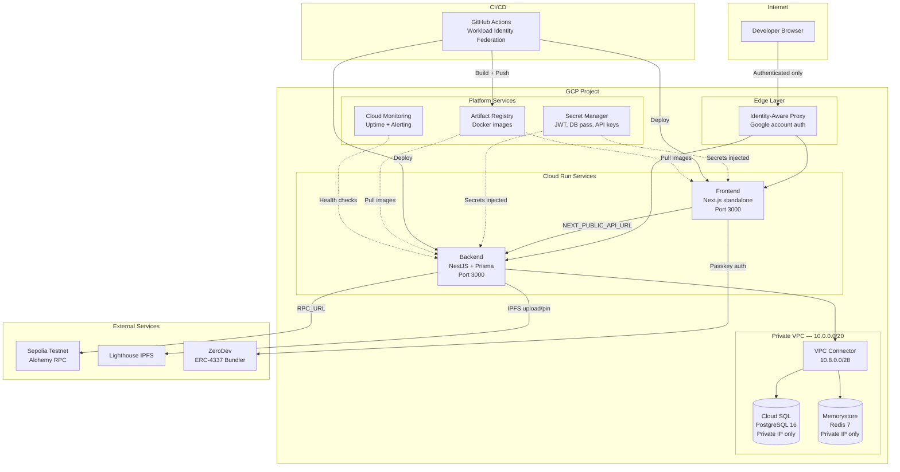

# Resonate — Deployment Guide

> **⚠️ Security**: Never commit private keys, API keys, or passwords to this repository.
> All sensitive values are managed via GCP Secret Manager and environment variables.

## Quick Reference

| Command               | Description                         |
| --------------------- | ----------------------------------- |
| `make docker-build`   | Build Docker images locally         |
| `make docker-up`      | Start production-like stack locally |
| `make docker-down`    | Stop production stack               |
| `make deploy-sepolia` | Deploy contracts to Sepolia testnet |
| `make infra-init`     | Initialize Terraform                |
| `make infra-plan`     | Preview infrastructure changes      |
| `make infra-apply`    | Apply infrastructure changes        |
| `make infra-destroy`  | Tear down all GCP infrastructure    |

---

## Architecture Overview



### Security Layers

| Layer                  | Mechanism                              | Detail                                           |
| ---------------------- | -------------------------------------- | ------------------------------------------------ |
| **External access**    | IAP (Identity-Aware Proxy)             | Only whitelisted Google accounts — no VPN needed |
| **Service networking** | VPC connector + private IPs            | Cloud SQL and Redis have zero public exposure    |
| **Secrets**            | GCP Secret Manager                     | Injected at runtime, never in env vars or code   |
| **Docker images**      | Private Artifact Registry              | Not publicly accessible                          |
| **CI/CD auth**         | Workload Identity Federation           | Keyless GitHub → GCP, no service account JSON    |
| **Network firewall**   | Deny-all ingress + internal-only allow | Custom VPC, no default network                   |
| **Database**           | Daily backups + PITR                   | Point-in-time recovery, 7-day retention          |

---

## Phase 1: Deploy Contracts to Sepolia

### Prerequisites

1. Fund the deployer wallet with Sepolia ETH (check the address with `cast wallet address $PRIVATE_KEY`)
   - Faucet: https://www.alchemy.com/faucets/ethereum-sepolia
   - Minimum: 0.05 ETH recommended
2. Get a Sepolia RPC URL (free): https://dashboard.alchemy.com
3. Get an Etherscan API key (free): https://etherscan.io/myapikey

### Deploy

```bash
# Set environment variables (NEVER commit these)
export PRIVATE_KEY=<your-deployer-private-key>
export SEPOLIA_RPC_URL=https://eth-sepolia.g.alchemy.com/v2/<your-key>
export ETHERSCAN_API_KEY=<your-etherscan-key>

# Run deployment
make deploy-sepolia
```

The script will:

1. Check deployer wallet balance
2. Deploy TransferValidator, StemNFT, and StemMarketplaceV2
3. Verify contracts on Etherscan
4. Save addresses to `contracts/deployments/sepolia.json`
5. Update `backend/.env` and `web/.env.local` with new addresses

---

## Phase 2: Provision GCP Infrastructure

### Prerequisites

1. Install `gcloud` CLI: https://cloud.google.com/sdk/docs/install
2. Install `terraform` (>= 1.5): https://developer.hashicorp.com/terraform/install
3. Authenticate: `gcloud auth application-default login`
4. Ensure billing is enabled on your GCP project (see `project_id` in `terraform.tfvars`)

### Setup

```bash
# Copy and fill in your configuration
cp infra/terraform/terraform.tfvars.example infra/terraform/terraform.tfvars
# Edit terraform.tfvars with your actual values (it's gitignored)

# Initialize Terraform
make infra-init

# Preview what will be created
make infra-plan

# Apply (creates all GCP resources)
make infra-apply
```

### What Gets Created

- **VPC** with private subnet and VPC connector
- **Cloud SQL** PostgreSQL 16 (private IP, daily backups)
- **Memorystore** Redis 7 (private network)
- **Artifact Registry** for Docker images
- **Cloud Run** backend + frontend services
- **Secret Manager** entries for all sensitive config
- **IAP** access control (Google account auth)
- **Monitoring** uptime checks + alerts
- **Workload Identity Federation** for CI/CD

### First Deployment (after Terraform)

```bash
# Configure Docker for Artifact Registry
gcloud auth configure-docker europe-west1-docker.pkg.dev --quiet

# Build and push images
REGISTRY=$(terraform -chdir=infra/terraform output -raw docker_registry)
docker build -t $REGISTRY/backend:latest ./backend
docker build -t $REGISTRY/frontend:latest ./web
docker push $REGISTRY/backend:latest
docker push $REGISTRY/frontend:latest

# Deploy to Cloud Run
gcloud run services update resonate-dev-backend \
  --image=$REGISTRY/backend:latest \
  --region=europe-west1

gcloud run services update resonate-dev-frontend \
  --image=$REGISTRY/frontend:latest \
  --region=europe-west1
```

---

## Phase 3: CI/CD (Automatic After Setup)

Once Terraform is applied, CI/CD is automatic:

1. Push to `main` → CI runs (lint, test, build)
2. CI passes → Deploy workflow triggers
3. Docker images built and pushed to Artifact Registry
4. Cloud Run services updated with new images

### GitHub Secrets Required

Set these in GitHub → Settings → Secrets → Actions:

| Secret             | Description                    | How to Get                          |
| ------------------ | ------------------------------ | ----------------------------------- |
| `GCP_WIF_PROVIDER` | Workload Identity Provider ID  | `terraform output -raw` after apply |
| `GCP_SA_EMAIL`     | GitHub Actions service account | `terraform output -raw` after apply |

---

## Teardown

```bash
# Destroy all GCP resources
make infra-destroy

# This removes: Cloud Run, Cloud SQL, Redis, VPC, secrets, monitoring, IAP
# ⚠️ Database data will be lost — ensure backups if needed
```

---

## Troubleshooting

### Can't access services

- Check IAP: ensure your Google account is in `iap_authorized_members` in `terraform.tfvars`
- Re-apply: `make infra-apply`

### Database connection issues

- Cloud SQL uses private IP — only accessible via VPC connector
- Check VPC connector status in Cloud Console

### Deployment fails in CI

- Verify GitHub secrets `GCP_WIF_PROVIDER` and `GCP_SA_EMAIL` are set
- Check Workload Identity Federation: `gcloud iam workload-identity-pools list --location=global`
