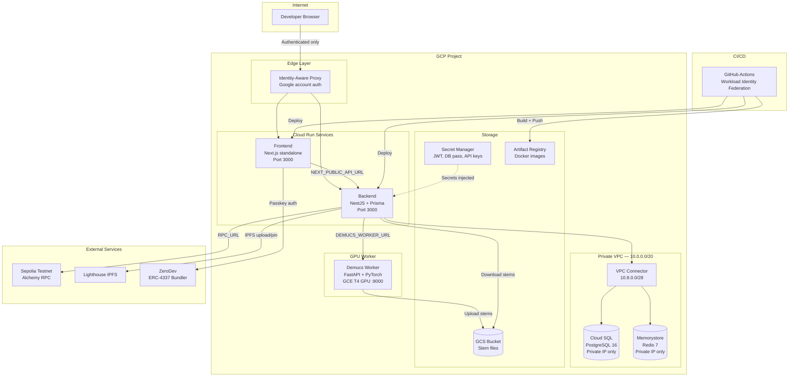
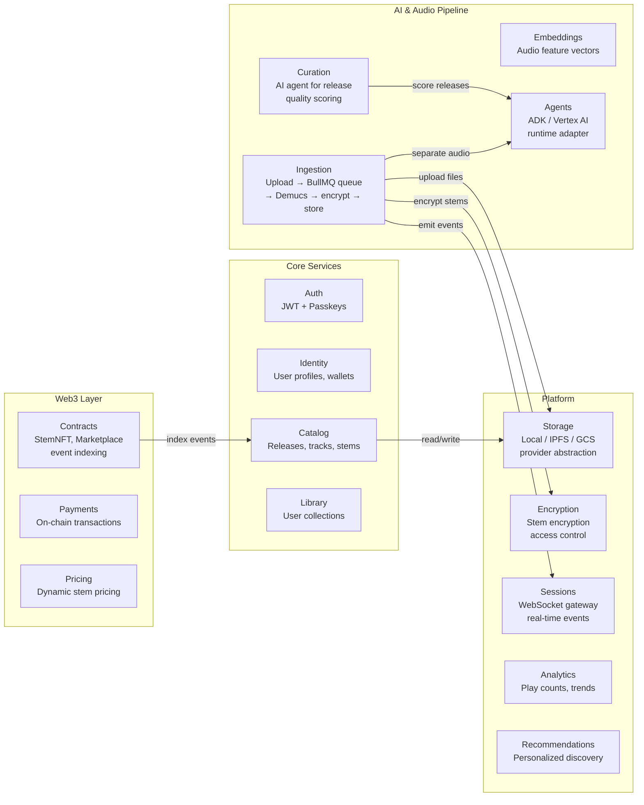

# Resonate — Deployment Guide

> **⚠️ Security**: Never commit private keys, API keys, or passwords to this repository.
> All sensitive values are managed via GCP Secret Manager and environment variables.

## Quick Reference

| Command               | Description                         |
| --------------------- | ----------------------------------- |
| `make docker-build`   | Build Docker images locally         |
| `make docker-up`      | Start production-like stack locally |
| `make docker-down`    | Stop production stack               |
| `make deploy-sepolia` | Deploy contracts to Sepolia testnet |
| `make infra-init`     | Initialize Terraform                |
| `make infra-plan`     | Preview infrastructure changes      |
| `make infra-apply`    | Apply infrastructure changes        |
| `make infra-destroy`  | Tear down all GCP infrastructure    |
| `make worker-health`  | Check Demucs worker health          |
| `make worker-gpu`     | Start Demucs worker with GPU        |

---

## Local Development

### Prerequisites

- Node.js 20+, Docker, npm
- (Optional) NVIDIA GPU + [Container Toolkit](https://docs.nvidia.com/datacenter/cloud-native/container-toolkit/install-guide.html) for GPU acceleration

### Quick Start

```bash
# 1. Start infrastructure (Postgres, Redis, Demucs worker)
make dev-up

# 2. Set up backend (first time: copy .env)
cp backend/.env.example backend/.env
make backend-dev    # runs migrations + dev server on :3000

# 3. Start frontend
make web-dev        # Next.js dev server on :3001
```

### Useful Commands

| Command               | Description                            |
| --------------------- | -------------------------------------- |
| `make dev-up`         | Start Postgres + Redis + Demucs worker |
| `make dev-down`       | Stop all services + remove volumes     |
| `make backend-dev`    | Backend dev server (:3000)             |
| `make web-dev`        | Frontend dev server (:3001)            |
| `make worker-health`  | Check Demucs worker status             |
| `make worker-logs`    | Tail Demucs worker logs                |
| `make worker-rebuild` | Rebuild worker image                   |
| `make db-reset`       | Reset database (drops all data)        |

---

## Architecture Overview



### Backend Module Architecture

The NestJS backend is organized into 20+ modules. Here are the main components grouped by domain:



#### Module Responsibilities

| Module              | Purpose                                                  | Key Files                                          |
| ------------------- | -------------------------------------------------------- | -------------------------------------------------- |
| **Ingestion**       | Upload → queue → Demucs → encrypt → store pipeline       | `ingestion.service.ts`, `ingestion.controller.ts`  |
| **Catalog**         | CRUD for releases, tracks, stems                         | `catalog.service.ts`, `catalog.controller.ts`      |
| **Auth**            | JWT tokens, passkey verification, role guards            | `auth.service.ts`, `roles.guard.ts`                |
| **Identity**        | User profiles, wallet linking, artist onboarding         | `identity.service.ts`                              |
| **Contracts**       | On-chain StemNFT minting, marketplace ops, event indexer | `contracts.service.ts`, `indexer.service.ts`       |
| **Storage**         | Abstraction over Local / Lighthouse IPFS providers       | `storage_provider.ts`, `local_storage_provider.ts` |
| **Encryption**      | Stem-level encryption with access control metadata       | `encryption.service.ts`                            |
| **Sessions**        | WebSocket gateway for real-time progress & events        | `events.gateway.ts`                                |
| **Agents**          | AI runtime adapter (ADK / Vertex / LangGraph / local)    | `agent_runtime.service.ts`, `adk_adapter.ts`       |
| **Curation**        | AI-powered release quality scoring                       | `curation.service.ts`                              |
| **Payments**        | Transaction handling for stem purchases                  | `payments.service.ts`                              |
| **Pricing**         | Dynamic stem pricing with edition strategies             | `stem-pricing.service.ts`                          |
| **Recommendations** | Personalized music discovery                             | `recommendations.service.ts`                       |
| **Analytics**       | Play counts, trending stems, artist stats                | `analytics.service.ts`                             |

### Security Layers

| Layer                  | Mechanism                              | Detail                                           |
| ---------------------- | -------------------------------------- | ------------------------------------------------ |
| **External access**    | IAP (Identity-Aware Proxy)             | Only whitelisted Google accounts — no VPN needed |
| **Service networking** | VPC connector + private IPs            | Cloud SQL and Redis have zero public exposure    |
| **Secrets**            | GCP Secret Manager                     | Injected at runtime, never in env vars or code   |
| **Docker images**      | Private Artifact Registry              | Not publicly accessible                          |
| **CI/CD auth**         | Workload Identity Federation           | Keyless GitHub → GCP, no service account JSON    |
| **Network firewall**   | Deny-all ingress + internal-only allow | Custom VPC, no default network                   |
| **Database**           | Daily backups + PITR                   | Point-in-time recovery, 7-day retention          |

---

## Phase 1: Deploy Contracts to Sepolia

### Prerequisites

1. Fund the deployer wallet with Sepolia ETH (check the address with `cast wallet address $PRIVATE_KEY`)
   - Faucet: https://www.alchemy.com/faucets/ethereum-sepolia
   - Minimum: 0.05 ETH recommended
2. Get a Sepolia RPC URL (free): https://dashboard.alchemy.com
3. Get an Etherscan API key (free): https://etherscan.io/myapikey

### Deploy

```bash
# Set environment variables (NEVER commit these)
export PRIVATE_KEY=<your-deployer-private-key>
export SEPOLIA_RPC_URL=https://eth-sepolia.g.alchemy.com/v2/<your-key>
export ETHERSCAN_API_KEY=<your-etherscan-key>

# Run deployment
make deploy-sepolia
```

The script will:

1. Check deployer wallet balance
2. Deploy TransferValidator, StemNFT, and StemMarketplaceV2
3. Verify contracts on Etherscan
4. Save addresses to `contracts/deployments/sepolia.json`
5. Update `backend/.env` and `web/.env.local` with new addresses

---

## Phase 2: Provision GCP Infrastructure

### Prerequisites

1. Install `gcloud` CLI: https://cloud.google.com/sdk/docs/install
2. Install `terraform` (>= 1.5): https://developer.hashicorp.com/terraform/install
3. Ensure billing is enabled on your GCP project

### Step 1: Authenticate with GCP

```bash
# Login to gcloud (opens browser)
gcloud auth login

# Set your project (must match project_id in terraform.tfvars)
gcloud config set project YOUR_GCP_PROJECT_ID

# Set Application Default Credentials (used by Terraform)
gcloud auth application-default login

# Configure Docker to push to Artifact Registry
gcloud auth configure-docker europe-west1-docker.pkg.dev --quiet
```

> **⚠️ Token Expiry**: If any step fails with auth errors, re-run
> `gcloud auth login` and `gcloud auth application-default login`.
> Tokens expire after ~1 hour of inactivity.

### Step 2: Configure Terraform Variables

```bash
cp infra/terraform/terraform.tfvars.example infra/terraform/terraform.tfvars
# Edit terraform.tfvars with your actual values (it's gitignored)
```

### Step 3: Create Registry & Network (partial apply)

Cloud Run requires Docker images to exist before deployment.
First, provision the Artifact Registry so you can push images:

```bash
make infra-init

# Apply ONLY the registry + core infra (before pushing images)
terraform -chdir=infra/terraform apply -target=google_artifact_registry_repository.docker
```

### Step 4: Build & Push Docker Images

```bash
# Get your registry URL
REGISTRY=$(terraform -chdir=infra/terraform output -raw docker_registry)

# Build and push backend
docker build -t $REGISTRY/backend:latest -f backend/Dockerfile backend/
docker push $REGISTRY/backend:latest

# Build and push frontend
# ⚠️ NEXT_PUBLIC_* vars are compile-time in Next.js — must be passed as --build-arg
BACKEND_URL=$(terraform -chdir=infra/terraform output -raw backend_url)
docker build -t $REGISTRY/frontend:latest \
  --build-arg NEXT_PUBLIC_API_URL="$BACKEND_URL" \
  --build-arg NEXT_PUBLIC_ZERODEV_PROJECT_ID="<your-zerodev-project-id>" \
  --build-arg NEXT_PUBLIC_CHAIN_ID="11155111" \
  --build-arg NEXT_PUBLIC_STEM_NFT_ADDRESS="$(terraform -chdir=infra/terraform output -raw stem_nft_address 2>/dev/null)" \
  --build-arg NEXT_PUBLIC_MARKETPLACE_ADDRESS="$(terraform -chdir=infra/terraform output -raw marketplace_address 2>/dev/null)" \
  -f web/Dockerfile web/
docker push $REGISTRY/frontend:latest
```

### Step 5: Apply Full Infrastructure

Now that images exist in the registry, deploy everything:

```bash
make infra-plan    # review what will be created
make infra-apply   # provisions all GCP resources (~20 min first time)
```

> **Note**: Cloud SQL creation takes 15–20 minutes. If the apply times out
> or fails with auth errors, re-authenticate and re-run `make infra-apply` —
> Terraform resumes from where it left off.

### What Gets Created

- **VPC** with private subnet and VPC connector
- **Cloud SQL** PostgreSQL 16 (private IP, daily backups)
- **Memorystore** Redis 7 (private network)
- **Artifact Registry** for Docker images
- **Cloud Run** backend + frontend services
- **Secret Manager** entries for all sensitive config
- **IAP** access control (Google account auth)
- **Monitoring** uptime checks + alerts
- **Workload Identity Federation** for CI/CD

### Updating Deployments

After the initial setup, to deploy new code:

```bash
REGISTRY=$(terraform -chdir=infra/terraform output -raw docker_registry)

# Rebuild and push updated backend
docker build -t $REGISTRY/backend:latest -f backend/Dockerfile backend/
docker push $REGISTRY/backend:latest

# Update the Cloud Run service
gcloud run services update resonate-dev-backend \
  --image=$REGISTRY/backend:latest \
  --region=europe-west1
```

> **Note**: For frontend rebuilds, remember to pass `--build-arg` flags
> (see Step 4 above). `NEXT_PUBLIC_*` vars are baked in at compile time.

---

## Phase 3: CI/CD (Automatic After Setup)

Once Terraform is applied, CI/CD is automatic:

1. Push to `main` → CI runs (lint, test, build)
2. CI passes → Deploy workflow triggers
3. Docker images built and pushed to Artifact Registry
4. Cloud Run services updated with new images

### GitHub Secrets Required

Set these in GitHub → Settings → Secrets → Actions:

| Secret             | Description                    | How to Get                          |
| ------------------ | ------------------------------ | ----------------------------------- |
| `GCP_WIF_PROVIDER` | Workload Identity Provider ID  | `terraform output -raw` after apply |
| `GCP_SA_EMAIL`     | GitHub Actions service account | `terraform output -raw` after apply |

---

## Teardown

```bash
# Destroy all GCP resources
make infra-destroy

# This removes: Cloud Run, Cloud SQL, Redis, VPC, secrets, monitoring, IAP
# ⚠️ Database data will be lost — ensure backups if needed
```

---

## Demucs CPU Worker (Cloud Run)

The Demucs stem separation worker can run on Cloud Run with CPU only. Slower than GPU (~5–10 min/track) but no GPU quota needed.

### Enable

Add to `infra/terraform/terraform.tfvars`:

```hcl
demucs_cpu_enabled = true
gcs_stems_bucket   = "resonate-stems-dev"  # unique bucket name
```

### Deploy

```bash
# 1. Apply Terraform (creates Cloud Run service + GCS bucket)
make infra-apply

# 2. Build and push CPU Docker image
REGISTRY=$(terraform -chdir=infra/terraform output -raw docker_registry)
docker build -t $REGISTRY/demucs-worker:latest -f workers/demucs/Dockerfile workers/demucs/
docker push $REGISTRY/demucs-worker:latest

# 3. Update the Cloud Run service with new image
gcloud run services update resonate-dev-demucs \
  --image=$REGISTRY/demucs-worker:latest \
  --region=europe-west1

# 4. Verify deployment
curl -s $(terraform -chdir=infra/terraform output -raw demucs_worker_url)/health
# Should return: {"status":"ok","storage_mode":"gcs"}
```

The backend automatically uses the worker URL via `DEMUCS_WORKER_URL` (set in `backend-service.tf`).

> **⚠️ Container Port**: The worker listens on port 8000 (configured in Terraform via `container_port`). If deploying manually, ensure `--port=8000` is set.

> **Cost**: Cloud Run bills per-request with `min_instance_count = 1` to avoid cold starts (~€0.10/hr idle).

---

## Demucs GPU Worker (GCE Instance)

The Demucs AI stem separation worker can also run on a dedicated GCE instance with an NVIDIA T4 GPU for faster processing (~30s/track). It's opt-in to avoid costs when not needed.

### Enable

Add to `infra/terraform/terraform.tfvars`:

```hcl
demucs_gpu_enabled = true
gcs_stems_bucket   = "resonate-stems-dev"  # unique bucket name
```

### Deploy

```bash
# 1. Apply Terraform (creates GCE instance + GCS bucket)
make infra-apply

# 2. Build and push GPU Docker image
REGISTRY=$(terraform -chdir=infra/terraform output -raw docker_registry)
docker build -t $REGISTRY/demucs-worker:latest \
  -f workers/demucs/Dockerfile.gpu workers/demucs/
docker push $REGISTRY/demucs-worker:latest

# 3. Verify deployment
terraform -chdir=infra/terraform output demucs_worker_ip
```

The backend automatically uses the worker's internal IP via `DEMUCS_WORKER_URL` (set in `backend-service.tf`).

### Environment Variables (Worker)

| Variable       | Description                    | Default                |
| -------------- | ------------------------------ | ---------------------- |
| `STORAGE_MODE` | `local` (dev) or `gcs` (cloud) | `local`                |
| `GCS_BUCKET`   | GCS bucket for stem uploads    | (required in gcs mode) |
| `OUTPUT_DIR`   | Local output directory         | `/outputs`             |

> **GPU Quota**: Check IAM & Admin → Quotas → `NVIDIA_T4_GPUS`. Default is 0 for new projects.
>
> **Cost**: Spot instance ~€0.35/hr. Not auto-restarted if preempted.

---

## Troubleshooting

### Auth errors during `terraform apply`

- Tokens expire after ~1 hour. Re-run `gcloud auth application-default login`
- Verify correct project: `gcloud config get project` (must match `terraform.tfvars`)
- If you see "wrong project" errors: `gcloud config set project YOUR_PROJECT_ID`

### `Image not found` on Cloud Run

- Images must be pushed **before** `terraform apply`
- Follow Step 3 → Step 4 → Step 5 in Phase 2 above
- Verify images exist: `gcloud artifacts docker images list $REGISTRY`

### `PORT` reserved env variable error

- Cloud Run sets `PORT` automatically — don't define it in Terraform
- Remove any `env { name = "PORT" }` blocks from `backend-service.tf`

### Can't access services

- Check IAP: ensure your Google account is in `iap_authorized_members` in `terraform.tfvars`
- Re-apply: `make infra-apply`

### Database connection issues

- Cloud SQL uses private IP — only accessible via VPC connector
- Check VPC connector status in Cloud Console

### Deployment fails in CI

- Verify GitHub secrets `GCP_WIF_PROVIDER` and `GCP_SA_EMAIL` are set
- Check Workload Identity Federation: `gcloud iam workload-identity-pools list --location=global`
