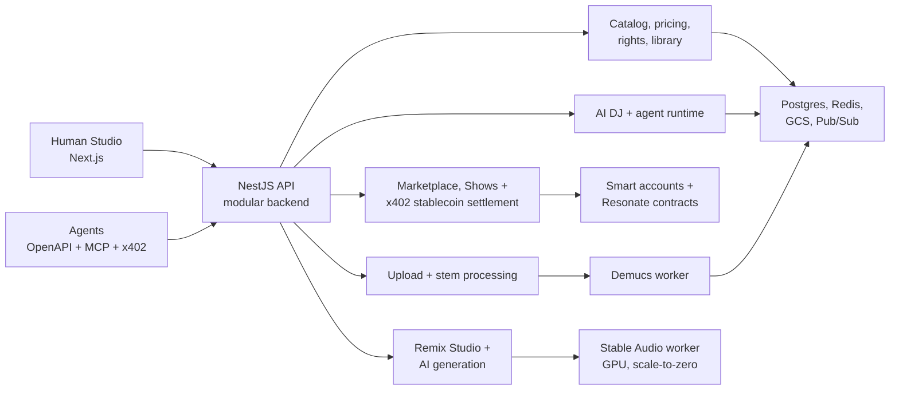

# Issue #1378 — Architecture docs/diagrams refresh (resonate repo)

Add the Stable Audio 3 remix worker and ShowCampaignEscrow to the high-level
architecture surfaces, and refresh the surrounding prose. A sibling update in
`resonate-iac` is handled separately — this plan covers ONLY this repo.

## Ground truth to reflect (from resonate-iac modules/compute + merged PRs)

- **Stable Audio remix worker**: Cloud Run v2 *service* `resonate-<env>-stable-audio`,
  GPU (`node_selector` accelerator), gen2 execution environment, scale-to-zero
  (min instances 0, ~4-minute model cold start), 1800s request timeout,
  port 8000, image `stable-audio-worker` from Artifact Registry, Hugging Face
  token from Secret Manager, VPC connector with PRIVATE_RANGES_ONLY egress.
  The **backend calls it synchronously over HTTP** (rendered WAV in the
  response — no Pub/Sub, no GCS write by the worker) via `REMIX_AUDIO_WORKER_URL`,
  authenticated with **Cloud Run ID tokens** (#1206/#1327). Product surface:
  Remix Studio draft renders with A/B versions (#1321) and license-gated
  export/download (#1324). Contrast with Demucs: Demucs is the Pub/Sub-driven
  stem-separation *job*; stable-audio is the request-driven GPU *service*.
- **ShowCampaignEscrow**: fan-funded shows escrow with the 6% success-only
  campaign fee (deployed on Base Sepolia for staging), part of the Resonate
  protocol contract set.

## 1. README.md — Architecture mermaid

Replace the flowchart with (only additions — keep existing node names/labels):

(SAW is a leaf: it returns rendered audio synchronously to the API.)

## 2. docs/architecture/resonate-deployment-architecture.svg

Hand-authored SVG; apply these EXACT edits (coordinates are final — do not
re-derive):

a. `<desc>`: after "Pub/Sub Demucs processing," insert "a GPU Stable Audio
   remix service," ; after "protocol contracts" keep as is but change the
   contracts phrase to "protocol contracts including the show campaign
   escrow".

b. Subtitle text (line ~54): change "AI stem processing, analytics
   intelligence" → "AI stem processing, GPU remix generation, analytics
   intelligence".

c. **Application containers panel** (currently `x=330 y=390 width=345 height=250`):
   - panel rect: `height="270"` (y stays 390; now ends 660).
   - Replace the three row rects/texts with FOUR rows (rect height 40,
     text baseline = rect y + 26):
     - rect y=448: text y=474 "Cloud Run frontend - Next.js"
     - rect y=500: text y=526 "Cloud Run backend - NestJS API"
     - rect y=552: text y=578 "Cloud Run Demucs Job - on demand"
     - rect y=604: text y=630 "Cloud Run stable-audio - GPU remix"
     All rects keep `x=358 width=278 class="sub"`; texts keep `x=382
     class="small"`.
   - **Private data panel** (x=705 y=390): `height="270"` too (rows unchanged).

d. **Analytics event pipeline panel**: move down 18px. Panel rect y 672→690.
   Label text y 706→724. The four row rects y 734→752, their texts y
   760→778. The two `.tiny` texts y 794→812 and y 808→826.

e. **Delivery and operations panel**: move down 20px. Panel rect y 842→862,
   label y 876→896, the four row rects y 904→924, their texts y 929→949.

f. **Resonate contracts panel** (x=1160 y=438): `height="196"` (was 176).
   Replace the three `.small` list lines with four:
   - y=506: "StemNFT, marketplace, content protection,"
   - y=526: "curation rewards, dispute resolution,"
   - y=546: "show campaign escrow, revenue escrow,"
   - y=566: "transfer validation"
   Chain badge rect y 568→586; its `.tiny` text y 588→606.

g. **Connector paths** (replace whole `d` attributes; backend row center
   moved 537→520, Demucs 599→572, analytics rows 755→773, delivery rows
   924→944):
   - `M636 537 C662 537 682 537 705 537` → `M636 520 C662 520 682 528 705 537`
   - `M636 599 C662 599 682 599 705 599` → `M636 572 C662 572 682 590 705 599`
   - `M675 537 C705 490 720 475 733 475` → `M675 520 C705 482 720 475 733 475`
   - `M675 537 C705 520 718 537 733 537` → `M675 520 C705 528 718 537 733 537`
   - `M675 537 C704 570 720 599 733 599` → `M675 520 C704 560 720 599 733 599`
   - `M636 537 H690 V712 H424 V734` → `M636 520 H690 V668 H424 V752`
   - `M492 755 H504` → `M492 773 H504`
   - `M646 755 H658` → `M646 773 H658`
   - `M818 755 H830` → `M818 773 H830`
   - `M636 537 H675 V360 H1088 C1116 360 1130 320 1160 305` →
     `M636 520 H685 V360 H1088 C1116 360 1130 320 1160 305`
   - `M636 537 H675 V650 H1088 C1118 650 1128 720 1160 736` →
     `M636 520 H685 V682 H1088 C1118 682 1128 726 1160 736`
   - `M236 652 C280 800 310 924 358 924` → `M236 652 C280 800 310 944 358 944`
   - `M513 924 C520 924 528 924 535 924` → `M513 944 C520 944 528 944 535 944`
   - `M705 924 C712 924 720 924 727 924` → `M705 944 C712 944 720 944 727 944`
   - `M863 924 C870 924 878 924 885 924` → `M863 944 C870 944 878 944 885 944`

   Leave every other path untouched.

## 3. docs/architecture/deployment_architecture.md

Read the doc first and match its structure/voice. Add the stable-audio
service wherever Cloud Run services/jobs are enumerated, plus a short
subsection covering the ground-truth facts above (GPU gen2 scale-to-zero
service, synchronous HTTP with ID-token auth from the backend, HF token
secret, VPC private egress, contrast with the Pub/Sub Demucs job). Mention
`ShowCampaignEscrow` wherever protocol contracts are listed. Keep edits
surgical — no restructuring.

## 4. docs/architecture/application_architecture.md

Same approach: add the remix-generation flow (Remix Studio → backend remix
module → stable-audio worker → draft versions → license-gated export #1324)
where backend modules/flows are described, and ShowCampaignEscrow + the shows
campaign flow if the protocol section lists contracts. Surgical edits.

## Gates

- `npx prettier --check` is NOT configured repo-wide — skip.
- Validate the SVG parses: `python3 -c "import xml.dom.minidom,sys; xml.dom.minidom.parse('docs/architecture/resonate-deployment-architecture.svg')"`.
- `git diff --check` clean.
- No app code changes; do not touch anything outside README.md and
  docs/architecture/.
