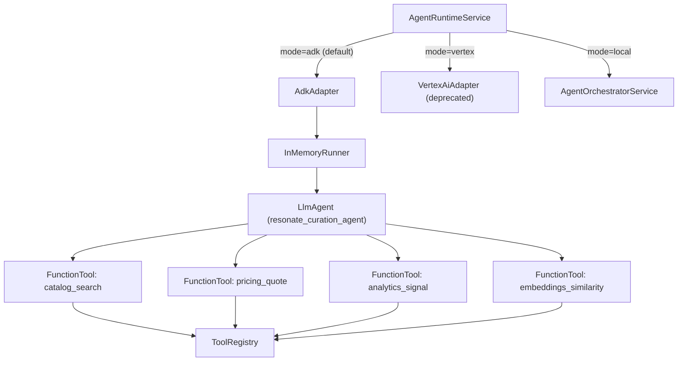

# Phase 4: Agentic AI + GenAI Orchestration (Research + Plan)

## Goals

- Replace heuristic selection with agentic policy + tool orchestration.
- Enable multi-agent coordination for transitions, remixing, and negotiation.
- Keep an evaluation harness to compare policies and avoid regressions.

## Ecosystem Survey (2024/2025)

- **Google Vertex AI / Agents / ADK**: Strong for tool calling, policy control, and
  integration with GCP data sources.
- **LangGraph (LangChain)**: Best-in-class for multi-agent graphs and stateful flows.
- **OpenAI tools / Assistants**: Good orchestration, but less control over infra.

## Recommended Stack (v1)

- **Runtime**: Google ADK (`@google/adk`) — default runtime as of #321.
  - Previous: Vertex AI manual SDK (deprecated, still available as `AGENT_RUNTIME=vertex`).
  - LangGraph stub available but not production-ready.
- **Policy Layer**: Deterministic policy + LLM arbitration.
- **Retrieval**: Catalog + analytics features as ADK `FunctionTool`s (genre, mood, budgets).
- **Safety**: Budget caps + explicit content filters enforced outside LLM.

## Agent Roles

- **Selector**: chooses candidate tracks.
- **Mixer**: plans transitions/remix strategy.
- **Negotiator**: selects license type and price within cap; resolves on-chain listings.

## Evaluation Harness

- Replay sessions with fixed seeds.
- Metrics: acceptance rate, budget adherence, repeat avoidance, session length.
- Offline test data: curated catalog snapshots.

## Implementation Plan (v1)

- Add `AgentPolicyService` with explicit policy rules.
- Add `AgentRunnerService` with tool registry and evaluation hooks.
- Expose `/agents/run` endpoint (internal or admin).
- Add `agent.evaluated` event for analytics.
- Add multi-role orchestrator: Selector/Mixer/Negotiator.

## Implemented (Phase 4)

- Tool registry with catalog + pricing tools (local).
- Selector/Mixer/Negotiator services wired via orchestrator.
- `/agents/orchestrate` admin endpoint.
- Agent orchestration events: `agent.selection`, `agent.mix_planned`,
  `agent.negotiated`, `agent.evaluated`.
- Evaluation harness `/agents/evaluate` with replay metrics.
- Embedding service + similarity scoring for selection ranking.
- **ADK Runtime (default)**: Migrated from manual Vertex AI SDK to Google ADK (#321).
  - `AdkCurationAgent`: Declarative `LlmAgent` with 4 `FunctionTool`s
    (`catalog_search`, `pricing_quote`, `analytics_signal`, `embeddings_similarity`).
  - `AdkAdapter`: Uses `InMemoryRunner` with event streaming and `TRACK:` response parsing.
  - ADK handles multi-turn tool calling, retries, and conversation state natively.
  - Old `VertexAiAdapter` preserved as fallback (`AGENT_RUNTIME=vertex`).
- **On-chain purchase integration**: Negotiator looks up active `StemListing`
  records and routes purchases through `AgentPurchaseService` for real UserOps.
  Falls back to mock transactions for unlisted tracks or when `AA_SKIP_BUNDLER=true`.
- **Listing-aware track selection**: `catalog.search` annotates results with
  `hasListing` flag; the selector and ADK system prompt both prioritize
  tracks with active marketplace listings.
- **Self-healing listing lookup**: `recordPurchase` performs a fallback
  `StemListing` query when the upstream runtime (e.g. ADK adapter) doesn't
  provide listing data.

## Architecture — Agent Runtime

## Next Steps

- Auto-list stems after minting to close the listing gap.
- Add vector similarity for mood/genre embeddings.
- Expand evaluation harness with listing-hit-rate metric.
- Remove deprecated `VertexAiAdapter` and `tool_declarations.ts` once ADK proves stable.
- Explore multi-agent composition (Selector → Mixer → Negotiator as sub-agents).
