# Resonate Business Model Analysis

> **Goal:** Define how full audio tracks and stems coexist commercially on Resonate, producing a model that is original, defensible, and valuable to all user personas.

---

## 1. The Core Tension

Resonate has two distinct assets:

| Asset          | Nature                                                                 | Analogy         |
| -------------- | ---------------------------------------------------------------------- | --------------- |
| **Full Track** | The finished song — what listeners consume                             | The movie       |
| **Stems**      | The isolated components (vocals, drums, bass…) — what creators license | The raw footage |

The question: **Does Resonate try to be Spotify (streaming) AND Splice (stems) at the same time?** If so, how do you avoid being a mediocre version of both?

### The Trap to Avoid

Spotify's economics are brutal: ~$0.003/stream, requiring billions of plays to produce meaningful artist revenue. Competing head-on with Spotify/Apple Music on full-track streaming is a losing game for a new entrant — they have catalog dominance, recommendation engines, and network effects that are essentially unbeatable.

**The insight: Resonate should NOT compete with Spotify on streaming. Full tracks should serve a different strategic purpose.**

---

## 2. Competitive Landscape

| Platform        | Full Tracks          | Stems                  | AI/Agent          | Web3                | Business Model                  |
| --------------- | -------------------- | ---------------------- | ----------------- | ------------------- | ------------------------------- |
| **Spotify**     | ✅ 100M+ catalog     | ❌                     | Basic recs        | ❌                  | Subscription ($10.99/mo)        |
| **Apple Music** | ✅ 100M+ catalog     | ❌ Spatial only        | ❌                | ❌                  | Subscription ($10.99/mo)        |
| **Audius**      | ✅ Indie catalog     | ❌                     | ❌                | ✅ ($AUDIO token)   | Free streaming + tipping        |
| **Splice**      | ❌                   | ✅ Samples/loops       | ❌                | ❌                  | Subscription ($9.99/mo credits) |
| **BeatStars**   | ❌                   | ✅ Beats/instrumentals | ❌                | ❌                  | Marketplace (per-license)       |
| **STEMS**       | ❌                   | ✅ Full stems          | ❌                | ✅ (NFTs)           | Per-stem purchase               |
| **Udio/Suno**   | AI-generated         | ❌                     | ✅ Generative     | ❌                  | Subscription                    |
| **Resonate**    | ✅ (source material) | ✅ (AI-separated)      | ✅ (AI DJ agents) | ✅ (ERC-1155, 4337) | **?**                           |

### Key Gap in the Market

Nobody combines **listening** (the discovery moment) with **licensing** (the commercial transaction) in one flow. On every competing platform, these are entirely separate activities on separate platforms. A DJ discovers a track on Spotify, then goes to BeatStars or contacts the artist's label to license it. This friction is the opportunity.

---

## 3. Recommended Model: "Listen → Discover → License"

### The Thesis

> **Full tracks are the storefront. Stems are the product.**

The full track is how users _discover_ music on Resonate. Stems are what they _buy_. The platform's unique value is collapsing the discovery-to-licensing pipeline into a single, AI-assisted flow.

### Three Revenue Layers

```
┌────────────────────────────────────────────────────────────┐
│  LAYER 3: STEM LICENSING MARKETPLACE                       │
│  Per-license purchases (Personal / Remix / Commercial /    │
│  Sync / Sample / Broadcast)                                │
│  ─── This is where the real money is ───                   │
│  Revenue: Transaction fees (10%) + royalty enforcement      │
├────────────────────────────────────────────────────────────┤
│  LAYER 2: AGENT-POWERED SUBSCRIPTION ("Resonate Pro")      │
│  $9.99-14.99/mo — AI DJ agent, budget wallet, unlimited    │
│  streaming, stem preview, remix sandbox                    │
│  Revenue: Recurring SaaS                                   │
├────────────────────────────────────────────────────────────┤
│  LAYER 1: FREE DISCOVERY TIER                              │
│  Free full-track streaming (ad-free, limited catalog)      │
│  ─── This is the hook ───                                  │
│  Revenue: None (acquisition cost)                          │
└────────────────────────────────────────────────────────────┘
```

---

## 4. Detailed Tier Breakdown

### Layer 1 — Free Discovery (the Hook)

| Feature                  | Details                                                     |
| ------------------------ | ----------------------------------------------------------- |
| **Full-track streaming** | Free, unlimited, no ads                                     |
| **Catalog**              | Artist-uploaded catalog (not competing with Spotify's 100M) |
| **Stems**                | Hidden — user sees tracks, not stems                        |
| **Social**               | Follow artists, share tracks                                |
| **Playlists**            | Create and share playlists                                  |
| **Quality**              | Standard quality (128kbps)                                  |

**Why free?** Because the catalog is small (indie/emerging artists) and the goal is to bring people into the ecosystem. This is NOT a Spotify competitor — it's a discovery tool for a curated niche. Think SoundCloud 2012, not Spotify 2026.

**Artist incentive to upload here vs. Spotify?** On Resonate, their music is not just streamed — it's a _storefront_ for stem licensing. Every play is a potential licensing lead. Artists earn from stems, not from streams.

> [!IMPORTANT]
> Free streaming is a **marketing cost**, not a revenue center. It exists solely to funnel users toward Layer 2 and Layer 3.

### Layer 2 — Resonate Pro (the Engine)

| Feature                 | Details                                                                  |
| ----------------------- | ------------------------------------------------------------------------ |
| **AI DJ Agent**         | Deploys a personal AI agent that curates sessions by mood, genre, energy |
| **Agent Wallet**        | ERC-4337 smart account with monthly budget cap                           |
| **Stem Preview**        | Hear individual stems in the player (toggle vocals, drums, bass…)        |
| **HiFi Streaming**      | Lossless quality (FLAC)                                                  |
| **Sonic Radar**         | AI-powered music discovery sessions                                      |
| **Remix Sandbox**       | Basic stem layering/preview tool (not a full DAW)                        |
| **Priority catalog**    | Early access to new releases                                             |
| **Unlimited playlists** | With stem annotations                                                    |
| **Price**               | **$9.99/mo** (individual) / **$14.99/mo** (creator)                      |

**Why subscribe?** The AI DJ agent is the killer feature — it is unlike anything on any other platform. The stem preview in the player turns passive listening into active exploration. The subscription funds the agent wallet for micro-transactions.

**Revenue split on micro-payments:**

| Recipient | Share |
| --------- | ----- |
| Artist    | 85%   |
| Platform  | 15%   |

> [!TIP]
> The $9.99/mo subscription partially pre-funds the agent wallet. For example, $5 of the subscription goes into the agent wallet as "streaming credits" (USDC). This means the artist gets paid per-play from actual funds, not from a Spotify-style pool. **Artists earn from YOUR plays, not from a shared pot.** This is a massive differentiation point.

### Layer 3 — Stem Licensing Marketplace (the Revenue Core)

This is Resonate's primary revenue engine and its deepest moat.

| License Type   | Buyer Persona                    | Typical Price                | Platform Fee |
| -------------- | -------------------------------- | ---------------------------- | ------------ |
| **Personal**   | Listener / music lover           | Included in Pro (micro-pay)  | 15%          |
| **Remix**      | DJ / Producer                    | $5 – $50 per stem            | 10%          |
| **Commercial** | Brand / Agency / Content creator | $50 – $5,000+ per stem       | 10%          |
| **Sync**       | Film / TV / Game studio          | $500 – $50,000+ (negotiated) | 10%          |
| **Sample**     | Producer (excerpt < 30s)         | $2 – $20 per sample          | 10%          |
| **Broadcast**  | Radio / Podcast                  | Annual fee (negotiated)      | 10%          |

**What makes this different from BeatStars or Splice?**

1. **On-chain proof of licensing** — License NFTs (ERC-1155) serve as verifiable, immutable proof of rights. No more "I bought a license but lost the email."
2. **Recursive remix royalties** — When a remix gets remixed, the original artist still earns via the ancestry chain. This is not possible on any competing platform.
3. **AI-assisted negotiation** — The agent can negotiate license terms within the buyer's budget. No more back-and-forth emails with labels.
4. **Stem-level granularity** — License just the vocals, just the drums, or any combination. Not possible on BeatStars (whole beat or nothing).

---

## 5. How the Model Maps to Existing Infrastructure

The proposed model leverages what's already built:

| Model Component          | Existing Infrastructure                                       | Status            |
| ------------------------ | ------------------------------------------------------------- | ----------------- |
| Free streaming           | Player, Library, Playlists, Releases                          | ✅ Built          |
| AI DJ Agent              | Selector/Mixer/Negotiator services, Agent wallet, Sonic Radar | ✅ Built          |
| Stem preview in player   | Stem separation (Demucs), Mixer UI, stem toggles              | ✅ Built          |
| Agent wallet + budget    | ERC-4337, ZeroDev, session keys, budget caps                  | ✅ Built          |
| Stem marketplace         | StemNFT, StemMarketplaceV2, IndexerService                    | ✅ Built          |
| License types            | LicenseType enum, StemPricing model, pricing panel            | ✅ Built          |
| On-chain royalties       | EIP-2981, 0xSplits, RoyaltyPayment model                      | ✅ Built          |
| License NFTs             | LicenseRegistry contract interface                            | 📋 Designed (RFC) |
| Recursive royalties      | RoyaltySplitter, AncestryTracker interfaces                   | 📋 Designed (RFC) |
| Subscription billing     | —                                                             | ❌ Not started    |
| Free tier access control | —                                                             | ❌ Not started    |

> [!NOTE]
> The only net-new infrastructure needed is subscription billing (Stripe or on-chain subscription) and tier-based access gating. Everything else is already built or designed.

---

## 6. Why This Model Works (Strategic Analysis)

### For Artists

| Traditional Streaming            | Resonate                                             |
| -------------------------------- | ---------------------------------------------------- |
| $0.003/stream from a shared pool | Per-play micro-payment from the listener's wallet    |
| No control over licensing        | Set your own stem prices per license type            |
| No remix revenue                 | Earn recursive royalties from all downstream remixes |
| Opaque payouts                   | On-chain, real-time revenue visibility               |

**Key message to artists:** "Your music isn't just streamed — it's a licensing storefront. Every listener is a potential licensing customer."

### For DJs / Producers

| Current Workflow                                                           | Resonate                                                  |
| -------------------------------------------------------------------------- | --------------------------------------------------------- |
| Discover on Spotify → License on BeatStars → 2 platforms, days of friction | Discover → Preview stems → License in one click           |
| "I think I have a license somewhere in my email"                           | On-chain License NFT = permanent proof                    |
| License the whole beat or nothing                                          | License individual stems (just the vocals, just the bass) |

### For Music Lovers

| Spotify                       | Resonate Free                         | Resonate Pro                      |
| ----------------------------- | ------------------------------------- | --------------------------------- |
| 100M songs, passive listening | Curated indie catalog, free streaming | AI DJ that learns your taste      |
| Algorithmic recommendations   | Manual discovery                      | Sonic Radar sessions              |
| Can't hear the parts          | Can't hear the parts                  | Toggle stems on/off in the player |

### For the Platform (Unit Economics)

| Revenue Stream                   | Monthly Estimate (at 10K Pro users) |
| -------------------------------- | ----------------------------------- |
| Pro subscriptions (10K × $9.99)  | $99,900                             |
| Stem licensing fees (10% of GMV) | Variable — scales with catalog      |
| Commercial/Sync licensing (10%)  | High-value, low-volume              |

The subscription creates predictable recurring revenue. The marketplace creates high-margin transaction revenue. The two reinforce each other: more subscribers → more discovery → more licensing demand → more artists upload → better catalog → more subscribers.

---

## 7. What Makes This Original

No platform today combines these three elements:

```mermaid
graph LR
    A["🎵 Free Streaming<br/>(Discovery)"] --> B["🤖 AI Agent Curation<br/>(Engagement)"]
    B --> C["🎛️ Stem Licensing<br/>(Monetization)"]
    C --> D["🔗 On-Chain Proof<br/>(Trust)"]
    D --> A
```



1. **Spotify** has discovery but no stems and no licensing
2. **Splice/BeatStars** has stems and licensing but no discovery and no AI
3. **Audius** has Web3 and streaming but no stems and no AI
4. **Resonate** is the only platform where you **hear a song → hear its parts → license the parts → get on-chain proof** — all in one flow, assisted by an AI agent

---

## 8. Risks and Mitigations

| Risk                                    | Severity  | Mitigation                                                                                                                                                                    |
| --------------------------------------- | --------- | ----------------------------------------------------------------------------------------------------------------------------------------------------------------------------- |
| Small catalog won't attract listeners   | 🔴 High   | Focus on a niche (electronic, hip-hop producers) where stem demand is highest. Quality over quantity.                                                                         |
| Artists won't upload if no listeners    | 🔴 High   | The licensing upside is the draw — position Resonate as a "stem distribution platform" first, not a streaming service. Artists upload here to sell stems, not to get streams. |
| Subscription price sensitivity          | 🟡 Medium | The agent wallet pre-funding model means $9.99 buys both the service AND streaming credits. Perceived value is higher than pure SaaS.                                         |
| Web3 complexity scares mainstream users | 🟡 Medium | Account abstraction (already built) hides all blockchain complexity. Users never see wallets, gas, or transactions.                                                           |
| Legal complexity of licensing           | 🟡 Medium | Legal template library (already designed in RFC) + on-chain enforcement reduces ambiguity.                                                                                    |

---

## 9. Recommended Naming & Positioning

| Tier      | Name                     | Tagline                               |
| --------- | ------------------------ | ------------------------------------- |
| Free      | **Resonate**             | "Hear the music. Hear the parts."     |
| Pro       | **Resonate Pro**         | "Your AI DJ. Your stems. Your rules." |
| Licensing | **Resonate Marketplace** | "License any stem, on-chain."         |

**Overall positioning:**

> **Resonate — The platform where listening becomes licensing.**

---

## 10. What to Build Next

Given this model, the immediate priorities shift slightly:

| Priority | Feature                                             | Purpose                           |
| -------- | --------------------------------------------------- | --------------------------------- |
| **P0**   | Tier-based access gating (free vs. pro)             | Foundation for the business model |
| **P0**   | Subscription billing integration                    | Revenue enablement                |
| **P0**   | Stem preview toggle in the main player (for Pro)    | Core differentiator UX            |
| **P1**   | License type selector in buy flow (#311)            | Marketplace revenue               |
| **P1**   | Agent wallet pre-funding from subscription          | Seamless micro-payment UX         |
| **P2**   | LicenseRegistry contract deployment                 | On-chain proof of licensing       |
| **P2**   | Artist landing page ("Your stems, your storefront") | Artist onboarding narrative       |
