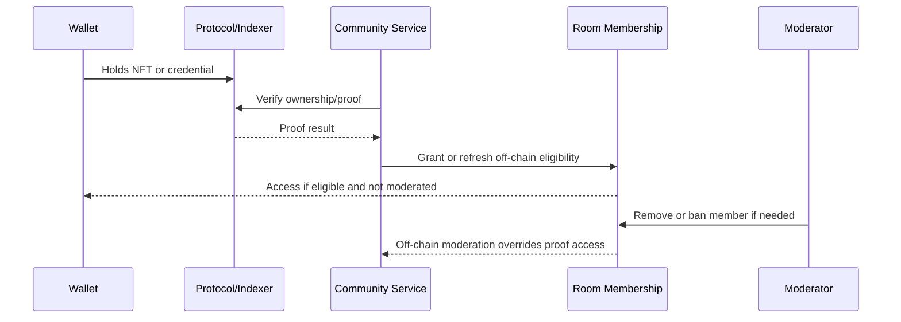

# Blockchain-Native Community Membership Boundaries

## Purpose

This RFC defines where NFT-backed or on-chain-verifiable community membership
can add product value, and where Resonate community state must remain off-chain.
It is an architecture and product-boundary document only. It does not propose a
contract implementation for the current slice.

The default rule is:

> Use blockchain for public, durable, portable proofs. Keep private, mutable,
> safety-sensitive, and consent-dependent community state off-chain.

This preserves the value of open credentials without turning private listener
taste, location, moderation, or social state into public enumerable data.

## Definitions

| Term | Meaning |
| --- | --- |
| On-chain membership | A token or contract state directly represents membership in a community. |
| NFT-backed credential | An NFT proves a portable role, badge, attendance, supporter, collector, or contributor status. |
| NFT-verifiable access | Resonate accepts NFT ownership as one eligibility input while keeping room membership and moderation state off-chain. |
| Off-chain membership | Resonate stores membership in backend product state, with consent, visibility, moderation, and deletion semantics. |
| Private cohort | A taste, city, artist-affinity, collector, or campaign cohort derived from governed listener signals and protected by consent, minimum-size, expiry, and privacy-bucket rules. |

## Decision Criteria

Use NFT-backed or on-chain-verifiable membership only when most of these are
true:

- the membership is intentionally public or selectively revealable;
- portability outside Resonate is part of the product promise;
- durability across apps, partners, venues, or artist communities matters;
- transferability is acceptable or explicitly constrained;
- ownership can be verified without exposing sensitive listener behavior;
- revocation, expiry, and replacement semantics are clear;
- moderation, bans, reports, and room state can still be enforced off-chain;
- the token metadata can be public without harming privacy or safety;
- artists, partners, or agents benefit from an open verification surface.

Keep membership off-chain when any of these are true:

- membership depends on mutable listener consent;
- membership reveals taste, location, social graph, listening history, private
  ownership, spending, pledge, attendance, or support behavior;
- counts need minimum-size gates, bucketing, or aggregate-only disclosure;
- users need hide, leave, delete, or profile-visibility controls;
- bans and removals must override access immediately;
- room access depends on moderation state, eligibility freshness, or revocable
  platform policy;
- the surface includes chat messages, reports, moderation actions, appeals, or
  safety workflows;
- the community would become publicly enumerable in a way users would not
  reasonably expect.

## Boundary Matrix

| Surface | Default Boundary | Why |
| --- | --- | --- |
| Stem ownership and marketplace collectibles | Existing NFT / contract proof | Ownership and resale already need public protocol truth. |
| Public artist supporter credential | NFT-backed candidate | Useful across artist sites, Discord, venues, and partner tools if opt-in and non-sensitive. |
| Public collector credential | NFT-backed candidate | Portable proof can unlock perks without copying Resonate backend state. |
| Campaign supporter badge | Mixed | Private supporter room access stays off-chain; optional public badge can be NFT-backed after campaign lifecycle and consent are safe. |
| Show attendance proof | NFT-backed candidate | Portable proof can support venue/artist perks when attendee opts in. |
| Remix or contributor credential | NFT-backed candidate | Public creative contribution benefits from durable attribution. |
| Partner/Discord role proof | NFT-verifiable candidate | NFT ownership can feed external role sync while Resonate keeps local moderation state. |
| Artist public room membership | Off-chain by default, NFT-verifiable later | Public room membership needs leave, ban, spam, and moderation semantics. |
| Artist holder room access | NFT-verifiable access | Contract ownership can unlock access, but room membership and bans remain off-chain. |
| Private supporter rooms | Off-chain | Support can be private; refunds/release lifecycle can revoke eligibility. |
| Taste cohorts | Off-chain only | Derived from private, mutable, consented listening/taste signals. |
| City-scene cohorts | Off-chain only | Location is sensitive and counts need thresholding. |
| Cohort room membership | Off-chain only | Depends on joined status, consent, expiry, minimum size, and redacted identity. |
| Messages, reports, bans, appeals | Off-chain only | Must be deletable, moderateable, and safety-sensitive. |
| Profile visibility settings | Off-chain only | User-controlled privacy preferences must not become public protocol state. |

## Why Private Cohorts Stay Off-Chain

Private taste and city cohorts are intentionally not public credentials. They
are generated from governed signals and protected by product rules that do not
map cleanly to public chain state:

- listeners can revoke `allowTasteMatching` or `allowCityScenes`;
- cohort membership can become hidden, left, stale, expired, archived, or
  below-threshold;
- visible counts are bucketed and minimum-size gated;
- cohort detail is authenticated and fails closed when consent or lifecycle
  state changes;
- cohort room messages redact other listeners as generic cohort members;
- cohort membership can reveal listening taste, location, artist affinity,
  collector behavior, or campaign support patterns;
- public enumeration would let outside actors infer private social clusters.

Putting this membership on-chain would make withdrawal, deletion, count
thresholds, expiry, and anonymity harder to preserve. For cohorts, blockchain
can still be an input to eligibility, for example collector behavior or stem
ownership, but the cohort itself remains off-chain product state.

## Recommended Access Pattern

NFTs should unlock or attest to eligibility; they should not own community room
state.

This pattern gives artists and partners portable proofs while preserving:

- private profile choices;
- room leave and removal semantics;
- off-chain bans even when a user still owns an NFT;
- fast revocation for platform policy or lifecycle changes;
- private messages and reports;
- backend/indexer outage handling.

## Transferability And Revocation

Community membership products need a clear transfer model before any NFT work
starts.

| Model | Good For | Risks |
| --- | --- | --- |
| Transferable NFT | Collectibles, public supporter badges, partner perks | Membership can be sold away from social trust; spam or speculation pressure can rise. |
| Soulbound or non-transferable token | Attendance, contribution, reputation-like credentials | Recovery, mistakes, and revocation need careful UX and governance. |
| Expiring token | Time-boxed campaigns, annual memberships, event access | Renewal and grace-period semantics become contract/product complexity. |
| Revocable credential | Safety-sensitive or policy-bound roles | Revocation authority must be explicit and auditable. |
| Off-chain role with NFT verification | Holder rooms, private benefits, Discord sync | Requires reliable indexer/proof service, but keeps moderation flexible. |

Default recommendation:

- use existing ownership NFTs as proof inputs where possible;
- keep room membership off-chain;
- mint new membership NFTs only for explicitly public, portable credentials;
- prefer non-transferable or expiring credentials for attendance,
  contribution, and reputation-like surfaces;
- never use token transfer as the only source of truth for moderation state.

## Candidate Future Surfaces

### Public Artist Supporter Membership

An artist could optionally issue public supporter credentials that unlock:

- partner-site recognition;
- Discord role sync;
- venue or ticket priority;
- merch or drop eligibility;
- public profile display.

Resonate should still store local room membership, visibility, bans, and
messages off-chain.

### Collector And Stem-Holder Credentials

Existing stem NFTs already provide ownership proof. A future public collector
credential can package a listener's opt-in relationship to an artist or
collection without exposing all holdings or wallet details.

The safer first product path is NFT-verifiable access:

1. verify stem or collection ownership;
2. grant a private `holder` role off-chain;
3. let the listener choose whether to display a public collector badge.

### Campaign Supporter Badges

Campaign support can be private during pledge, refund, cancellation, and
booking uncertainty. Optional public badges should only be considered after:

- campaign lifecycle state is safe to reveal;
- the supporter opts in;
- refund/release states are handled;
- the badge copy avoids financial-return implications.

### Show Attendance Proofs

Attendance can be a good portable credential when the attendee opts in. It can
support:

- artist community status;
- venue partnerships;
- post-show rewards;
- local ambassador recognition.

Coarse location and city-scene membership still stay off-chain because they
can reveal sensitive movement or home-scene information.

### Remix And Contributor Credentials

Public contribution and remix participation can benefit from durable
attribution, especially when linked to licensing or provenance. This should
align with the Remix Studio and license NFT roadmap rather than create a
separate community-only token.

## Implementation Prerequisites For A Future Build

No implementation is part of #1084. Before any future contract or app work,
create a separate issue/PR with:

- user story and exact surface;
- transferability model;
- revocation and expiry policy;
- metadata schema and privacy review;
- wallet recovery and account-abstraction implications;
- indexer/proof read path and outage behavior;
- off-chain override rules for bans/removals;
- event taxonomy and analytics plan;
- contract interface and test ladder if a new contract is introduced;
- docs for env/deploy handoffs if any new address or provider is needed.

Contract work that holds value, gates authority, or changes custody must follow
the smart-contract test ladder: unit, fuzz, invariant, and documented formal or
mutation-testing decisions.

## Open Questions

- Which public supporter credentials are valuable enough to justify a new NFT
  instead of using existing stem ownership proof?
- Should attendance and contributor credentials be transferable,
  non-transferable, expiring, or revocable?
- How should account recovery work for community credentials tied to embedded
  or ERC-4337 wallets?
- Which partners need open verification first: Discord, venues, artist sites,
  or agent tools?
- What is the minimum public metadata schema that avoids leaking private
  listener behavior?
- Should public credential display require the same profile visibility controls
  as off-chain badges?

## Non-Goals

- No Solidity implementation.
- No Prisma schema migration.
- No backend endpoint or service changes.
- No frontend UI changes.
- No new environment variables or deployment handoffs.
- No conversion of taste, city, or cohort room membership to on-chain state.
