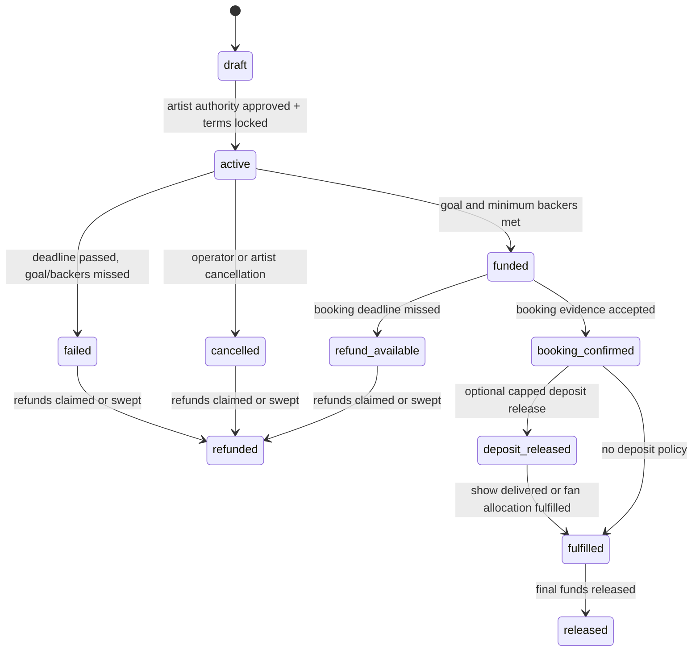

# RFC: Show Campaign Trust And Escrow Policy

## Abstract

Resonate Shows should be open enough for fans to create demand, but strict
enough that pledged money cannot be captured by an impersonator. The right
tradeoff is a two-layer model:

1. anyone can create or support a public demand signal;
2. only an artist-authorized campaign can collect full escrowed pledges and
   receive funds.

This keeps the feature aligned with Resonate's decentralization values while
acknowledging a hard product truth: a wallet alone does not prove artist
identity, team authority, booking authority, or payout rights.

## Goals

- Let fans signal demand for an artist, city, and show without asking permission
  from a centralized gatekeeper first.
- Prevent fake artist campaigns from collecting or redirecting funds.
- Make every campaign rule visible before pledging: artist authority, goal,
  deadline, minimum backers, payment asset, release policy, refund policy, and
  dispute window.
- Separate funding success from payout eligibility.
- Keep refunds permissionless where the outcome is objective.
- Use ops review, community disputes, DAO/jury escalation, and oracles only in
  the parts of the lifecycle where each is defensible.

## Non-Goals

- This RFC does not define final ticketing, venue inventory, tax, or event
  insurance behavior.
- This RFC does not make Resonate a primary ticketing marketplace.
- This RFC does not require every artist to complete full KYC before any demand
  signal exists.
- This RFC does not claim that Resonate can prove legal ownership of an artist
  identity in every jurisdiction. It defines product authority levels and fund
  release rules.

## Core Principle

> Demand can be permissionless. Payout authority cannot be.

Fans should be able to say "we want this artist in this city." But the moment
the product asks fans to lock meaningful funds, the campaign must bind to an
artist-authorized beneficiary wallet or split contract.

## Campaign Levels

Campaign creation should be progressive instead of binary.

| Level | Creator | Pledges | Public Label | Purpose |
| --- | --- | --- | --- | --- |
| `signal` | Any logged-in human or wallet passing basic anti-abuse checks | No paid pledges, or tiny refundable intent caps | Fan-proposed | Measure demand and invite artist/team response |
| `provisional_campaign` | Verified human, promoter, venue, or artist candidate with partial evidence | Capped pledges, strict refund-first terms | Provisional | Let early demand form while artist authority is being reviewed |
| `active_escrow_campaign` | Certified artist authority, trusted source, or approved operator | Full pledge tiers | Artist-authorized | Production beta money flow |

Signals should never imply artist approval. They are useful because they let a
community gather visible demand before an artist team is onboarded.

Provisional campaigns are optional for beta. If implemented, they should have
low caps, stronger warnings, and automatic refunds unless the artist authority
credential is approved before the deadline.

Active escrow campaigns are the only campaigns eligible for full funding goals
and staged release.

## Artist Authority

The product should certify artist authority, not just "artist identity." The
question is:

> Is this wallet or split contract authorized to accept funds for this artist
> and campaign scope?

Recommended authority classes:

| Class | Meaning | Eligible Actions |
| --- | --- | --- |
| `none` | No reviewed proof | Create public signals only |
| `human_verified` | Creator passed proof-of-humanity or anti-Sybil checks | Create signals; request review |
| `artist_acknowledged` | Artist or team acknowledged the campaign, but beneficiary authority is not finalized | Mark signal as acknowledged; no full release |
| `artist_authorized` | Resonate reviewed evidence tying a beneficiary wallet to the artist or official team | Activate escrow; confirm booking; receive staged release |
| `trusted_source_authorized` | Distributor, label, official artist team, or catalog operator is an approved trusted source | Lower-friction activation, still auditable |

### Evidence

Artist authority should reuse the typed evidence model from the rights
verification workflow. Useful evidence kinds include:

- `proof_of_control`: official website domain challenge, verified social
  account challenge, artist profile claim, distributor dashboard proof;
- `trusted_catalog_reference`: distributor, label, official artist team, or
  catalog operator record;
- `prior_publication`: artist profile, official channel, Bandcamp, SoundCloud,
  YouTube OAC, Spotify/Apple artist profile, official site;
- `rights_metadata`: ISRC, UPC, release metadata, credited artists, management
  or label metadata;
- `internal_review_note`: ops decision and confidence reason.

Public campaign pages should expose a concise verification summary without
leaking private documents. Private evidence should be hash-bound to the
authority decision.

### Attestation

After review, Resonate should create a revocable authority credential. It can
begin as a backend record and later be mirrored to an attestation protocol.

Suggested credential shape:

```ts
type ArtistAuthorityCredential = {
  version: "resonate-artist-authority/v1";
  artistId: string;
  artistDisplayName: string;
  beneficiaryAddress: string;
  beneficiaryType: "wallet" | "split_contract" | "multisig";
  scope: "show_campaign" | "all_campaigns" | "catalog" | "limited";
  evidenceBundleId: string;
  evidenceHash: string;
  issuer: "resonate_ops" | "trusted_source" | "dao";
  status: "active" | "revoked" | "expired";
  issuedAt: string;
  expiresAt?: string | null;
  revokedAt?: string | null;
};
```

The campaign escrow beneficiary must match an active credential, or a split
contract controlled by that credential.

## Campaign Creation Policy

An `active_escrow_campaign` requires:

- artist reference or reviewed artist display fields;
- certified artist authority credential;
- immutable beneficiary wallet or split contract;
- city and country;
- deadline;
- goal amount;
- minimum backers, except for explicit patron-only campaign types;
- stablecoin payment asset for beta;
- pledge tiers and fan value;
- booking deadline after funding;
- release policy;
- cancellation and refund terms;
- campaign metadata URI or backend metadata hash.

Fields that affect fan risk should be immutable after activation:

- beneficiary;
- goal amount;
- deadline;
- minimum backers;
- payment asset;
- pledge tier prices;
- release policy;
- refund policy.

Editable after activation:

- descriptive copy;
- hero/card images;
- FAQ;
- venue target if it is explicitly non-binding;
- operator notes and evidence updates.

Material changes should create lifecycle events and, where they affect fan risk,
force cancellation and reactivation rather than silent mutation.

## Funding And Release Lifecycle

Funding success and payout success must be separate states.



### State Rules

| State | Meaning | Who Can Trigger |
| --- | --- | --- |
| `draft` | Campaign exists but cannot receive pledges | Artist/admin/operator |
| `active` | Fans can pledge into escrow | Artist-authorized wallet or approved operator |
| `failed` | Deadline passed without goal or minimum backers | Permissionless keeper/backend/indexer |
| `funded` | Goal and minimum backers were met | Permissionless keeper/backend/indexer |
| `booking_confirmed` | Booking evidence was accepted | Artist-authorized wallet proposes; ops/trusted source/oracle confirms |
| `deposit_released` | Optional capped pre-show deposit was released | Contract after confirmed booking and release policy |
| `fulfilled` | Show happened or promised ticket/priority allocation was delivered | Ops/trusted source/oracle; disputed if challenged |
| `released` | Remaining funds sent to beneficiary | Permissionless after fulfillment/dispute window |
| `refund_available` | Fans can claim refunds | Permissionless after failure, cancellation, or booking deadline miss |
| `refunded` | Refund process is complete for campaign accounting | Backend/indexer after refund claims or sweep |
| `cancelled` | Campaign stopped before release | Artist-authorized wallet, approved operator, or emergency multisig |

## Release Policy

MVP should use a conservative policy:

- no payout when a campaign merely reaches its goal;
- automatic refunds if the campaign misses its deadline or minimum backers;
- automatic refunds if booking is not confirmed by the booking deadline;
- optional deposit release only if disclosed before pledging;
- final release only after fulfillment evidence and a short dispute window.

Suggested beta defaults:

| Parameter | Default |
| --- | --- |
| Payment asset | USDC or configured stablecoin |
| Booking confirmation window | 14-30 days after funding |
| Deposit release | 0% for first beta, then max 30% once ops is ready |
| Fulfillment dispute window | 3-7 days after show/allocation evidence |
| Minimum backers | Required for show campaigns |
| Refunds | Permissionless after failed/cancelled/missed booking deadline |

The first production beta should avoid pre-show release unless the operator is
ready to absorb the support and legal complexity. Once venue/operator workflows
exist, a capped deposit can pay real booking costs while preserving fan trust.

## Trigger Authority

Different transitions need different authority.

Objective transitions should be permissionless:

- deadline reached;
- goal and minimum backers met;
- refund window opened;
- final release after all preconditions and dispute windows.

Subjective transitions need evidence and review:

- artist authority approval;
- booking confirmation;
- fulfillment confirmation;
- fraud cancellation;
- dispute resolution.

Recommended beta authorities:

| Transition | Beta Authority | Later Decentralized Path |
| --- | --- | --- |
| Activate campaign | Resonate ops/admin plus artist-authorized wallet | Trusted-source attestation or DAO-approved issuer |
| Mark funded | Contract/indexer | Permissionless |
| Confirm booking | Artist proposes, Resonate ops confirms | Optimistic oracle or venue/promoter attestation |
| Release deposit | Contract after booking confirmation | Permissionless after oracle finality |
| Confirm fulfillment | Ops/trusted source confirms | Optimistic oracle with challenge window |
| Resolve ambiguous dispute | Admin or DAO jury | DAO jury / arbitration provider |
| Emergency pause/cancel | Multisig/admin | Timelocked multisig / DAO guardian |

This is intentionally hybrid. It is more honest than pretending a contract can
know whether a venue contract is real on day one.

## Disputes

Show disputes should reuse the existing dispute philosophy:

- obvious fraud and impersonation go to ops fast-freeze;
- ambiguous claims go to structured evidence review;
- contested community judgments can escalate to jury/DAO arbitration;
- objective missed deadlines should not require a dispute.

Recommended dispute types:

| Type | Examples | Default Path |
| --- | --- | --- |
| Artist impersonation | Fake team, wrong beneficiary, fake manager | Immediate pause, ops review |
| Booking fraud | Forged venue confirmation, misleading date | Pause release, evidence review |
| Fulfillment dispute | Priority/ticket credit not delivered | Evidence review, possible jury |
| Campaign terms dispute | Goal/deadline/benefit misrepresented | Ops review |
| Payment/indexer issue | Transaction missing or duplicated | Backend/indexer reconciliation |

Dispute evidence should use the typed evidence schema instead of raw URLs.

## Smart Contract Requirements

`ShowCampaignEscrow` should not reuse `RevenueEscrow`. Revenue escrow holds
post-sale creator earnings; show campaigns need thresholds, backer accounting,
refunds, authority checks, staged release, and booking deadlines.

Minimum contract behavior:

- create campaign with immutable risk terms;
- bind beneficiary to an artist authority credential hash or attestation id;
- accept ERC-20 stablecoin pledges;
- track unique backers for minimum-backer thresholds;
- mark funded when goal and backer thresholds are met;
- open refunds after failure, cancellation, or missed booking deadline;
- allow booking confirmation only from an authorized confirmer;
- allow optional capped deposit release after booking confirmation;
- allow final release after fulfillment confirmation and dispute window;
- emit events for every lifecycle transition;
- support pause/cancel for emergency operations.

Recommended events:

- `CampaignCreated`
- `CampaignActivated`
- `Pledged`
- `CampaignFunded`
- `CampaignFailed`
- `CampaignCancelled`
- `BookingConfirmed`
- `RefundAvailable`
- `RefundClaimed`
- `DepositReleased`
- `FulfillmentConfirmed`
- `FundsReleased`
- `AuthorityUpdated`
- `CampaignPaused`

## Backend Changes

Extend the existing `ShowCampaign` truth layer with fields similar to:

```ts
type ShowCampaignTrustFields = {
  campaignLevel: "signal" | "provisional_campaign" | "active_escrow_campaign";
  artistAuthorityStatus:
    | "none"
    | "human_verified"
    | "artist_acknowledged"
    | "artist_authorized"
    | "trusted_source_authorized"
    | "rejected"
    | "revoked"
    | "expired";
  authorityCredentialId?: string | null;
  authorityEvidenceBundleId?: string | null;
  beneficiaryAddress?: string | null;
  beneficiaryType?: "wallet" | "split_contract" | "multisig" | null;
  bookingDeadline?: string | null;
  releasePolicy: "refund_only_until_booking" | "staged_release" | "manual_ops_release";
  depositReleaseBps: number;
  disputeWindowSeconds: number;
  artistAcceptedAt?: string | null;
  bookingEvidenceBundleId?: string | null;
  fulfillmentEvidenceBundleId?: string | null;
};
```

Add lifecycle event types for:

- `campaign_signal_created`
- `artist_authority_requested`
- `artist_authority_approved`
- `artist_authority_rejected`
- `artist_authority_revoked`
- `artist_authority_expired`
- `campaign_escalated_to_escrow`
- `booking_evidence_submitted`
- `deposit_released`
- `fulfillment_confirmed`
- `refund_available`

## Frontend Requirements

The UI should make trust state visible without burying fans in policy text.

Campaign cards and detail pages should show:

- campaign level badge: fan-proposed, provisional, artist-authorized;
- artist authority summary;
- beneficiary address or split contract;
- payment asset and chain;
- refund conditions;
- release policy;
- booking deadline once funded;
- current pledge status for connected wallet;
- dispute/refund action when available.

Copy should avoid guaranteed-ticket promises until a venue/ticketing integration
exists. Use "ticket credit" or "priority allocation" unless inventory is
actually confirmed.

## Open Questions

- What is the first production-beta maximum pledge amount before stronger
  artist authority is required?
- Should provisional campaigns exist in beta, or should beta support only
  public signals and artist-authorized escrow campaigns?
- Which addresses should hold beta confirmation authority: single ops wallet,
  multisig, or contract role managed by admin?
- Should deposit release be disabled for the first real campaign?
- What evidence is enough to treat a venue/promoter as a trusted booking
  attester?

## Recommended MVP Decision

For the first production beta:

1. ship public `signal` pages and `active_escrow_campaign` pages;
2. skip paid provisional campaigns until the core loop is stable;
3. require artist-authorized beneficiary credentials for active escrow;
4. use stablecoin pledges;
5. release no funds at `funded`;
6. refund automatically if booking is not confirmed by the booking deadline;
7. keep booking confirmation under Resonate ops/multisig for beta;
8. add DAO/oracle confirmation only after the operational evidence model is
   proven.

This gives Resonate a real feature without pretending decentralization can
replace artist verification, booking evidence, or refund accountability on day
one.
