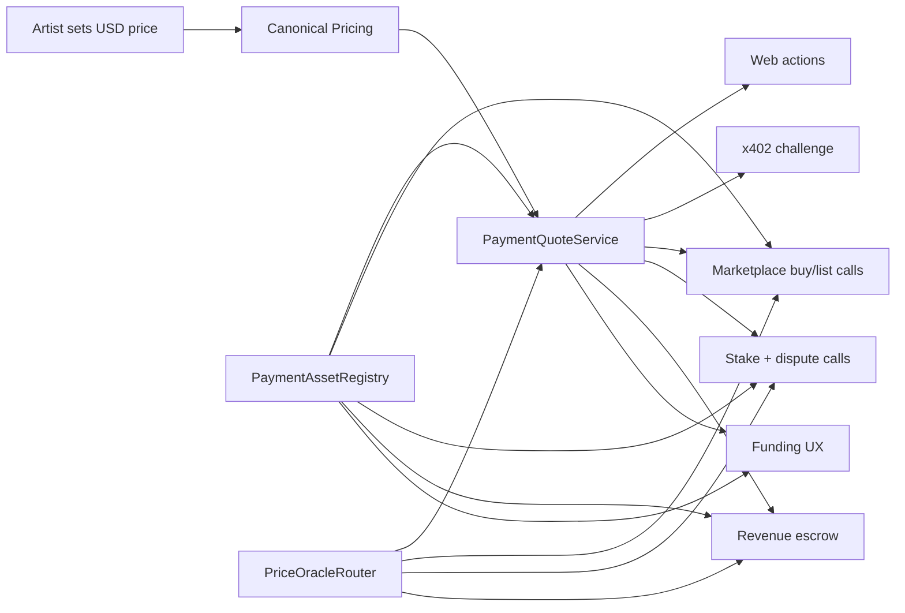

# RFC: Extensible Stablecoin and Native Asset Payments

Date: 2026-04-29
Status: Draft

## Summary

Resonate should support an open, chain-scoped list of payment assets for every
economic user action in the app, not only checkout purchases. The first
stablecoin should be Circle USDC on Base Sepolia, while ETH remains supported
for users who already hold native assets. WETH is the next ERC-20 asset after
the first USDC/native ETH milestone.

The proposed architecture keeps USD as the canonical business price, then
converts that price into the buyer's selected payment asset through a shared
asset registry and quote/oracle layer. Stablecoins, WETH, and native ETH become
payment strategies behind one interface instead of separate checkout paths.

## Current State

- `StemMarketplaceV2` already stores `paymentToken` per listing, with
  `address(0)` representing native ETH.
- Upload/content-protection staking is native ETH-only today through
  `ContentProtection.stake()` and `stakeForRelease()`.
- Community dispute counter-stakes and appeal stakes are native ETH-only today
  through `CurationRewards.reportContent()` and `appealDispute()`.
- `RevenueEscrow.deposit()` stores and releases native ETH only.
- The web listing flow currently defaults marketplace listings to ETH.
- The x402 path already exposes a USDC quote and settlement flow for paid stem
  downloads.
- Backend storefront pricing is canonicalized around USD, then displayed as
  USDC for x402 with optional ETH marketplace alternatives.
- The current UI labels most marketplace prices as ETH even though the contract
  shape can carry an ERC-20 token address.

## Goals

- Support Circle USDC as the first stablecoin payment asset.
- Support an open, extensible list of future stablecoins without duplicating
  checkout logic.
- Preserve native ETH payments and keep WETH as the next ERC-20 asset after
  the first USDC milestone.
- Keep artist/license prices canonical in USD.
- Convert expected USD prices into payment-asset units through a consistent
  quote service.
- Apply the same payment asset policy to uploads, listing purchases, x402
  downloads, dispute counter-stakes, appeal stakes, and escrowed revenue unless
  a documented exception applies.
- Support local dev and Base Sepolia first.
- Avoid hardcoded production addresses in source code. Deployment-specific
  asset addresses, oracle feeds, and router addresses must come from config.

## Non-Goals

- Fiat card checkout.
- Cross-chain settlement.
- Automatic swaps between user-held assets and seller-preferred assets.
- Mainnet launch configuration beyond keeping the design compatible.
- Replacing x402 immediately. x402 should consume the same quote and asset
  registry model over time.

Optional production on-ramp/off-ramp providers are in scope for user
experience, but not as a committed provider selection in this RFC. The
architecture should make room for providers such as Coinbase Onramp, Stripe
crypto on-ramp, Circle Mint/Circle Account flows, or regional payout providers
without hard-wiring one vendor into payment settlement.

## Design Principles

1. Canonical prices are denominated in USD.
2. Payment assets are chain-scoped records, not global symbols.
3. Economic user actions use the same payment asset policy unless there is a
   documented protocol reason not to.
4. Conversion is a strategy, not a branch in each checkout component.
5. Staked assets should be refunded, slashed, or redistributed in the same asset
   they were deposited in.
6. Escrowed revenue should preserve asset identity instead of co-mingling
   balances across currencies.
7. Native ETH remains required for gas or account deployment when no paymaster
   sponsors those operations; that is infrastructure funding, not an app-level
   payment policy.
8. On-chain enforcement must use bounded, stale-checked oracle data.
9. UI, backend, and contracts must agree on the same asset identity.
10. Testnets may use mock oracles when production-grade feeds are unavailable.
11. Local development should be one-command, deterministic, offline-capable, and
    never depend on public faucets or third-party on-ramp providers.

## Payment Surface Inventory

The payment asset registry should cover all protocol-level economic actions.

| Surface | Current implementation | Desired policy |
| --- | --- | --- |
| Marketplace listing purchase | `StemMarketplaceV2.buy()` supports native ETH or arbitrary ERC-20 via `paymentToken`, but UI mostly assumes ETH | Support operator-enabled assets, starting with native ETH and Circle USDC |
| Human marketplace listing creation | `list()` and `listLastMint()` accept `paymentToken`, while web flows pass zero address | Operator controls the global allowlist; seller selects preferred accepted assets from that allowlist |
| x402 stem download | USDC-only asset map inside x402 config | Use shared registry; USDC first because facilitator support is asset-specific |
| Agent marketplace purchase | Session-key policy and purchase service call `buy()` with ETH-style value assumptions | Quote and enforce agent spend caps by canonical USD plus selected settlement asset |
| Upload/content-protection stake | `ContentProtection.stake()` and `stakeForRelease()` are payable ETH | Support configured stake assets or intentionally mark upload staking as ETH-only with a reason |
| Stake refund/slash | Refunds, reporter reward, treasury share, and burn accounting are ETH transfers | Preserve deposited asset; slash/refund/reward in that same asset |
| Dispute counter-stake | `CurationRewards.reportContent()` is payable ETH | Counter-stake can use any enabled dispute asset with oracle conversion to the required canonical value |
| Dispute appeal stake | `CurationRewards.appealDispute()` is payable ETH | Appeal stake can use any enabled dispute asset with oracle conversion to the required canonical value |
| Revenue escrow | `RevenueEscrow.deposit()` accepts and releases ETH only | Store escrow balances by token and asset; release/redirect in deposited asset |
| Backend wallet budget | `WalletService` tracks `balanceUsd`, `spentUsd`, and caps off-chain | Keep canonical USD for policy, but attach settlement asset receipts for real payments |
| Backend `PaymentsService` | In-memory USD-only payment records | Replace or wrap with asset-aware payment intent/settlement records |
| Curator off-chain stake prototype | `CurationService.stake()` stores `amountUsd` in memory | Treat as prototype data; align with on-chain counter-stake policy before production |
| Smart account gas/funding | Kernel/paymaster flow needs native gas unless sponsored | Keep native ETH gas funding separate from app payment asset support |
| Account deployment value | `KernelFactory.createAccount()` is payable to forward native ETH to proxy creation | Keep native-only; not an app payment surface |
| User on-ramp/funding UX | Wallet page has local Anvil funding and test ETH faucet links; signup faucet can send native test ETH | Provide environment-aware funding actions for gas and each enabled payment asset |
| User off-ramp/cash-out UX | Artist onboarding stores a payout address; no cash-out provider flow | Optional provider-driven off-ramp for supported production assets; testnets show transfer/copy-only UX |

## Protocol Payment Policy

Resonate should expose a single payment policy object for each surface:

- `surface`: `marketplace_purchase`, `listing_creation`, `upload_stake`,
  `dispute_counter_stake`, `dispute_appeal_stake`, `revenue_escrow`, or
  `x402_download`
- `canonicalAmountUsd`
- `acceptedAssets`
- `defaultAsset`
- `conversionPolicy`: optional relationship for surfaces that can settle in a
  different asset from the canonical requirement through an oracle conversion
- `exceptionReason`: required when a surface is intentionally native-only or
  single-asset

Initial policy:

- Operator asset policy: Resonate operators configure the enabled
  coins/currencies per chain and surface.
- Seller asset preference: sellers choose the assets they accept from the
  operator-enabled set. Listings should not automatically accept every enabled
  asset unless the seller chooses that behavior.
- Marketplace purchases: native ETH and Circle USDC in the first milestone;
  WETH follows after USDC/native ETH are stable.
- Listing creation: seller-selected accepted asset subset from the operator
  allowlist. If the first marketplace contract can only support one token per
  listing, treat that as a temporary Phase 1 limitation and model the API as a
  subset so V3 can add multi-asset acceptance without changing product language.
- x402 downloads: Circle USDC only at launch, because facilitator settlement is
  asset-specific.
- Upload/content-protection staking: multi-asset from the first stablecoin
  milestone, starting with USDC and native ETH. A native-only temporary
  exception is acceptable only if security review blocks multi-asset staking.
- Dispute counter-stakes: use oracle conversion so reporters can stake with any
  enabled dispute asset against a creator stake denominated in another asset.
- Appeal stakes: use oracle conversion against the canonical required appeal
  value; refunds and slashes occur in the deposited asset.
- Revenue escrow: asset-scoped from the start, with USDC as the first stablecoin
  escrow asset and native ETH preserved where marketplace settlement uses ETH.
- Gas/account funding: native ETH only unless sponsored by paymaster; this is
  outside the app payment asset policy.
- Gas sponsorship: Resonate should sponsor a capped amount just-in-time for
  wallets performing eligible operations. Do not airdrop unconditional gas to
  every wallet; sponsor or top up only when an operation needs it.
- Funding UX: every enabled payment asset should expose a user action that is
  appropriate to the current environment, even if that action is a local mint,
  a testnet faucet link, a copy-address transfer prompt, or a production
  on-ramp provider.
- On-ramp UX: prioritize Base USDC funding. Provider choice stays configurable;
  wallet/exchange transfer remains the fallback.
- Off-ramp UX: wallet, exchange, or faucet transfer is enough for MVP. Fiat
  cash-out remains optional and provider-gated.

## Proposed Architecture



### Payment Asset Model

Create one shared payment asset model used by backend, web, deployment scripts,
and contract configuration.

Fields:

- `chainId`
- `assetId`, for example `base-sepolia:usdc`
- `symbol`, for example `USDC`, `ETH`, `WETH`
- `name`
- `kind`: `native`, `wrapped_native`, or `stablecoin`
- `tokenAddress`: ERC-20 address, or zero address for native ETH
- `decimals`
- `enabled`
- `settlement`: `marketplace`, `x402`, `stake`, `dispute`, `escrow`, or a list
  of those surfaces
- `pricingStrategy`: `usd_pegged`, `chainlink_feed`, or `fixed_test_price`
- `oracleFeed`: optional feed address
- `maxStalenessSeconds`
- `minAnswer` and `maxAnswer`, optional circuit breaker bounds

This should live as typed config, then be hydrated from environment variables or
deployment JSON. Source code may include local-only defaults, but chain-specific
deployed addresses should be supplied through deployment artifacts and env vars.

### Conversion Strategies

Use a strategy pattern for conversion:

- `UsdPeggedStableStrategy`
  - For stablecoins such as Circle USDC.
  - Converts `usdAmount` to token units using decimals.
  - Optionally validates a token/USD feed if configured.
- `NativeEthStrategy`
  - Converts `usdAmount` to wei using ETH/USD oracle data.
  - Used for native ETH.
- `WrappedNativeStrategy`
  - Same quote math as native ETH, but emits ERC-20 approval and transfer
    requirements for WETH.
- `FixedTestPriceStrategy`
  - Local dev and testnet fallback for deterministic tests.
  - Must be explicitly labeled as non-production.

Backend interface:

```typescript
interface PaymentConversionStrategy {
  quote(input: {
    chainId: number;
    asset: PaymentAsset;
    usdAmount: Decimal;
    quantity: bigint;
    slippageBps?: number;
  }): Promise<PaymentQuote>;
}
```

Contract interface:

```solidity
interface IPriceOracleRouter {
    function quoteUsdToAsset(
        uint256 usdAmountE8,
        address paymentToken
    ) external view returns (uint256 assetAmount);
}
```

Use `usdAmountE8` for oracle-normalized USD values and token-specific decimals
for the returned amount.

### Contract Layer

Two paths are possible.

#### Phase 1: Registry-Gated Fixed-Amount Listings

Keep `StemMarketplaceV2` semantics and add registry validation in a new
marketplace version:

- Listings store `pricePerUnit` in the selected payment asset's smallest unit.
- `paymentToken` must be enabled in `PaymentAssetRegistry`.
- Native ETH remains `address(0)`.
- USDC uses ERC-20 allowance plus `safeTransferFrom` in the first milestone.
  WETH follows in a later milestone using the same ERC-20 payment path.
- Backend/web quote the USD price into the selected asset at listing time.

This is the lowest-risk migration because it preserves the existing buy
function shape and direct royalty routing.

Trade-off: ETH listings can drift from the canonical USD value after the listing
is created.

#### Phase 2: USD-Priced Dynamic Settlement

Introduce `StemMarketplaceV3` with USD-denominated listings:

- Listing stores `priceUsdE8`.
- Listing stores accepted payment asset policy, either one asset or a set.
- Buyer selects a payment asset at purchase time.
- Contract calls `PriceOracleRouter` to compute `assetAmount`.
- Buyer supplies `maxAssetAmount` to protect against oracle movement.
- Contract validates oracle freshness and registry enablement.

This is the best long-term model for "expected price in different currencies"
because the listing remains priced in USD while settlement can happen in ETH,
WETH, USDC, or future stablecoins.

Trade-off: more contract surface, more oracle risk, and a migration from the V2
ABI.

Recommendation: implement Phase 1 first for Circle USDC and native ETH, while
designing the registry/oracle interfaces so WETH and Phase 2 dynamic settlement
do not replace the backend and web abstractions.

#### Stake and Dispute Assets

Content-protection staking is not just gas; it is a user economic deposit that
can be refunded or slashed. It should be asset-aware for consistency with
stablecoin payments.

Introduce stake records that include asset identity:

```solidity
struct AssetAmount {
    address token;
    uint256 amount;
}

struct StakeInfoV2 {
    address token;
    uint256 amount;
    uint256 depositedAt;
    bool active;
}
```

Native ETH remains `address(0)`. ERC-20 stakes are collected with
`safeTransferFrom`. Refunds, reporter rewards, treasury shares, and burns are
processed in the original deposit asset.

Counter-stakes should reference the canonical value of the creator stake they
challenge, then allow settlement in any enabled dispute asset through the oracle
router:

- If a creator staked USDC, a reporter may counter-stake in USDC or native ETH
  if both are enabled for disputes.
- If a creator staked ETH, a reporter may counter-stake in USDC using the
  ETH/USD oracle conversion.
- Appeals use oracle conversion against the canonical required appeal value.
- Refunds and slashes are paid in the asset that was actually deposited.

This avoids forcing users into a single token while preserving accounting for
the deposited asset.

#### Revenue Escrow Assets

`RevenueEscrow` currently stores one native ETH balance per token. It should
move to asset-scoped balances:

```solidity
mapping(uint256 tokenId => mapping(address asset => EscrowInfo)) public escrows;
```

Deposits, releases, freezes, and redirects should include the asset. This keeps
ETH, WETH, and USDC revenue separable for accounting and dispute redirection.

#### Native-Only Exceptions

Some payable functions should remain native-only because they are not product
payments:

- `KernelFactory.createAccount()` forwards native ETH to proxy deployment and
  is account infrastructure.
- Gas funding for smart accounts remains native ETH unless a paymaster sponsors
  the user operation.
- External contracts such as 0xSplits may have their own ETH/ERC-20 APIs; the
  integration layer should choose the matching method based on asset.

### Backend Layer

Add a `payments` module:

```text
backend/src/modules/payments/
  payment-assets.config.ts
  payment-assets.service.ts
  payment-quote.service.ts
  strategies/
    usd-pegged-stable.strategy.ts
    native-eth.strategy.ts
    wrapped-native.strategy.ts
    fixed-test-price.strategy.ts
  funding/
    funding-options.service.ts
    funding-provider.interface.ts
    local-faucet.provider.ts
    external-link.provider.ts
  payments.controller.ts
```

Responsibilities:

- Publish enabled assets for the active chain.
- Quote canonical USD prices into each enabled asset.
- Publish payment policy by app surface.
- Return approval requirements for ERC-20 assets.
- Return `msg.value` requirements for native ETH.
- Feed x402 with the same USDC asset metadata and quote values.
- Feed web marketplace purchase/listing, upload stake, dispute, and escrow
  screens with the same quote contract.
- Publish environment-aware funding and optional off-ramp options for the
  connected wallet and selected chain.

Example API shapes:

```http
GET /api/payments/assets?chainId=84532
GET /api/payments/policy?surface=upload_stake&chainId=84532
GET /api/payments/quote?stemId=...&license=personal&assetId=base-sepolia:usdc&quantity=1
GET /api/payments/funding-options?chainId=84532&wallet=0x...
```

Example quote response:

```json
{
  "asset": {
    "assetId": "base-sepolia:usdc",
    "symbol": "USDC",
    "kind": "stablecoin",
    "decimals": 6
  },
  "canonical": {
    "currency": "USD",
    "amount": "5.00"
  },
  "settlement": {
    "amount": "5000000",
    "display": "5 USDC",
    "requiresApproval": true,
    "paymentToken": "0x..."
  },
  "oracle": {
    "strategy": "usd_pegged",
    "source": "configured",
    "updatedAt": null
  }
}
```

### Web Layer

Replace hardcoded ETH/USDC presentation with asset-aware components:

- `PaymentAssetSelector`
- `PaymentQuoteBreakdown`
- `ApprovalStatus`
- `NativeValueWarning`
- `FundingActionPanel`
- `AssetBalanceList`

Checkout behavior:

- Native ETH: call `buy` with `msg.value`.
- WETH/stablecoin: prompt approval if needed, then call `buy` with
  `paymentToken`.
- x402 USDC: keep the x402 challenge path, but source asset metadata from the
  shared payment config.

Stake/dispute behavior:

- Upload staking screen shows the configured stake asset selector.
- If the first implementation keeps upload staking ETH-only, the UI must say
  this is because the current staking contract only accepts native stake
  deposits.
- Dispute/reporting screens let the user choose any enabled dispute asset and
  show the oracle-converted counter-stake required for that asset.
- Appeal UI lets the user choose any enabled dispute asset and shows the
  oracle-converted appeal stake required for that asset.

Listing behavior:

- Artist enters canonical USD price.
- Artist selects accepted payment asset for Phase 1.
- The app quotes and writes `pricePerUnit` in asset units.
- The listing UI displays both canonical USD and settlement asset amount.

Funding behavior:

- Wallet page shows gas balance separately from app payment asset balances.
- Any blocking payment flow can deep-link to the funding panel with the exact
  missing asset and destination smart account address.
- Copy-address transfer is always available for enabled assets.
- Local/testnet helper actions must be visually distinct from real-money
  production actions.
- Production on-ramp/off-ramp flows must open provider-hosted flows or audited
  SDK components rather than collecting card, bank, or KYC data directly in
  Resonate.

### Funding and On-Ramp UX

Funding UX should adapt to the configured environment and the asset being
requested.

## Local Developer Experience

The local developer path should make multi-asset payments easier to test than
the current ETH-only path, not harder. A developer should be able to run one
setup command, open the app, and exercise upload staking, marketplace purchase,
dispute counter-stake, appeal stake, revenue escrow, and x402 quote surfaces
with deterministic ETH and USDC balances, plus WETH once the wrapped-native
milestone lands.

### Golden Path

Add a high-level local payment setup target:

```bash
make payments-dev-up
```

This target should orchestrate existing local helpers and payment-specific
setup:

1. Start Postgres, Redis, and Pub/Sub via `make dev-up`.
2. Start local Anvil and Alto via `make local-aa-up`.
3. Deploy local AA contracts.
4. Deploy protocol contracts.
5. Deploy payment dev contracts:
   - `MockUSDC` with 6 decimals
   - wrapped-native WETH-style contract with `deposit()` and `withdraw()` when
     the WETH milestone lands
   - mock ETH/USD oracle
   - optional USDC/USD circuit-breaker oracle
   - `PaymentAssetRegistry`
   - marketplace/staking/escrow versions that consume the registry
6. Configure deterministic prices:
   - `USDC/USD = 1`
   - `ETH/USD = 3000`
   - `WETH/USD = ETH/USD`
7. Write generated local artifacts and env values.
8. Seed or expose local funding actions for the connected wallet and smart
   account.

Related reset target:

```bash
make payments-dev-reset
```

This should redeploy local payment contracts, rewrite artifacts, clear stale
frontend build output, and leave the developer with a clean, funded local state.

### Generated Artifacts

Local payment setup should produce one canonical deployment artifact:

```text
contracts/deployments/local-payments.json
```

Recommended shape:

```json
{
  "network": "local",
  "chainId": 31337,
  "assets": [
    {
      "assetId": "local:eth",
      "symbol": "ETH",
      "kind": "native",
      "tokenAddress": "0x0000000000000000000000000000000000000000",
      "decimals": 18,
      "settlement": ["marketplace", "stake", "dispute", "escrow"]
    },
    {
      "assetId": "local:usdc",
      "symbol": "USDC",
      "kind": "stablecoin",
      "tokenAddress": "0x...",
      "decimals": 6,
      "settlement": ["marketplace", "stake", "dispute", "escrow", "x402"]
    }
  ],
  "oracles": {
    "ethUsd": "0x...",
    "usdcUsd": "0x..."
  },
  "funding": {
    "devFaucetEnabled": true,
    "defaultMintAmounts": {
      "local:eth": "10",
      "local:usdc": "1000",
      "local:weth": "10"
    }
  }
}
```

Config scripts should derive `backend/.env` and `web/.env.local` from this
artifact instead of asking developers to copy addresses manually. The generated
values should include `PAYMENT_ASSETS_JSON`, `PAYMENT_DEFAULT_ASSET`,
`PAYMENT_ORACLE_MODE=fixed_test_price`, and local funding options.

### Local Funding Controls

The app should expose local-only funding controls behind explicit gates:

- `NODE_ENV !== "production"`
- `NEXT_PUBLIC_CHAIN_ID=31337`
- `PAYMENT_DEV_FAUCET_ENABLED=true`
- local RPC URL points at localhost

Developer actions:

- Fund native ETH with `anvil_setBalance` or a prefunded Anvil account.
- Mint local mock USDC directly to the smart account.
- Wrap local ETH into WETH when the WETH milestone lands.
- Fund all supported local assets in one click.
- Reset balances to deterministic defaults.

Recommended backend endpoint:

```http
POST /api/payments/dev/fund
```

Request:

```json
{
  "wallet": "0x...",
  "assets": ["local:eth", "local:usdc", "local:weth"],
  "profile": "buyer"
}
```

The endpoint must reject non-local chains and production mode. It should be
idempotent enough for repeated use during demos.

### Seeded Personas

Local dev should include deterministic personas for manual QA and automated
flows:

- `creator`: can upload, stake, mint, and list.
- `buyer`: can buy with ETH and USDC first, then WETH once enabled.
- `reporter`: can file disputes and counter-stake.
- `appealer`: can appeal with any enabled dispute asset through oracle
  conversion.
- `treasury`: receives protocol fees and slashed treasury shares.

These personas can be labels over local wallet addresses rather than committed
private-key abstractions. Any standard Anvil keys used by scripts must remain
clearly documented as local-only.

### Local x402

Local development should not require a public x402 facilitator. The local
profile should choose one of three explicit modes:

- `local_facilitator`: a local or facilitator-compatible settlement loop that
  exercises the real x402 challenge and receipt path as closely as practical.
- `mock_facilitator`: a local test verifier/settler accepts mock USDC and
  returns deterministic receipts.
- `quote_only`: x402 endpoints expose the quote and challenge shape, while
  paid download settlement is disabled with a clear local-only message.

The preferred local mode is the closest real implementation available. Use a
local facilitator or real facilitator-compatible local flow when practical.
Fall back to `mock_facilitator` only when a real local settlement loop is not
available, and use `quote_only` only as the minimum viable development fallback.
This reduces rollout gaps between local development and Base Sepolia.

### Diagnostics

Add a local diagnostics endpoint or CLI:

```bash
make payments-dev-status
```

It should print:

- active chain ID and RPC URL
- deployed payment assets and decimals
- registry address
- oracle mode and configured prices
- smart account gas balance
- smart account USDC balance and WETH balance when enabled
- x402 local mode
- whether funding controls are enabled

The wallet page should surface the same information in a compact developer
panel when running on local Anvil.

### Local Test Expectations

Local tests should be deterministic and offline:

- Forge tests cover ETH and USDC marketplace payments first; WETH tests are
  added with the wrapped-native milestone.
- Forge tests cover ETH and USDC upload stake, refund, slash, counter-stake,
  rejected dispute, inconclusive dispute, appeal refund, and appeal slash.
- Backend unit tests quote with fixed local prices and assert exact token units.
- Web tests verify that insufficient asset balance links to the local funding
  panel instead of an external faucet.
- Playwright can run an end-to-end local happy path:
  upload with USDC stake -> list in USDC -> buy in USDC -> file dispute with
  USDC counter-stake.

### Developer Guardrails

- Local mock token addresses must never be used as Base Sepolia defaults.
- Production builds must fail if `PAYMENT_DEV_FAUCET_ENABLED=true`.
- The UI must label local balances as test assets.
- Generated local artifacts should be safe to overwrite and should not contain
  real private keys or secrets.
- Reset commands should never touch Base Sepolia or production deployment
  artifacts.

#### Local Anvil

Local dev should provide one-click funding for deterministic testing:

- Native ETH: use Anvil prefunded accounts or `anvil_setBalance`.
- Local mock USDC: mint mock tokens to the user's smart account.
- Local WETH: use a wrapped-native contract with `deposit()` and `withdraw()`
  when WETH support lands. This better matches real web3 applications than a
  mintable mock token.
- The UI should label these actions as local-only test funding.

#### Base Sepolia

Base Sepolia should provide faucet-oriented actions:

- Native gas ETH: link to the Coinbase/Base Sepolia faucet and any configured
  project faucet.
- Circle USDC: link to Circle's testnet faucet with guidance to select Base
  Sepolia.
- WETH: after the first USDC/native ETH milestone, provide a wrap action backed
  by a configured wrapped-native contract. Hide WETH until that contract and UX
  are ready.
- Signup faucet can continue to send native test ETH, but should be generalized
  or complemented by asset-specific funding options for USDC.

References:

- Base documents Base Sepolia test ETH faucets through Coinbase Developer
  Platform and other faucet providers.
- Circle's testnet faucet supports USDC on Base Sepolia.

#### Production / Mainnet

Production should be provider-gated and region-aware:

- On-ramp asset priority: Base USDC first. Provider choice is configurable;
  wallet/exchange transfer remains the universal fallback.
- On-ramp providers: configurable provider entries such as Coinbase Onramp,
  Stripe crypto on-ramp, Circle flows for eligible accounts, or a plain "send
  from exchange" transfer path.
- Gas funding: prefer just-in-time paymaster sponsorship with per-wallet and
  per-operation caps. If sponsorship is unavailable or exhausted, surface native
  ETH funding alongside payment asset funding.
- Off-ramp: not required for MVP beyond wallet/exchange transfer. Provider fiat
  cash-out can be added when legal, regional, and compliance requirements are
  settled.
- Provider availability must be driven by config and not assumed globally.
- The UI should explain fees, provider custody/KYC handoff, supported regions,
  and settlement asset before the user leaves Resonate.

Configuration shape:

```json
{
  "environment": "base-sepolia",
  "funding": [
    {
      "assetId": "base-sepolia:eth",
      "type": "external_link",
      "label": "Get Base Sepolia ETH",
      "urlEnv": "PAYMENT_BASE_SEPOLIA_ETH_FAUCET_URL"
    },
    {
      "assetId": "base-sepolia:usdc",
      "type": "external_link",
      "label": "Get test USDC",
      "urlEnv": "PAYMENT_BASE_SEPOLIA_USDC_FAUCET_URL"
    }
  ],
  "offRamp": []
}
```

### x402 Integration

x402 should become a consumer of the same payment asset registry instead of
owning a separate hardcoded USDC map.

Near-term:

- Keep `X402_*` env vars for facilitator behavior.
- Add `PAYMENT_ASSETS_JSON` or deployment-artifact-backed asset config.
- Require the x402 asset to resolve to an enabled `stablecoin` asset for the
  configured network.

Later:

- Support multiple x402-compatible stablecoins only when the facilitator
  supports those assets.

### License and Receipt Model

Marketplace purchases and x402 downloads should grant the same canonical
license or entitlement object when they buy the same rights. Payment rails
should produce different receipts, not different license concepts.

Recommended model:

- `License` / `Entitlement`: user, stem/track, license type, rights terms,
  status, validity window, and revocation state.
- `PaymentReceipt`: settlement rail (`marketplace`, `x402`, future provider),
  payment asset, amount, canonical USD quote, tx hash or facilitator receipt,
  and proof metadata.

This keeps downstream library access, agent policy, rights enforcement, and
analytics consistent while preserving payment provenance.

## Oracle Strategy

### Stablecoins

For Circle USDC:

- Treat USDC as USD-pegged for quote math.
- Use token decimals for unit conversion.
- Optionally add a token/USD feed circuit breaker when a reliable feed exists
  on the target chain.
- Production should block new checkouts when a configured USDC/USD depeg check
  breaches bounds. Testnets should warn only, because testnet liquidity and
  oracle/faucet behavior are less reliable. Local dev uses fixed prices.

### ETH and WETH

Use an ETH/USD feed where available.

Contract requirements:

- Verify `answer > 0`.
- Verify `updatedAt` is not older than `maxStalenessSeconds`.
- Normalize feed decimals to `usdAmountE8`.
- Let buyers pass `maxAssetAmount` so stale quotes or price moves do not cause
  accidental overpayment.

Quote freshness:

- User-facing ETH/WETH quotes should expire after 120 seconds by default.
- Contracts should enforce `maxAssetAmount` / slippage protection for any
  oracle-converted payment.
- Oracle feed staleness should be configured per feed. Default to 1 hour for
  production ETH/WETH feeds unless the selected feed's heartbeat requires a
  tighter or looser bound. Testnet/mock profiles can use explicit relaxed
  values, but the UI should label them as test profiles.

### Local Dev

Deploy a mock oracle with deterministic prices, for example ETH/USD at a
configurable test value. Tests should update the mock answer to cover quote
movement, stale answers, and invalid answers.

### Base Sepolia

Use Circle's official Base Sepolia USDC address from deployment config. For
ETH/USD, prefer a Chainlink feed only if a supported Base Sepolia feed is
available at implementation time. If not, deploy the same mock/stub oracle used
for local dev and mark it as testnet-only.

Important: Base mainnet has a Chainlink ETH/USD feed, but this RFC does not
assume the same feed exists on Base Sepolia.

## Environment Profiles

### Local Anvil

Required configuration:

- `NEXT_PUBLIC_CHAIN_ID=31337`
- `PAYMENT_ASSETS_JSON` with local mock USDC and, once enabled, wrapped-native
  WETH addresses
- `PAYMENT_ORACLE_MODE=fixed_test_price` or mock aggregator address
- `PAYMENT_DEFAULT_ASSET=local:usdc`
- `PAYMENT_FUNDING_OPTIONS_JSON` with local ETH/mock-token funding actions
- `PAYMENT_DEV_FAUCET_ENABLED=true`
- `X402_LOCAL_MODE=local_facilitator`, `mock_facilitator`, or `quote_only`

Deployment steps:

1. Deploy mock USDC.
2. Deploy wrapped-native WETH helper when the WETH milestone is enabled.
3. Deploy mock ETH/USD oracle.
4. Deploy optional mock USDC/USD oracle.
5. Deploy payment asset registry.
6. Deploy marketplace/staking/escrow versions with registry validation.
7. Write all addresses to local deployment JSON.
8. Run local funding seed for developer personas.

### Base Sepolia

Required configuration:

- `NEXT_PUBLIC_CHAIN_ID=84532`
- `NEXT_PUBLIC_RPC_URL`
- `PAYMENT_DEFAULT_ASSET=base-sepolia:usdc`
- `PAYMENT_ASSETS_JSON` or deployment artifact including Circle USDC
- `PAYMENT_ORACLE_MODE=chainlink_or_testnet_mock`
- `X402_NETWORK=eip155:84532`
- `X402_PAYOUT_ADDRESS`
- `X402_FACILITATOR_URL`
- `PAYMENT_BASE_SEPOLIA_ETH_FAUCET_URL`
- `PAYMENT_BASE_SEPOLIA_USDC_FAUCET_URL`

Circle USDC reference:

- Base Sepolia USDC is published by Circle as
  `0x036CbD53842c5426634e7929541eC2318f3dCF7e`.

Recommended testnet funding links should be configurable, with defaults only in
deployment examples:

- Coinbase Developer Platform faucet for Base Sepolia test ETH.
- Circle testnet faucet for Base Sepolia USDC.

### Production

Required configuration before enabling production on-ramp/off-ramp:

- `PAYMENT_ONRAMP_ENABLED`
- `PAYMENT_ONRAMP_PROVIDERS_JSON`
- `PAYMENT_OFFRAMP_ENABLED`
- `PAYMENT_OFFRAMP_PROVIDERS_JSON`
- Region and asset allow-lists per provider
- Legal/compliance owner approval for each provider integration

## Security Considerations

- Do not trust ERC-20 metadata from chain calls for display or accounting.
- Only enabled registry assets may be listed or purchased through first-party UI.
- If the contract accepts arbitrary ERC-20 tokens, the UI must clearly label
  unknown tokens and avoid presenting them as supported assets.
- Oracle feeds must have stale-data checks and answer bounds.
- Stablecoin depeg protection must block production checkout when configured
  bounds are breached. Testnets should warn only, and local dev should use
  explicit fixed prices.
- ERC-20 approvals should be exact or bounded, not unlimited by default.
- Fee and royalty math must use the selected asset units consistently.
- Indexer events must include or derive the payment token, otherwise analytics
  cannot distinguish ETH, WETH, and USDC revenue.
- On-ramp/off-ramp providers must be configured as external handoffs or audited
  SDK components. Resonate should not store card, bank, tax, or KYC data for
  provider flows unless a separate compliance design approves it.
- Funding shortcuts must never exist in production unless they are real provider
  integrations. Local mint/faucet controls must be gated by environment.

## Migration Plan

1. Add shared payment asset and quote services in the backend.
2. Add payment policy endpoints for marketplace, upload stake, disputes, x402,
   and escrow surfaces.
3. Add funding-options endpoints for local, Base Sepolia, and production
   provider-gated environments.
4. Add local developer setup targets, generated artifacts, mock assets, mock
   oracles, and dev funding controls.
5. Update x402 to read USDC asset metadata from the shared registry.
6. Add web payment asset selectors and asset-aware formatting across purchase,
   listing, upload staking, dispute, and appeal flows.
7. Add environment-aware funding panels on wallet and blocking payment flows.
8. Add contract registry validation and tests for ETH and USDC purchases, then
   add WETH coverage when the wrapped-native milestone lands.
9. Add asset-aware stake/counter-stake/appeal/escrow contract support, or
   document a temporary ETH-only exception for any delayed surface.
10. Update deployment scripts for local and Base Sepolia asset/oracle/funding
   setup.
11. Update indexer, storefront, and OpenAPI schemas for asset-aware payments.
12. Open follow-up issue for dynamic USD-priced settlement if Phase 1 drift is
   unacceptable after testing.

## Proposed Issue Breakdown

### Issue 1: Payment Asset Registry and Quote RFC Acceptance

Acceptance criteria:

- RFC reviewed and accepted.
- Phase 1 fixed-amount listing model accepted, with Phase 2 dynamic USD-priced
  settlement tracked as follow-up work.
- Multi-asset upload staking accepted for the first stablecoin milestone unless
  security review requires a documented native-only exception.
- Base Sepolia oracle strategy confirmed: Circle USDC plus ETH/USD Chainlink
  feed when available, otherwise a testnet-only mock/stub oracle.

### Issue 2: Backend Payment Assets and Quote Service

Acceptance criteria:

- Backend exposes enabled payment assets for the active chain.
- Backend quotes USD prices into USDC and native ETH first, with the strategy
  interfaces ready for WETH in the next milestone.
- Backend exposes payment policy by surface, including upload stake, dispute
  counter-stake, appeal stake, and escrow.
- Backend exposes funding options for the selected chain, wallet, and asset.
- Unit tests cover decimals, rounding, disabled assets, and stale oracle errors.
- New env vars are documented in `docs/deployment/environment.md`.

### Issue 3: Contract Registry, Oracle Adapter, and Marketplace Tests

Acceptance criteria:

- Contracts include a payment asset registry.
- Marketplace rejects unsupported payment tokens.
- Native ETH and USDC purchase tests pass in the first milestone; WETH tests are
  added when the wrapped-native contract milestone lands.
- Oracle adapter tests cover valid, stale, zero, and negative answers.
- Deployment scripts emit asset and oracle addresses.

### Issue 4: Local Payment Developer Experience

Acceptance criteria:

- `make payments-dev-up` starts local infra, deploys mock assets/oracles,
  deploys payment-aware contracts, writes generated artifacts, and prepares
  local funding controls.
- `make payments-dev-reset` restores deterministic local payment state without
  touching testnet or production artifacts.
- `make payments-dev-status` reports chain, asset, oracle, balance, funding,
  and x402-local-mode status.
- Local mock USDC, oracle, and registry addresses are generated into a single
  artifact consumed by backend and web config; WETH addresses are added when
  the wrapped-native milestone lands.
- Local funding controls can fund ETH and USDC to the connected smart account,
  are impossible to enable in production, and are ready to add WETH wrapping.
- Local x402 uses the closest real local settlement implementation available;
  fallback modes are explicit.

### Issue 5: Asset-Aware Upload Staking and Dispute Stakes

Acceptance criteria:

- `ContentProtection` stake records preserve the stake asset.
- Upload staking accepts enabled stake assets or has a documented temporary
  ETH-only exception.
- Stake refund/slash flows pay out in the original stake asset.
- `CurationRewards` counter-stakes can use oracle conversion across enabled
  dispute assets.
- Appeals can use oracle conversion across enabled dispute assets.
- Tests cover ETH, USDC, refund, slash, rejected dispute, inconclusive dispute,
  and appeal outcomes.

### Issue 6: Asset-Aware Revenue Escrow

Acceptance criteria:

- Revenue escrow tracks balances by token ID and payment asset.
- Deposits, freezes, releases, and redirects preserve asset identity.
- Tests cover ETH and USDC escrow deposits and releases.
- Analytics and receipts can distinguish escrowed assets.

### Issue 7: Web Asset-Aware Payment UX

Acceptance criteria:

- Buy modal supports ETH and USDC labels and quote display in the first
  milestone, with WETH-ready asset formatting.
- ERC-20 approval flow works for USDC first and is reusable for WETH later.
- Native ETH still works with `msg.value`.
- Listing screens no longer hardcode ETH for all prices.
- Upload stake, report, and appeal screens use shared asset-aware quote
  components or clearly display documented ETH-only exceptions.
- Wallet page shows asset balances and environment-aware funding actions.
- Blocking payment flows deep-link to the right funding action when the user is
  short on gas or settlement asset.
- Local Anvil shows developer funding controls and diagnostics without
  requiring public faucets.
- Vitest or Playwright coverage validates asset-specific UI states.

### Issue 8: On-Ramp and Optional Off-Ramp UX

Acceptance criteria:

- Local dev exposes local-only ETH/mock-token funding actions.
- Base Sepolia exposes configurable test ETH and Circle USDC faucet actions.
- Production provider configuration is documented and disabled by default.
- Optional off-ramp entries can be configured for eligible production assets and
  regions without changing payment settlement code.
- UI clearly distinguishes test funding, transfer funding, provider on-ramp,
  and provider off-ramp flows.

### Issue 9: x402 Uses Shared Payment Asset Metadata

Acceptance criteria:

- x402 public config resolves USDC from the shared payment asset registry.
- Existing x402 tests continue passing.
- OpenAPI payment schemas no longer hardcode USDC as the only possible payment
  asset except on x402-only endpoints where facilitator support is USDC-only.

### Issue 10: Indexer, Analytics, and Receipts

Acceptance criteria:

- Indexed purchases, stakes, counter-stakes, appeal stakes, and escrow events
  preserve `paymentToken`, symbol, decimals, and amount.
- Artist analytics can aggregate by asset.
- Receipts display canonical USD and settlement asset amount.

Implementation status:

- Backend payment-bearing records now persist the token, asset id, symbol,
  decimals, settlement amount, settlement units, and canonical USD where it can
  be derived.
- The indexer decodes `WithAsset` contract events for creator stakes,
  counter-stakes, appeal stakes, bounty/escrow movements, and preserves token
  metadata on typed events.
- Artist analytics responses include `payoutsByAsset` alongside the existing
  canonical USD totals.
- x402 receipts include canonical USD and settlement asset fields, and browser
  checkout renders those values when a receipt is present.

## Decisions

- Asset governance has two levels: operators configure the accepted
  coins/currencies per chain and surface; sellers choose their preferred
  accepted assets from that operator allowlist.
- First Base Sepolia milestone starts with Circle USDC and native ETH. WETH
  lands after USDC/native ETH are stable.
- Upload staking should be multi-asset from the first stablecoin milestone
  because pushing users toward stablecoins while requiring ETH for upload
  staking creates inconsistent UX. A native-only stake exception needs a
  security-review reason.
- Counter-stakes and appeal stakes use oracle conversion so users can deposit
  an enabled dispute asset even when the creator stake used another asset.
- Revenue escrow should be multi-asset before multi-asset marketplace settlement
  is enabled. Start with USDC as the first stablecoin escrow asset.
- Production on-ramp UX should prioritize Base USDC. Provider selection remains
  configurable.
- Fiat off-ramp is not required for MVP; wallet, exchange, or faucet transfer is
  enough.
- Gas should be sponsored just-in-time with per-wallet/per-operation caps for
  wallets performing eligible operations.
- Local x402 should use the closest real implementation available. Mock or
  `quote_only` modes are fallbacks only when real local settlement is not
  practical.
- Local WETH, when added, should use a wrapped-native contract with `deposit()`
  and `withdraw()`, not a mintable mock.
- Marketplace purchases and x402 downloads should grant the same canonical
  license/entitlement object when they buy the same rights; receipts differ by
  payment rail.
- ETH/WETH user-facing quotes expire after 120 seconds by default. Oracle feed
  staleness is configured per feed, with a 1 hour production default unless the
  selected feed requires a different bound.
- USDC depeg checks block production checkout when configured bounds are
  breached. Testnets warn only; local dev uses fixed prices.

## External References

- Circle USDC contract addresses:
  https://developers.circle.com/stablecoins/usdc-contract-addresses
- Chainlink Base mainnet ETH/USD feed:
  https://data.chain.link/feeds/base/mainnet/eth-usd
- Base network faucet docs:
  https://docs.base.org/base-chain/network-information/network-faucets
- Circle testnet faucet docs:
  https://developers.circle.com/wallets/developer-console-faucet
- Existing Resonate x402 architecture:
  `docs/architecture/x402_payments.md`
