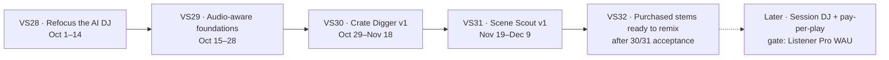

# Roadmap — Taste engine: refocused AI DJ, Crate Digger, Scene Scout (2026-10-01 → 2026-12-09)

**Status:** in progress. Vision Sprints 28 and 29 are closed; application work
for 30 and 31 is merged, with acceptance still in progress. Owner-approved
Sprint 32 is queued after the current acceptance; no start date or capacity
estimate is set. Sprints 28 to 31 were approved on 2026-09-30, and each has a
sprint doc under [`docs/sprints/`](../sprints/README.md) and one GitHub
milestone. ADR-TE-1…6 were accepted as written on 2026-09-30
([#1953](https://github.com/akoita/resonate/issues/1953)); a later change to a
decision re-scopes the affected sprint in its doc.
**Owner:** [@akoita](https://github.com/akoita) (solo + AI-assisted)
**Direction:** [AI DJ Rethink and Taste Engine](../strategy/ai-dj-taste-engine-2026-09.md) ·
[ADR-TE-1…6](../strategy/taste-engine-decisions.md) ·
[RFC: Taste Engine](../rfc/taste-engine.md)
**Umbrella epic:** [#1952](https://github.com/akoita/resonate/issues/1952) · **Decision issue:** [#1953](https://github.com/akoita/resonate/issues/1953)

The original sequence of Vision Sprints 28 to 31 delivers the pro tools inside
ADR-BM-6 phase 2 (Oct–Dec 2026). The Session DJ stays tracked but without a
milestone until the Listener Pro gate. The order is refocus, audio-aware
foundations, the Crate Digger, then Scene Scout, because each one needs the one
before: the Crate Digger needs measured track features, and Scene Scout reads
the searches the Crate Digger records. Sprint 32 is a separately approved
buyer-experience increment after Sprint 30 and 31 acceptance.

Dates are indicative (about 10 working days per sprint; Sprint 30 is longer
because it carries the only large item). Sprints close on exit criteria, not
dates.

---

## Vision Sprint 28 — Refocus the AI DJ (closed 2026-09-30)

**Sprint doc:** [Vision Sprint 28](../sprints/2026-10-01-vision-sprint-28-refocus-ai-dj.md)

**Goal:** the AI DJ never spends or generates on its own, and Sonic Radar
shows what resonated with you, not what the agent bought.

| Priority | Item | Issue | Size |
| --- | --- | --- | --- |
| P0 | Stop autonomous stem buying: no listener preset selects `buy` mode, `buy` mode behind an operator flag that defaults off; keep the purchase path for the Crate Digger (ADR-TE-1) | [#1954](https://github.com/akoita/resonate/issues/1954) | S |
| P0 | Sonic Radar becomes the discovery journal: resonant discoveries per session, a reason, one next action per artist; "total spent" removed (ADR-TE-5) | [#1955](https://github.com/akoita/resonate/issues/1955) | M |
| P1 | Remove the dormant generation paths (sparse-catalog AI tracks in the orchestrator, Lyria transitions in the mixer) before #1456 routes the DJ through shared code (ADR-TE-4; ADR-BM-5.3, ADR-BM-3) | [#1956](https://github.com/akoita/resonate/issues/1956) | S |
| P1 | Route the DJ through the shared ranking core, one taste profile and one explanation vocabulary | [#1456](https://github.com/akoita/resonate/issues/1456) | M |
| P1 | Enforce the six recommendation rules in the ranking policy stage, with tests and a User Guide page (ADR-TE-2) | [#1957](https://github.com/akoita/resonate/issues/1957) | S |
| P2 | Mark ERC-8004 reputation and curator-agent work as frozen, with the reason (ADR-TE-6) | [#1958](https://github.com/akoita/resonate/issues/1958) | S |

**Exit criteria**

- No agent session on staging produces a purchase or a generation job unless a
  person started it; a test covers both paths.
- Sonic Radar on staging lists only listened tracks, with categorical reasons
  and no price lines.
- Home and the DJ return the same explanations for the same track (#1456
  acceptance).
- User Guide pages for the AI DJ and Sonic Radar and the feature pages are
  updated in the same PRs.

**Revenue line:** vision-neutral trust and quality; removes latent unbilled
GPU paths. No fee, split or payout change.

## Vision Sprint 29 — Audio-aware discovery foundations (closed 2026-10-02)

**Sprint doc:** [Vision Sprint 29](../sprints/2026-10-15-vision-sprint-29-audio-aware-discovery.md)

**Goal:** ranking and search know what every track sounds like (measured
tempo, key, energy) and what it is close to (real embeddings), and a ranking
change is only promoted on a measured win.

The worker measures tempo, key and energy only on separated stems
(`workers/demucs/main.py`, #1184) and the recommender uses metadata-inferred
features (`agent_audio_feature.service.ts`, `source: metadata_inferred`), so
track-level measurement is new work ([RFC §3.2](../rfc/taste-engine.md)).

| Priority | Item | Issue | Size |
| --- | --- | --- | --- |
| P0 | Measure tempo, key and energy on the full mix at ingestion (the worker already has a single-file `/analyze` endpoint), with confidence; backfill the catalog (ADR-TE-3) | [#1959](https://github.com/akoita/resonate/issues/1959) | M |
| P0 | Measured track features replace metadata-inferred ones in ranking and the catalog API, with a fallback when confidence is low | [#1960](https://github.com/akoita/resonate/issues/1960) | M |
| P0 | Real content embeddings with pgvector HNSW, backfill and embed on ingest | [#1452](https://github.com/akoita/resonate/issues/1452) | M |
| P1 | Measurement: offline recall@k and NDCG, per-surface skip and save rates, a holdout, and the resonant-discoveries metric (ADR-TE-5) | [#1455](https://github.com/akoita/resonate/issues/1455) | M |
| P2 | Natural-language taste edits ("less drill, more live instruments") on the existing taste memory controls | [#1961](https://github.com/akoita/resonate/issues/1961) | S |

**Exit criteria**

- At least 90% of published staging tracks carry measured tempo and key with a
  confidence value.
- A zero-play track is reachable through similarity (the cold-start check in
  the [Discovery Intelligence RFC §8](../rfc/discovery-intelligence.md)).
- The quality dashboard reports resonant discoveries and per-surface skip
  rate.

**Deployment half:** the backfill and scheduled embedding jobs are tracked in
`resonate-iac#257`, cross-linked from #1959. **Revenue line:** vision-neutral
infrastructure for lines 3 and 4. Embedding calls are metered and bounded to
backfill plus on-ingest.

## Vision Sprint 30 — Crate Digger v1 (implementation merged; acceptance in progress)

**Sprint doc:** [Vision Sprint 30](../sprints/2026-10-29-vision-sprint-30-crate-digger.md)

**Goal:** a DJ describes what their set needs and gets a quoted, rights-clear
crate they can buy with one signature.

| Priority | Item | Issue | Size |
| --- | --- | --- | --- |
| P0 | Crate request API: plain-language or reference-track request turned into visible filters (BPM, key and Camelot, energy, stems available, license type, max price, verified human artist); honest "3 of 8 found" results | [#1962](https://github.com/akoita/resonate/issues/1962) | M |
| P0 | Crate page: ordered crate, per-track rights summary, preview of each transition, edit and reorder | [#1963](https://github.com/akoita/resonate/issues/1963) | M |
| P0 | Quote and one-signature purchase: priced cart, then a batched smart-account operation over the existing marketplace rails, with one receipt per line; no contract change (ADR-TE-1) | [#1964](https://github.com/akoita/resonate/issues/1964) | L |
| P1 | Export the licensed crate to rekordbox XML and Serato, with BPM, key and cue points | [#1965](https://github.com/akoita/resonate/issues/1965) | M |
| P1 | `crate.pro` entitlement seam, free for now, same pattern as Remix Studio Pro mode ([#1903](https://github.com/akoita/resonate/issues/1903)) | [#1966](https://github.com/akoita/resonate/issues/1966) | S |
| P2 | Bounded watching: alert when new releases match a saved crate; optional auto-buy under a cap with the existing session keys (ADR-TE-1.3) | [#1967](https://github.com/akoita/resonate/issues/1967) | M |

**Delivery status:** Application work for #1962–#1966 and notification-only
watching (#1967) is merged. Export implementation and the correction in
[PR #2043](https://github.com/akoita/resonate/pull/2043) are merged; manual
rekordbox acceptance remains open in #1965. Optional capped auto-buy is tracked
separately in [#2027](https://github.com/akoita/resonate/issues/2027). Sprint 30
stays open pending acceptance.

**Exit criteria**

- On staging, a DJ goes from a sentence to a paid, receipted crate without
  leaving the page, and a failed line is never charged.
- Every cart line shows the rights obtained before the signature (quote before
  spend).
- The exported file opens in rekordbox with correct BPM and key.

**Revenue line:** line 3, marketplace take-rate 10%, phase 2. Artist share
stays at least 85%; purchases are voluntary and quoted (ADR-BM-4).

## Vision Sprint 31 — Scene Scout v1 (application work merged; acceptance in progress)

**Sprint doc:** [Vision Sprint 31](../sprints/2026-11-19-vision-sprint-31-scene-scout.md)

**Goal:** an artist sees where real demand for a release is and gets one
concrete next action for it.

| Priority | Item | Issue | Size |
| --- | --- | --- | --- |
| P0 | Qualified demand aggregates per release: resonant plays, saves and purchases by city, with minimum-audience thresholds and no listener identities, shown as new card types in the existing artist action cockpit ([#1121](https://github.com/akoita/resonate/issues/1121)) | [#1968](https://github.com/akoita/resonate/issues/1968) | M |
| P1 | Demand from pros: stems DJs searched for in the Crate Digger and did not find, shown to the artist | [#1969](https://github.com/akoita/resonate/issues/1969) | S |
| P1 | First listeners: each new verified-artist release gets a slot in the exploration share for listeners whose taste fits, then a reception summary | [#1970](https://github.com/akoita/resonate/issues/1970) | M |
| P2 | Popularity and engagement marts replace the interim in-process aggregation | [#1450](https://github.com/akoita/resonate/issues/1450) | M |

Application PRs [#2044](https://github.com/akoita/resonate/pull/2044) through
[#2048](https://github.com/akoita/resonate/pull/2048) are merged. Staging
acceptance remains open in [resonate-iac#264](https://github.com/akoita/resonate-iac/issues/264);
warehouse scheduling and live checks remain open in
[resonate-iac#263](https://github.com/akoita/resonate-iac/issues/263).
Canonical follows and pledge attribution remain unavailable; see the
[Scene Scout feature page](../features/scene_scout.md) for the current limits.

**Exit criteria**

- On staging, a demand card links to a prefilled Shows campaign draft for that
  city.
- No aggregate below `DISCOVERY_MIN_AUDIENCE` is shown, and a test proves it.
- Low-traffic releases show "not enough listening yet" rather than a guess.

**Revenue line:** line 2, Artist Pro, phase 2; it drives conversions into
Shows (6%) and the marketplace (10%). Artist Pro billing does not exist yet, so
the pro features ship behind an entitlement seam, free for now.

## Vision Sprint 32 — Purchased stems ready to remix (approved; queued after current acceptance)

**Sprint doc:** [Vision Sprint 32](../sprints/2026-10-03-vision-sprint-32-purchased-stems.md)
· **Milestone:** [34](https://github.com/akoita/resonate/milestone/34)

**Goal:** Buyers can find their purchased stems in the library, see the license
they bought, and open eligible stems in Remix Studio.

| Order | Issue | Outcome |
| --- | --- | --- |
| First | [#2023](https://github.com/akoita/resonate/issues/2023) | Preserve the buyer's passkey smart-account wallet address through wallet refresh |
| Then | [#2042](https://github.com/akoita/resonate/issues/2042) | Give buyers a clear purchase handoff, license-aware library entry and eligible Remix Studio actions |

The order is a preference, not a hard dependency: buyer-library work can
proceed independently of wallet preservation. Keep #2042's open choice between
improving Library › Stems and a separate buyer page for implementation review.
Issues [#2041](https://github.com/akoita/resonate/issues/2041),
[#2030](https://github.com/akoita/resonate/issues/2030),
[#1976](https://github.com/akoita/resonate/issues/1976), and
[#2012](https://github.com/akoita/resonate/issues/2012) remain deferred from
this sprint. No start date or capacity estimate is set.

**Exit criteria**

- After purchase, the buyer can reach the owned stem from the purchase handoff
  and a buyer-facing entry point.
- The library identifies each owned stem's license and offers Remix Studio
  actions only where the purchased license allows remixing.
- The in-app User Guide explains where purchased stems live and how license
  eligibility controls the remix action.

**Revenue line:** Line 3, marketplace take-rate, phase 2. Purchases stay
voluntary and quoted; artists receive at least 85%. No fee, split, or payout
change (ADR-BM-4).

## Later — tracked under the umbrella epic, no milestone

These stay open issues so nothing is silently dropped; each gets a milestone
only when its gate is met.

| Item | Gate | Issue |
| --- | --- | --- |
| Session DJ: intent sessions mixed on measured tempo, key and energy | Listener Pro gate: 500 to 1,000 genuine weekly active listeners (ADR-BM-6) | [#1971](https://github.com/akoita/resonate/issues/1971) |
| Pay-per-play from the pre-funded budget, with the monthly "where your money went" statement in Sonic Radar | Listener Pro billing (Stripe v1) | [#1972](https://github.com/akoita/resonate/issues/1972) |
| Taste passport: export, and lend to an external assistant with a scoped grant | Session DJ shipped | [#1973](https://github.com/akoita/resonate/issues/1973) |
| Collaborative filtering activation | Enough real traffic to pass the #978 eval gate | [#1453](https://github.com/akoita/resonate/issues/1453) |
| MCP tool `crate.build` with quote and receipt | Crate Digger v1 shipped; line 5 | [#1974](https://github.com/akoita/resonate/issues/1974) |
| Public registry validation for agents | Hardened public origin | [#783](https://github.com/akoita/resonate/issues/783) |

## Epics

| Epic | Role | Change |
| --- | --- | --- |
| [#1952](https://github.com/akoita/resonate/issues/1952) Taste engine: refocused AI DJ, Crate Digger, Scene Scout (`vision:core`) | Umbrella for everything in this plan | Created 2026-09-30 |
| [#1447](https://github.com/akoita/resonate/issues/1447) Discovery Intelligence | Ranking infrastructure: #1450, #1452, #1453, #1455, #1456 | Keep; linked from the umbrella |
| [#977](https://github.com/akoita/resonate/issues/977) AI DJ taste intelligence | All six children shipped; its remaining direction moves to the umbrella | Closed as completed 2026-09-30, with a pointer |
| [#1121](https://github.com/akoita/resonate/issues/1121) Artist action cockpit | Shipped with 15 deterministic card types; hosts the Scene Scout cards | Keep; linked |

## Sprint artifacts

Sprints 28 to 31 were approved by the owner on 2026-09-30; Sprint 32 was
approved separately. Issues carry the milestone and no `sprint:` label.
Milestones 30 to 33 were created on 2026-09-30; milestone 34 tracks Sprint 32.

| Sprint | Sprint doc | Milestone | Issues |
| --- | --- | --- | --- |
| Vision Sprint 28: Refocus the AI DJ | [doc](../sprints/2026-10-01-vision-sprint-28-refocus-ai-dj.md) | [30](https://github.com/akoita/resonate/milestone/30) | [#1954](https://github.com/akoita/resonate/issues/1954), [#1955](https://github.com/akoita/resonate/issues/1955), [#1956](https://github.com/akoita/resonate/issues/1956), [#1456](https://github.com/akoita/resonate/issues/1456), [#1957](https://github.com/akoita/resonate/issues/1957), [#1958](https://github.com/akoita/resonate/issues/1958) |
| Vision Sprint 29: Audio-aware discovery foundations | [doc](../sprints/2026-10-15-vision-sprint-29-audio-aware-discovery.md) | [31](https://github.com/akoita/resonate/milestone/31) | [#1959](https://github.com/akoita/resonate/issues/1959), [#1960](https://github.com/akoita/resonate/issues/1960), [#1452](https://github.com/akoita/resonate/issues/1452), [#1455](https://github.com/akoita/resonate/issues/1455), [#1961](https://github.com/akoita/resonate/issues/1961) |
| Vision Sprint 30: Crate Digger v1 | [doc](../sprints/2026-10-29-vision-sprint-30-crate-digger.md) | [32](https://github.com/akoita/resonate/milestone/32) | [#1962](https://github.com/akoita/resonate/issues/1962), [#1963](https://github.com/akoita/resonate/issues/1963), [#1964](https://github.com/akoita/resonate/issues/1964), [#1965](https://github.com/akoita/resonate/issues/1965), [#1966](https://github.com/akoita/resonate/issues/1966), [#1967](https://github.com/akoita/resonate/issues/1967) |
| Vision Sprint 31: Scene Scout v1 | [doc](../sprints/2026-11-19-vision-sprint-31-scene-scout.md) | [33](https://github.com/akoita/resonate/milestone/33) | [#1968](https://github.com/akoita/resonate/issues/1968), [#1969](https://github.com/akoita/resonate/issues/1969), [#1970](https://github.com/akoita/resonate/issues/1970), [#1450](https://github.com/akoita/resonate/issues/1450) |
| Vision Sprint 32: Purchased stems ready to remix | [doc](../sprints/2026-10-03-vision-sprint-32-purchased-stems.md) | [34](https://github.com/akoita/resonate/milestone/34) | [#2023](https://github.com/akoita/resonate/issues/2023), [#2042](https://github.com/akoita/resonate/issues/2042) |

The "Later" items keep no milestone until their gate is met.

## Assumptions and risks

| Assumption or risk | Consequence |
| --- | --- |
| ADR-TE-1…6 are accepted as written (2026-09-30), with the Crate Digger first | If Scene Scout goes first, Sprint 31 moves up to right after Sprint 28; the audio-aware sprint is then only needed before the Crate Digger |
| Solo capacity; recent sprints held 1 to 8 items | Sprint 30 carries the only large item (the one-signature cart) and may split into two milestones |
| Fiat billing (Stripe) and the production launch are still gated | Every milestone here is proven on staging and claims no production deployment; pro features ship behind free entitlement seams |
| The staging catalog is small | Crate results will often be partial, so the exit criteria use fixtures and the honest "n of m found" state |
| Batched purchases depend on the smart account batching several marketplace calls, plus ERC-20 approvals | Verify in the first Sprint 30 issue; if a contract change turns out to be needed, it goes through the full contract test ladder in `contracts/AGENTS.md` |
