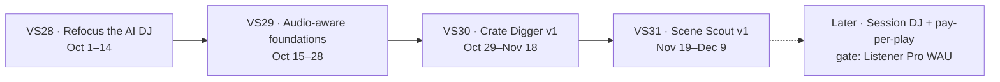

# Roadmap — Taste engine: refocused AI DJ, Crate Digger, Scene Scout (2026-10-01 → 2026-12-09)

**Status:** proposed, not committed scope. No GitHub milestone or sprint label
exists for these sprints until the owner approves each one, per
`CLAUDE.md` and [`docs/sprints/README.md`](../sprints/README.md).
**Owner:** [@akoita](https://github.com/akoita) (solo + AI-assisted)
**Direction:** [AI DJ Rethink and Taste Engine](../strategy/ai-dj-taste-engine-2026-09.md) ·
[ADR-TE-1…6](../strategy/taste-engine-decisions.md) ·
[RFC: Taste Engine](../rfc/taste-engine.md)
**Umbrella epic:** _to be filed_

Four sprints, Vision Sprints 28 to 31, deliver the pro tools inside ADR-BM-6
phase 2 (Oct–Dec 2026). The Session DJ stays tracked but without a milestone
until the Listener Pro gate. The order is refocus, then audio-aware
foundations, then the Crate Digger, then Scene Scout, because each one needs
the one before: the Crate Digger needs measured track features, and Scene
Scout reads the searches the Crate Digger records.

Dates are indicative (about 10 working days per sprint; Sprint 30 is longer
because it carries the only large item). Sprints close on exit criteria, not
dates.

---

## Vision Sprint 28 — Refocus the AI DJ (proposed, Oct 1–14)

**Goal:** the AI DJ never spends or generates on its own, and Sonic Radar
shows what resonated with you, not what the agent bought.

| Priority | Item | Issue | Size |
| --- | --- | --- | --- |
| P0 | Turn autonomous stem buying off by default behind a documented flag; keep the purchase path for the Crate Digger (ADR-TE-1) | new | S |
| P0 | Remove AI filler tracks and Lyria transitions from DJ orchestration (ADR-TE-4; ADR-BM-5.3, ADR-BM-3) | new | S |
| P0 | Sonic Radar becomes the discovery journal: resonant discoveries per session, a reason, one next action per artist; "total spent" removed (ADR-TE-5) | new | M |
| P1 | Route the DJ through the shared ranking core, one taste profile and one explanation vocabulary | [#1456](https://github.com/akoita/resonate/issues/1456) | M |
| P1 | Enforce the six recommendation rules in the ranking policy stage, with tests and a User Guide page (ADR-TE-2) | new | S |
| P2 | Mark ERC-8004 reputation and curator-agent work as frozen, with the reason (ADR-TE-6) | new | S |

**Exit criteria**

- No agent session on staging produces a purchase or a generation job unless a
  person started it; a test covers both paths.
- Sonic Radar on staging lists only listened tracks, with categorical reasons
  and no price lines.
- Home and the DJ return the same explanations for the same track (#1456
  acceptance).
- User Guide pages for the AI DJ and Sonic Radar and the feature pages are
  updated in the same PRs.

**Revenue line:** vision-neutral trust and quality; removes unbilled GPU
spend. No fee, split or payout change.

## Vision Sprint 29 — Audio-aware discovery foundations (proposed, Oct 15–28)

**Goal:** ranking and search know what every track sounds like (measured
tempo, key, energy) and what it is close to (real embeddings), and a ranking
change is only promoted on a measured win.

The worker measures tempo, key and energy only on separated stems
(`workers/demucs/main.py`, #1184) and the recommender uses metadata-inferred
features (`agent_audio_feature.service.ts`, `source: metadata_inferred`), so
track-level measurement is new work ([RFC §3.2](../rfc/taste-engine.md)).

| Priority | Item | Issue | Size |
| --- | --- | --- | --- |
| P0 | Measure tempo, key and energy on the full mix at ingestion (the worker already has a single-file `/analyze` endpoint), with confidence; backfill the catalog (ADR-TE-3) | new | M |
| P0 | Measured track features replace metadata-inferred ones in ranking and the catalog API, with a fallback when confidence is low | new | M |
| P0 | Real content embeddings with pgvector HNSW, backfill and embed on ingest | [#1452](https://github.com/akoita/resonate/issues/1452) | M |
| P1 | Measurement: offline recall@k and NDCG, per-surface skip and save rates, a holdout, and the resonant-discoveries metric (ADR-TE-5) | [#1455](https://github.com/akoita/resonate/issues/1455) | M |
| P2 | Natural-language taste edits ("less drill, more live instruments") on the existing taste memory controls | new | S |

**Exit criteria**

- At least 90% of published staging tracks carry measured tempo and key with a
  confidence value.
- A zero-play track is reachable through similarity (the cold-start check in
  the [Discovery Intelligence RFC §8](../rfc/discovery-intelligence.md)).
- The quality dashboard reports resonant discoveries and per-surface skip
  rate.

**Deployment half:** the backfill and scheduled embedding jobs need a
cross-linked `resonate-iac` issue. **Revenue line:** vision-neutral
infrastructure for lines 3 and 4. Embedding calls are metered and bounded to
backfill plus on-ingest.

## Vision Sprint 30 — Crate Digger v1 (proposed, Oct 29–Nov 18)

**Goal:** a DJ describes what their set needs and gets a quoted, rights-clear
crate they can buy with one signature.

| Priority | Item | Issue | Size |
| --- | --- | --- | --- |
| P0 | Crate request API: plain-language or reference-track request turned into visible filters (BPM, key and Camelot, energy, stems available, license type, max price, verified human artist); honest "3 of 8 found" results | new | M |
| P0 | Crate page: ordered crate, per-track rights summary, preview of each transition, edit and reorder | new | M |
| P0 | Quote and one-signature purchase: priced cart, then a batched smart-account operation over the existing marketplace rails, with one receipt per line; no contract change (ADR-TE-1) | new | L |
| P1 | Export the licensed crate to rekordbox XML and Serato, with BPM, key and cue points | new | M |
| P1 | `crate.pro` entitlement seam, free for now, same pattern as Remix Studio Pro mode ([#1903](https://github.com/akoita/resonate/issues/1903)) | new | S |
| P2 | Bounded watching: alert when new releases match a saved crate; optional auto-buy under a cap with the existing session keys (ADR-TE-1.3) | new | M |

**Exit criteria**

- On staging, a DJ goes from a sentence to a paid, receipted crate without
  leaving the page, and a failed line is never charged.
- Every cart line shows the rights obtained before the signature (quote before
  spend).
- The exported file opens in rekordbox with correct BPM and key.

**Revenue line:** line 3, marketplace take-rate 10%, phase 2. Artist share
stays at least 85%; purchases are voluntary and quoted (ADR-BM-4).

## Vision Sprint 31 — Scene Scout v1 (proposed, Nov 19–Dec 9)

**Goal:** an artist sees where real demand for a release is and gets one
concrete next action for it.

| Priority | Item | Issue | Size |
| --- | --- | --- | --- |
| P0 | First slice of the artist action cockpit: deterministic action cards with deep links | [#1121](https://github.com/akoita/resonate/issues/1121) | M |
| P0 | Qualified demand aggregates per release: resonant plays, saves and purchases by city, with minimum-audience thresholds and no listener identities | new | M |
| P1 | Demand from pros: stems DJs searched for in the Crate Digger and did not find, shown to the artist | new | S |
| P1 | First listeners: each new verified-artist release gets a slot in the exploration share for listeners whose taste fits, then a reception summary | new | M |
| P2 | Popularity and engagement marts replace the interim in-process aggregation | [#1450](https://github.com/akoita/resonate/issues/1450) | M |

**Exit criteria**

- On staging, a demand card links to a prefilled Shows campaign draft for that
  city.
- No aggregate below `DISCOVERY_MIN_AUDIENCE` is shown, and a test proves it.
- Low-traffic releases show "not enough listening yet" rather than a guess.

**Revenue line:** line 2, Artist Pro, phase 2; it drives conversions into
Shows (6%) and the marketplace (10%). Artist Pro billing does not exist yet, so
the pro features ship behind an entitlement seam, free for now.

## Later — tracked under the umbrella epic, no milestone

These stay open issues so nothing is silently dropped; each gets a milestone
only when its gate is met.

| Item | Gate | Issue |
| --- | --- | --- |
| Session DJ: intent sessions mixed on measured tempo, key and energy | Listener Pro gate: 500 to 1,000 genuine weekly active listeners (ADR-BM-6) | new |
| Pay-per-play from the pre-funded budget, with the monthly "where your money went" statement in Sonic Radar | Listener Pro billing (Stripe v1) | new |
| Taste passport: export, and lend to an external assistant with a scoped grant | Session DJ shipped | new |
| Collaborative filtering activation | Enough real traffic to pass the #978 eval gate | [#1453](https://github.com/akoita/resonate/issues/1453) |
| MCP tool `crate.build` with quote and receipt | Crate Digger v1 shipped; line 5 | new |
| Public registry validation for agents | Hardened public origin | [#783](https://github.com/akoita/resonate/issues/783) |

## Epics

| Epic | Role | Change |
| --- | --- | --- |
| New: "Taste engine: refocused AI DJ, Crate Digger, Scene Scout" (`vision:core`) | Umbrella for everything in this plan | Create |
| [#1447](https://github.com/akoita/resonate/issues/1447) Discovery Intelligence | Ranking infrastructure: #1450, #1452, #1453, #1455, #1456 | Keep; linked from the umbrella |
| [#977](https://github.com/akoita/resonate/issues/977) AI DJ taste intelligence | All six children shipped; its remaining direction moves to the umbrella | Close as completed, with a pointer |
| [#1121](https://github.com/akoita/resonate/issues/1121) Artist action cockpit | Becomes the Scene Scout P0 | Keep; linked |

## Approval steps

On the owner's approval of Vision Sprint 28, and only then:

1. Create milestone 30 with the Sprint 28 issues plus #1456, and the
   `sprint:vision-28` label.
2. Add the sprint doc `docs/sprints/2026-10-01-vision-sprint-28-refocus-ai-dj.md`
   and a row in the sprint index, on a branch with a PR.

Sprints 29 to 31 follow the same step when each comes up for approval.

## Assumptions and risks

| Assumption or risk | Consequence |
| --- | --- |
| ADR-TE-1…6 are accepted as proposed, with the Crate Digger first | If Scene Scout goes first, Sprint 31 moves up to right after Sprint 28; the audio-aware sprint is then only needed before the Crate Digger |
| Solo capacity; recent sprints held 1 to 8 items | Sprint 30 carries the only large item (the one-signature cart) and may split into two milestones |
| Fiat billing (Stripe) and the production launch are still gated | Every milestone here is proven on staging and claims no production deployment; pro features ship behind free entitlement seams |
| The staging catalog is small | Crate results will often be partial, so the exit criteria use fixtures and the honest "n of m found" state |
| Batched purchases depend on the smart account batching several marketplace calls, plus ERC-20 approvals | Verify in the first Sprint 30 issue; if a contract change turns out to be needed, it goes through the full contract test ladder in `contracts/AGENTS.md` |
