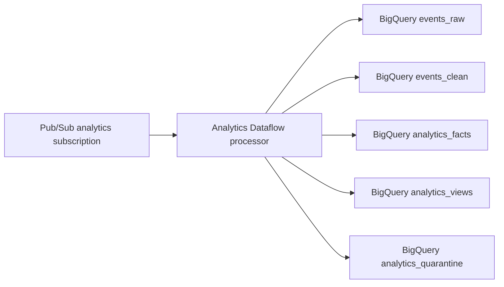

# Analytics Dataflow Processor

This worker is the Dataflow processing artifact for the analytics event
pipeline:



The runtime is a Python Apache Beam streaming pipeline packaged as a Dataflow
Flex Template. Pure transformation logic lives in `analytics_transform.py` so
validation, quarantine, and row derivation can be tested without a Dataflow
runner.

## Flex Template Parameters

The processor accepts the default parameters emitted by `resonate-iac` issue
`#129`:

| Parameter | Purpose |
| --- | --- |
| `inputSubscription` | Terraform-managed analytics Dataflow subscription ID. |
| `deadLetterTopic` | Terraform-managed dead-letter topic ID. Pub/Sub owns final dead-letter forwarding. |
| `outputProjectId` | Project containing the BigQuery warehouse dataset. |
| `outputDataset` | BigQuery dataset ID, such as `analytics_dev`. |
| `rawTable` | `events_raw` table ID. |
| `cleanTable` | `events_clean` table ID. |
| `factsTable` | `analytics_facts` table ID. |
| `viewsTable` | `analytics_views` table ID. |
| `quarantineTable` | `analytics_quarantine` table ID. |
| `environment` | Optional environment label for logs. |
| `supportedEventVersions` | Comma-separated versions promoted beyond raw. Defaults to `1`. |
| `dedupeWindowSeconds` | Fixed window for eventId dedupe. Defaults to `900`. |

## Build

Build and push the container image with your environment-specific Artifact
Registry target, then publish the Flex Template container spec JSON to GCS:

```bash
cd workers/analytics-dataflow
docker build -t "$IMAGE_URI" .
docker push "$IMAGE_URI"
IMAGE_URI="$IMAGE_URI" TEMPLATE_GCS_PATH="$TEMPLATE_GCS_PATH" ./build-flex-template.sh
```

`resonate-iac` should set `analytics_dataflow_flex_template_gcs_path` to the
same `TEMPLATE_GCS_PATH` when `analytics_dataflow_launch_enabled=true`.

## Behavior

- Valid envelopes are written to `events_raw`, `events_clean`,
  `analytics_facts`, and `analytics_views`.
- Unsupported versions and families are retained in `events_raw` and written to
  `analytics_quarantine` with a reason.
- Malformed messages are written to `analytics_quarantine`.
- Pub/Sub redeliveries are deduped by `eventId` within a fixed streaming
  window before BigQuery writes.

## Test

```bash
cd workers/analytics-dataflow
python -m unittest test_analytics_transform.py
```
