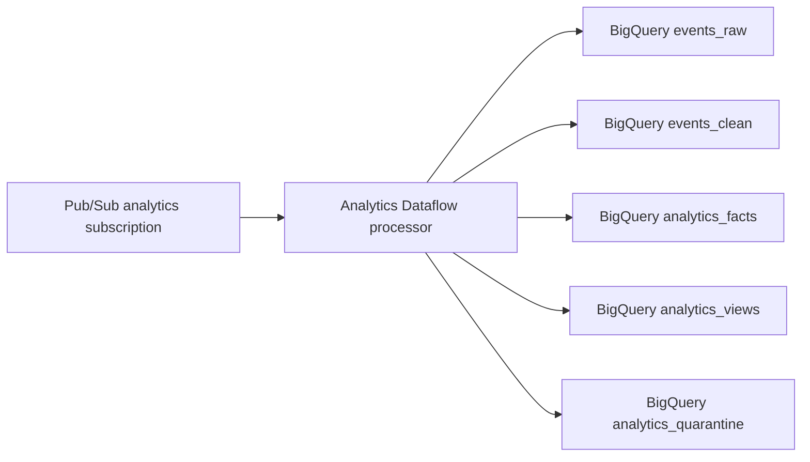

# Analytics Dataflow Processor

This worker is the Dataflow processing artifact for the analytics event
pipeline:



The runtime is a Python Apache Beam streaming pipeline packaged as a Dataflow
Flex Template. Pure transformation logic lives in `analytics_transform.py` so
validation, quarantine, and row derivation can be tested without a Dataflow
runner.

The Flex Template image includes `setup.py` and sets
`FLEX_TEMPLATE_PYTHON_SETUP_FILE` so Beam stages the local
`analytics_transform` module to Dataflow worker harnesses. Keep new local
Python modules in `setup.py`; copying them into the image is not enough for
worker-side unpickling.

## Flex Template Parameters

The processor accepts the default parameters emitted by `resonate-iac` issue
`#129`:

| Parameter | Purpose |
| --- | --- |
| `inputSubscription` | Terraform-managed analytics Dataflow subscription ID. |
| `deadLetterTopic` | Terraform-managed dead-letter topic ID. Pub/Sub owns final dead-letter forwarding. |
| `outputProjectId` | Project containing the BigQuery warehouse dataset. |
| `outputDataset` | BigQuery dataset ID, such as `analytics_dev`. |
| `rawTable` | `events_raw` table ID. |
| `cleanTable` | `events_clean` table ID. |
| `factsTable` | `analytics_facts` table ID. |
| `viewsTable` | `analytics_views` table ID. |
| `quarantineTable` | `analytics_quarantine` table ID. |
| `environment` | Optional environment label for logs. |
| `supportedEventVersions` | Comma-separated versions promoted beyond raw. Defaults to `1`. |
| `dedupeWindowSeconds` | Event-id dedupe TTL in keyed state. Defaults to `900`. |

## Build

Build and push the container image with your environment-specific Artifact
Registry target, then publish the Flex Template container spec JSON to GCS:

```bash
cd workers/analytics-dataflow
docker build -t "$IMAGE_URI" .
docker push "$IMAGE_URI"
IMAGE_URI="$IMAGE_URI" TEMPLATE_GCS_PATH="$TEMPLATE_GCS_PATH" ./build-flex-template.sh
```

`resonate-iac` should set `analytics_dataflow_flex_template_gcs_path` to the
same `TEMPLATE_GCS_PATH` when `analytics_dataflow_launch_enabled=true`.

## Publish From GitHub Actions

Use the **Publish Analytics Dataflow Flex Template** workflow in this repository
to publish the staging artifact. On `main`, changes under
`workers/analytics-dataflow/` publish the staging artifact automatically. An
operator can also run the workflow manually with `workflow_dispatch`.

The workflow uses the same GitHub environment variables and secrets as app image
publication:

| Name | Type | Purpose |
| --- | --- | --- |
| `GCP_PROJECT_ID` | environment variable | Target GCP project. |
| `GCP_REGION` | environment variable | Artifact Registry and Dataflow region, for example `europe-west1`. |
| `GCP_WIF_PROVIDER` | secret | Workload Identity Federation provider. |
| `GCP_ARTIFACT_REGISTRY_SA_EMAIL` | secret | Publisher service account used for Cloud Build, Artifact Registry, Dataflow template build, and GCS object writes. |
| `ANALYTICS_DATAFLOW_ARTIFACT_REGISTRY_REPOSITORY` | optional environment variable | Artifact Registry repository. Defaults to `resonate-<environment>`. |
| `ANALYTICS_DATAFLOW_TEMPLATE_BUCKET` | optional environment variable | GCS bucket for template, staging, and temp artifacts. Defaults to `<GCP_PROJECT_ID>-analytics-dataflow`. |
| `ANALYTICS_DATAFLOW_TEMPLATE_PREFIX` | optional environment variable | Prefix for `template.json`. Defaults to `templates/<environment>/analytics-dataflow`. |
| `ANALYTICS_DATAFLOW_TEMPLATE_GCS_PATH` | optional environment variable | Full `gs://.../template.json` override. |

Default staging convention:

```text
IMAGE_URI=europe-west1-docker.pkg.dev/<project>/resonate-staging/analytics-dataflow:<sha>
TEMPLATE_GCS_PATH=gs://<project>-analytics-dataflow/templates/staging/analytics-dataflow/template.json
analytics_dataflow_staging_location=gs://<project>-analytics-dataflow/staging/staging/analytics-dataflow
analytics_dataflow_temp_location=gs://<project>-analytics-dataflow/temp/staging/analytics-dataflow
```

The workflow writes the resolved `IMAGE_URI`, `TEMPLATE_GCS_PATH`,
`analytics_dataflow_staging_location`, and `analytics_dataflow_temp_location`
to the GitHub Actions job summary. Pass those values to the `resonate-iac`
deploy workflow when enabling Terraform-managed launch:

```text
analytics_dataflow_launch_enabled=true
analytics_dataflow_flex_template_gcs_path=<published TEMPLATE_GCS_PATH>
analytics_dataflow_staging_location=<published staging location>
analytics_dataflow_temp_location=<published temp location>
analytics_dataflow_template_bucket_names=["<template bucket>"]
analytics_dataflow_worker_bucket_names=["<staging/temp bucket>"]
```

## Behavior

- Valid envelopes are written to `events_raw`, `events_clean`,
  `analytics_facts`, and `analytics_views`.
- Unsupported versions and families are retained in `events_raw` and written to
  `analytics_quarantine` with a reason.
- Malformed messages are written to `analytics_quarantine`.
- Pub/Sub redeliveries are deduped by `eventId` in keyed state for the
  configured TTL while the first event is written immediately.

## Derived SQL

Post-Dataflow BigQuery materializations live in `sql/`. The first derived
feature set is Agent Taste Intelligence:

- `sql/agent_taste_intelligence_baseline.sql` creates
  `track_intelligence_features`, `user_track_signal_training`, and
  `user_track_recommendation_scores` from `events_clean`.
- `sql/agent_taste_intelligence_bqml.sql` is an optional BigQuery ML
  matrix-factorization template that writes
  `user_track_recommendation_scores_bqml` for offline comparison before
  promotion.

The backend consumes only the serving table contract, so these jobs can be
scheduled, rerun, or replaced independently of the streaming Dataflow worker.

## Test

```bash
cd workers/analytics-dataflow
python -m unittest test_analytics_transform.py
```
